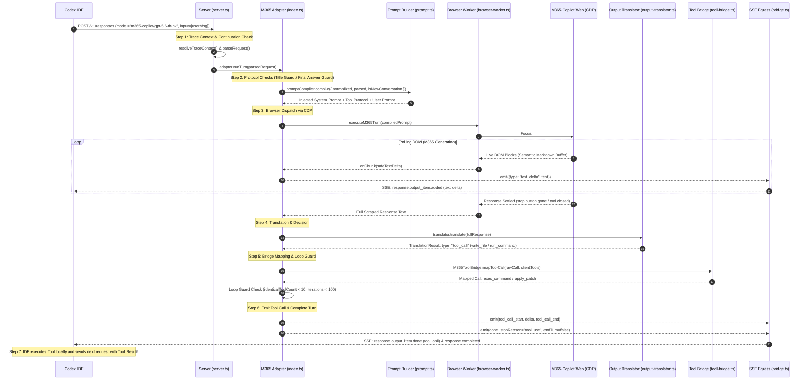
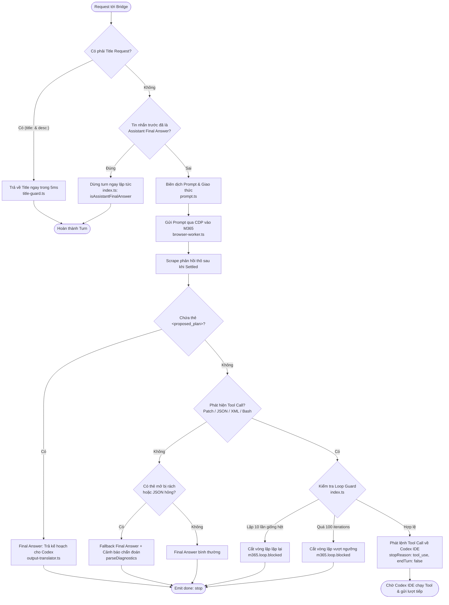

# Codex-M365 Engineering Control Assessment Report

> **Tài liệu kiểm toán kỹ thuật chuyên sâu (Comprehensive Technical Audit & Architecture Assessment)**  
> **Tác giả:** Principal Architect & Staff Systems Engineer  
> **Mục tiêu:** Phục hồi quyền kiểm soát kỹ thuật (Engineering Ownership), xóa bỏ "Vibe Coding" và "Black Boxes" trong hệ thống Codex-M365 Bridge.

---

## MỤC LỤC

1. [Phần 1 - Executive Summary](#phần-1---executive-summary)
2. [Phần 2 - Source Code Inventory](#phần-2---source-code-inventory)
3. [Phần 3 - Request Lifecycle & Call Chain](#phần-3---request-lifecycle--call-chain)
4. [Phần 4 - Decision Flow Mapping](#phần-4---decision-flow-mapping)
5. [Phần 5 - Tool Calling Architecture](#phần-5---tool-calling-architecture)
6. [Phần 6 - Prompt Engineering Analysis & Construction Flow](#phần-6---prompt-engineering-analysis--construction-flow)
7. [Phần 7 - Loop & Continuation Analysis](#phần-7---loop--continuation-analysis)
8. [Phần 8 - Control Surface Report](#phần-8---control-surface-report)
9. [Phần 9 - Configuration Map](#phần-9---configuration-map)
10. [Phần 10 - Observability Assessment](#phần-10---observability-assessment)
11. [Phần 11 - Top 20 Files to Master Codex-M365](#phần-11---top-20-files-to-master-codex-m365)
12. [Phần 12 - Top 10 Sources of Engineering Complexity](#phần-12---top-10-sources-of-engineering-complexity)
13. [Phần 13 - Technical Debt Report](#phần-13---technical-debt-report)
14. [Phần 14 - Testability Report](#phần-14---testability-report)
15. [Phần 15 - Roadmap để làm chủ hệ thống](#phần-15---roadmap-để-làm-chủ-hệ-thống)

---

# PHẦN 1 - EXECUTIVE SUMMARY

## 1.1. Hệ thống này thực chất là gì?

Hệ thống **Codex-M365** thực chất là một **Local Semantic Gateway & Protocol Adapter** (Cổng chuyển đổi giao thức ngữ nghĩa cục bộ). Nó đóng vai trò là một **Responses API Reverse Proxy & Autonomous Web Scraping Bridge**, bắc cầu giữa:
1. **Thượng nguồn (Upstream Client):** Codex IDE / Codex CLI / OpenAI Responses API Client mong đợi một giao thức LLM chuẩn có Native Function Calling dạng Server-Sent Events (SSE).
2. **Hạ nguồn (Downstream LLM Provider):** Microsoft 365 Copilot Web UI chạy trên phiên đăng nhập của người dùng doanh nghiệp (Enterprise Protected Web Session) – một giao diện chat web hướng người dùng, **hoàn toàn không có public API, không hỗ trợ tool calling có cấu trúc**, và bị giới hạn bởi DOM/React renderer.

```
+----------------------------------------------------------------------------------------------------+
|                                    BẢN CHẤT CỐT LÕI CỦA CODEX-M365                                |
|                                                                                                    |
|  [Codex IDE / CLI] <---> [Local Bridge Server] <---> [CDP over Electron] <---> [M365 Copilot Web]  |
|   (SSE Responses)        (Virtual Tool Engine)       (Browser Worker)          (End-User Chat UI)  |
+----------------------------------------------------------------------------------------------------+
```

### Các vai trò kỹ thuật mà hệ thống đồng thời đảm nhận:
1. **AI Agent Protocol Adapter:** Giả lập OpenAI Responses API `/v1/responses` với đầy đủ streaming chunk (`response.text.delta`, `response.function_call_arguments.delta`, `response.completed`).
2. **Prompt Orchestrator & Text Interaction Protocol Engine:** Biến đổi cây ngữ cảnh phức tạp của Codex (System prompt, Developer instructions, Environment context, Trailing tool results) thành một chuỗi prompt văn bản phẳng tự nhiên, ép M365 Copilot tuân thủ giao thức văn bản để phát sinh tool call (`<tool_call>`, `<custom_tool_call>`, block commands).
3. **Browser Automation Layer (CDP Driver):** Điều khiển Chrome DevTools Protocol (CDP) kết nối trực tiếp vào `WebContentsView` của Electron Launcher để paste prompt, click send, giám sát DOM Mutation và stream dữ liệu theo khối ngữ nghĩa (Semantic Block Buffering).
4. **Tool Translation & Normalization Layer:** Bóc tách kết quả văn bản thô từ M365 (thông qua regex, lenient JSON parser, XML parser, Bash command parser) và ánh xạ ngược lại các công cụ native của Codex (`read_file`, `apply_patch`, `exec_command`).
5. **Cross-Turn State Bridge:** Đồng bộ hoá lịch sử hội thoại qua `previous_response_id` và `conversationKey` trong phiên M365 stateful.

---

## 1.2. Kiến trúc tổng quát (Architectural Topology)

```
                                      KIẾN TRÚC TỔNG QUAN HỆ THỐNG
                                      
  [ Codex IDE / Client ]
             │
             │ (1) POST /v1/responses (JSON body + previous_response_id)
             ▼
  ┌────────────────────────────────────────────────────────────────────────┐
  │ SERVER & INGRESS LAYER                                                 │
  │ [src/server.ts: responseRequest() -> handleM365ResponseRequest()]       │
  │  - Extract Turn Identity (Thread ID, Turn ID)                          │
  │  - Resolve Distributed Trace Context (TraceStorage / AsyncLocalStorage) │
  │  - Expand previous_response_id -> State Store Continuation             │
  │  - Parse CodexParsedRequest                                            │
  └───────────────────────────────────┬────────────────────────────────────┘
                                      │ (2) parsed request
                                      ▼
  ┌────────────────────────────────────────────────────────────────────────┐
  │ ADAPTER ORCHESTRATION LAYER                                            │
  │ [src/adapters/m365-copilot/index.ts: M365CopilotAdapter.runTurn()]      │
  │  - Title Guard Bypass (sinh title trong 5ms nếu là background ping)    │
  │  - Early Final Answer Guard (bảo vệ chống lặp turn đã kết thúc)        │
  │  - Loop & Convergence Guard (chặn lặp tool >= 10 lần, iterations >= 100)│
  └─────────────────┬────────────────────────────────────┬─────────────────┘
                    │                                    │
                    │ (3a) Compile Prompt                │ (3b) Direct Turn
                    ▼                                    ▼
  ┌───────────────────────────────────────┐   ┌────────────────────────────┐
  │ PROMPT COMPILATION ENGINE             │   │ BROWSER WORKER ENGINE      │
  │ [prompt.ts & prompts.ts]              │   │ [browser-worker.ts]        │
  │  - System Instructions Injection      │   │  - Connect CDP Playwright  │
  │  - Tool Declaration (9 IDE Tools)     │   │  - Check / Switch Mode     │
  │  - Plan Mode / Implement Plan Prompts │   │  - Inject Prompt via Paste │
  │  - Normalizer: Context & Trailing Res │   │  - Poll DOM + Shimmer      │
  │  - Truncation Guard (95k chars limit) │   │  - Semantic Block Buffer   │
  └───────────────────┬───────────────────┘   └──────────────┬─────────────┘
                      │                                      │
                      └──────────────────┬───────────────────┘
                                         │ (4) Raw Scraped Text
                                         ▼
  ┌────────────────────────────────────────────────────────────────────────┐
  │ OUTPUT TRANSLATOR & PARSER LAYER                                       │
  │ [output-translator.ts & markdown.ts & bash-translator.ts]              │
  │  - Strip outer code fence & balance braces                             │
  │  - Priority 0: PatchToolCallDetector (*** Begin Patch / apply_patch)    │
  │  - Priority 1: JsonToolCallDetector (action: tool_call)                │
  │  - Priority 2: XmlToolCallDetector (<tool_call>...</tool_call>)        │
  │  - Priority 3: BashCommandDetector (cat, ls, grep, git status...)      │
  │  - Fallback: Final Answer Detection                                    │
  └───────────────────────────────────┬────────────────────────────────────┘
                                      │ (5) Detected Tool Calls / Text Deltas
                                      ▼
  ┌────────────────────────────────────────────────────────────────────────┐
  │ TOOL BRIDGE & STRATEGY RESOLUTION                                      │
  │ [tool-bridge.ts & strategies/resolver.ts]                              │
  │  - Map M365 Tool Calls -> Codex Client Tools                           │
  │  - Resolve Platform Strategy (Posix vs PowerShell)                     │
  │  - Atomic File Staging (bảo vệ giới hạn dòng lệnh ARG_MAX)             │
  └───────────────────────────────────┬────────────────────────────────────┘
                                      │ (6) Adapter Events (text_delta, tool_call, done)
                                      ▼
  ┌────────────────────────────────────────────────────────────────────────┐
  │ EGRESS & SSE STREAMING BRIDGE                                          │
  │ [src/bridge.ts: bridgeToResponsesSSE()]                                │
  │  - AsyncEventQueue -> Server-Sent Events (SSE)                         │
  │  - Emit Responses frames: text.delta, function_call.delta, completed   │
  │  - Store traceState into Local Cache for next continuation             │
  └───────────────────────────────────┬────────────────────────────────────┘
                                      │ (7) SSE Stream Chunk
                                      ▼
                             [ Codex IDE / Client ]
```

---

## 1.3. Trách nhiệm của từng lớp (Separation of Concerns)

| Lớp (Layer) | File đại diện | Trách nhiệm chính | Mức độ độc lập |
|---|---|---|---|
| **Ingress & Routing** | [`src/server.ts`](file:///Users/huytv/IdeaProjects/1.m365-codex/codex-chatgpt-web/src/server.ts) | Nhận HTTP, định tuyến model slug (`m365-*`), mở rộng state từ `previous_response_id`, quản lý trace context MDC. | Cao (chuẩn HTTP Hono/Bun) |
| **Adapter Orchestration** | [`src/adapters/m365-copilot/index.ts`](file:///Users/huytv/IdeaProjects/1.m365-codex/codex-chatgpt-web/src/adapters/m365-copilot/index.ts) | Trọng tài điều khiển vòng đời turn, quản lý hội thoại, kiểm soát vòng lặp (Loop Guard), định tuyến streaming queue. | Trung tâm điều phối |
| **Prompt Engineering** | [`src/adapters/m365-copilot/prompt.ts`](file:///Users/huytv/IdeaProjects/1.m365-codex/codex-chatgpt-web/src/adapters/m365-copilot/prompt.ts), [`prompts.ts`](file:///Users/huytv/IdeaProjects/1.m365-codex/codex-chatgpt-web/src/adapters/m365-copilot/prompts.ts) | Chuẩn hóa toàn bộ ngữ cảnh thành ngôn ngữ tự nhiên tối ưu cho Copilot, chèn giao thức giả lập tool calling. | Tách biệt nội dung và logic |
| **Browser Execution (CDP)** | [`src/adapters/m365-copilot/browser-worker.ts`](file:///Users/huytv/IdeaProjects/1.m365-codex/codex-chatgpt-web/src/adapters/m365-copilot/browser-worker.ts) | Kết nối Playwright CDP vào Electron WebContentsView, tự động hóa DOM M365 (paste, click send, poll loading, scrape). | Rất nhạy cảm với thay đổi UI của Microsoft |
| **Output Parsing & Translation** | [`src/adapters/m365-copilot/output-translator.ts`](file:///Users/huytv/IdeaProjects/1.m365-codex/codex-chatgpt-web/src/adapters/m365-copilot/output-translator.ts) | Phân tích cú pháp mềm dẻo (Lenient Parser), chuyển đổi văn bản markdown tự do thành JSON Tool Call có cấu trúc theo thứ tự ưu tiên. | Cao (Pure Logic, Testable) |
| **Tool Bridge & Command Strategy** | [`src/adapters/m365-copilot/tool-bridge.ts`](file:///Users/huytv/IdeaProjects/1.m365-copilot/codex-chatgpt-web/src/adapters/m365-copilot/tool-bridge.ts), [`strategies/`](file:///Users/huytv/IdeaProjects/1.m365-codex/codex-chatgpt-web/src/adapters/m365-copilot/strategies) | Ánh xạ tên công cụ, sinh lệnh shell POSIX/PowerShell tương thích với môi trường client, quản lý Atomic File Staging. | Tuân thủ SOLID (Strategy Pattern) |
| **Egress & Protocol Bridge** | [`src/bridge.ts`](file:///Users/huytv/IdeaProjects/1.m365-codex/codex-chatgpt-web/src/bridge.ts) | Chuyển đổi luồng `AsyncEventQueue<AdapterEvent>` thành định dạng chuẩn SSE của OpenAI Responses API. | Cao |

---

# PHẦN 2 - SOURCE CODE INVENTORY

Dưới đây là bản kiểm kê toàn bộ module cấu thành hệ thống Codex-M365:

```
                           SƠ ĐỒ PHÂN BỐ CÁC MODULE CHÍNH
                           
  src/
  ├── server.ts                       [CRITICAL] Cổng vào HTTP & Ingress Routing
  ├── m365-models.ts                  [HIGH]     Định nghĩa danh mục model M365
  ├── bridge.ts                       [CRITICAL] Bộ chuyển đổi SSE Responses API
  ├── config.ts                       [HIGH]     Cấu hình hệ thống & đường dẫn
  ├── observability/                  [HIGH]     Hệ thống Log cấu trúc & Trace Context
  │   ├── types.ts, trace-context.ts, emitter.ts, debug-logger.ts
  └── adapters/
      └── m365-copilot/               [CRITICAL CORE]
          ├── index.ts                [CRITICAL] Adapter chính, điều phối turn & Loop Guard
          ├── browser-worker.ts       [CRITICAL] Tự động hóa CDP trình duyệt & DOM Scraper
          ├── prompt.ts & prompts.ts  [CRITICAL] Prompt Templates & Truncation Engine
          ├── output-translator.ts    [CRITICAL] Parser đa tầng (Patch, JSON, XML, Bash)
          ├── markdown.ts             [HIGH]     Semantic Block Buffering & Tool Detector
          ├── tool-bridge.ts          [HIGH]     Ánh xạ công cụ & chuẩn hóa file content
          ├── bash-translator.ts      [HIGH]     Dịch shell command sang function calls
          ├── atomic-file-writer.ts   [HIGH]     Ghi file nguyên tử & Staging vượt giới hạn CLI
          ├── capability-picker.ts    [MEDIUM]   Điều khiển chọn Model trên UI M365 qua CDP
          ├── title-guard.ts          [MEDIUM]   Bypass yêu cầu sinh tiêu đề ngầm (5ms)
          ├── codex-normalizer.ts     [HIGH]     Chuẩn hóa Payload Codex 1:1 Domain Model
          ├── codex-raw-payload.ts    [MEDIUM]   Typesafe Wrapper cho Raw JSON Request
          ├── canonical-types.ts      [MEDIUM]   Kiểu dữ liệu chuẩn hóa
          └── strategies/             [MEDIUM]   Chiến lược lệnh Cross-Platform (POSIX/Win)
```

## Bảng phân tích chi tiết từng module

| Module / File | Mục đích kỹ thuật | Thành phần cốt lõi | Mức độ quan trọng | Tác động nếu hỏng (Blast Radius) |
|---|---|---|---|---|
| [`src/server.ts`](file:///Users/huytv/IdeaProjects/1.m365-codex/codex-chatgpt-web/src/server.ts) | Cổng HTTP Server, bắt request từ Codex IDE, mở rộng `previous_response_id`, phân nhánh sang M365 Adapter. | `handleM365ResponseRequest`, `responseRequest`, `resolveTraceContext` | **CRITICAL** | Toàn bộ hệ thống sập. Codex IDE nhận lỗi 500/502 hoặc ngắt kết nối vĩnh viễn. |
| [`src/adapters/m365-copilot/index.ts`](file:///Users/huytv/IdeaProjects/1.m365-codex/codex-chatgpt-web/src/adapters/m365-copilot/index.ts) | Điều phối 1 turn hoàn chỉnh: kiểm tra Title Guard, Assistant Final Answer, gọi browser worker, kiểm tra Loop Guard, bắn SSE. | `M365CopilotAdapter`, `runTurn`, `conversationGuard`, `MAX_TOOL_ITERATIONS` | **CRITICAL** | Lỗi logic turn, loop vô hạn hoặc kết thúc sớm (premature termination) khiến Agent bị đơ. |
| [`src/adapters/m365-copilot/browser-worker.ts`](file:///Users/huytv/IdeaProjects/1.m365-copilot/codex-chatgpt-web/src/adapters/m365-copilot/browser-worker.ts) | Kết nối CDP Playwright, tìm ô chat M365, paste prompt, click send, giám sát DOM Mutation và stream dữ liệu theo khối. | `executeM365Turn`, `M365MarkdownBuffer`, `connectLauncherBrowserHost` | **CRITICAL** | Không thể gửi prompt vào M365 Copilot hoặc không đọc được phản hồi, timeout 120s. |
| [`src/adapters/m365-copilot/prompt.ts`](file:///Users/huytv/IdeaProjects/1.m365-codex/codex-chatgpt-web/src/adapters/m365-copilot/prompt.ts) & [`prompts.ts`](file:///Users/huytv/IdeaProjects/1.m365-codex/codex-chatgpt-web/src/adapters/m365-copilot/prompts.ts) | Xây dựng prompt tổng hợp, inject giao thức Text Interaction Protocol, Plan Mode rules, cắt tỉa 95k ký tự. | `promptCompiler.compile`, `compileM365Prompt`, `TOOL_DECLARATION_PROMPT` | **CRITICAL** | Model Copilot "thoát vai", từ chối gọi tool, in ra câu trả lời vô dụng hoặc bị tràn giới hạn ký tự. |
| [`src/adapters/m365-copilot/output-translator.ts`](file:///Users/huytv/IdeaProjects/1.m365-codex/codex-chatgpt-web/src/adapters/m365-copilot/output-translator.ts) | Phân tích cú pháp thô từ phản hồi Copilot bằng các detector có trọng số ưu tiên: Patch -> JSON -> XML -> Bash -> Final Answer. | `M365OutputTranslator`, `PatchToolCallDetector`, `XmlToolCallDetector`, `JsonToolCallDetector` | **CRITICAL** | Model sinh lệnh nhưng parser không nhận ra, dẫn đến fallback sang Final Answer làm Agent dừng lại. |
| [`src/adapters/m365-copilot/tool-bridge.ts`](file:///Users/huytv/IdeaProjects/1.m365-codex/codex-chatgpt-web/src/adapters/m365-copilot/tool-bridge.ts) | Ánh xạ công cụ mà Copilot xuất ra thành tên công cụ và tham số mà Codex IDE hỗ trợ. Xử lý normalize mã nguồn và file staging. | `M365ToolBridge`, `normalizeFileContent`, `TOOL_HANDLERS` | **HIGH** | Codex IDE không nhận diện được công cụ, từ chối thực thi hoặc file ghi bị lỗi định dạng / mất dữ liệu. |
| [`src/adapters/m365-copilot/bash-translator.ts`](file:///Users/huytv/IdeaProjects/1.m365-codex/codex-chatgpt-web/src/adapters/m365-copilot/bash-translator.ts) | Chuyển đổi các câu lệnh bash thường gặp (`cat`, `ls`, `grep`, `git status`) thành function call tương ứng. Chặn câu lệnh phá hủy. | `BashCommandTranslator`, `CatRule`, `isDestructiveCommand` | **HIGH** | Model in ra `cat pom.xml` nhưng không được thực thi; hoặc nguy hiểm hơn là chạy nhầm lệnh phá hủy. |
| [`src/adapters/m365-copilot/atomic-file-writer.ts`](file:///Users/huytv/IdeaProjects/1.m365-codex/codex-chatgpt-web/src/adapters/m365-copilot/atomic-file-writer.ts) | Ghi file nguyên tử (Atomic write qua temp file + rename), tính toán SHA-256, tạo staging file để vượt giới hạn ARG_MAX. | `AtomicFileWriter`, `createStagingFile`, `computeSha256` | **HIGH** | Lệnh ghi file lớn bị cụt trên Windows PowerShell (lỗi 8191 chars) hoặc gây hỏng file mã nguồn dự án. |
| [`src/adapters/m365-copilot/markdown.ts`](file:///Users/huytv/IdeaProjects/1.m365-codex/codex-chatgpt-web/src/adapters/m365-copilot/markdown.ts) | Đệm Markdown theo khối ngữ nghĩa (Semantic Block Buffering), phát hiện tool call ngay trong lúc streaming. | `M365MarkdownBuffer`, `M365ToolCallDetector`, `m365HtmlToMarkdown` | **HIGH** | Giao diện Codex hiển thị chữ bị giật, nhảy offset, hoặc lộ khối XML tool call thô ra màn hình chat. |
| [`src/adapters/m365-copilot/capability-picker.ts`](file:///Users/huytv/IdeaProjects/1.m365-codex/codex-chatgpt-web/src/adapters/m365-copilot/capability-picker.ts) | Điều khiển UI M365 Copilot để chuyển đổi giữa các mode: Auto, Think Deeper, Quick Response, GPT-5.6. | `M365CapabilityPicker`, `ensureM365CapabilityMode` | **MEDIUM** | Model không chạy đúng chế độ mong muốn (ví dụ muốn GPT-5.6 Think nhưng lại chạy Auto thông thường). |
| [`src/adapters/m365-copilot/title-guard.ts`](file:///Users/huytv/IdeaProjects/1.m365-codex/codex-chatgpt-web/src/adapters/m365-copilot/title-guard.ts) | Nhận diện request sinh tiêu đề cuộc trò chuyện từ Codex và phản hồi tức thì (5ms) không cần gọi qua M365 Web. | `isTitleRequest`, `generateTitleResponse` | **MEDIUM** | M365 bị quá tải do phải xử lý các lượt sinh tiêu đề ngớ ngẩn làm chậm trải nghiệm người dùng. |
| [`src/adapters/m365-copilot/strategies/`](file:///Users/huytv/IdeaProjects/1.m365-codex/codex-chatgpt-web/src/adapters/m365-copilot/strategies) | Cung cấp chiến lược sinh lệnh thực thi phù hợp cho từng OS (Posix cho Linux/macOS, PowerShell cho Windows). | `CommandStrategyResolver`, `PosixCommandStrategy`, `PowerShellCommandStrategy` | **MEDIUM** | Lệnh sinh ra bị lỗi cú pháp khi chạy trên Windows hoặc macOS (ví dụ dùng `cat` trên cmd). |
| [`src/bridge.ts`](file:///Users/huytv/IdeaProjects/1.m365-codex/codex-chatgpt-web/src/bridge.ts) | Chuyển đổi AdapterEvent thành chuẩn Server-Sent Events (SSE) của OpenAI Responses API. | `bridgeToResponsesSSE`, `buildResponseJSON` | **CRITICAL** | Codex IDE không nhận được event stream, báo lỗi giao thức kết nối. |
| [`src/m365-models.ts`](file:///Users/huytv/IdeaProjects/1.m365-codex/codex-chatgpt-web/src/m365-models.ts) | Danh mục các model route M365 (`m365-copilot/gpt-5.6-think`, `m365-copilot/auto`,...). | `M365_MODEL_ROUTES`, `isM365ModelSlug`, `resolveM365CapabilityMode` | **HIGH** | Router không nhận diện được model, chuyển nhầm request sang ChatGPT Web hoặc báo route not found. |
| [`src/observability/`](file:///Users/huytv/IdeaProjects/1.m365-codex/codex-chatgpt-web/src/observability) | Hệ thống Structured Logging, Trace Context phân tán (MDC qua AsyncLocalStorage), Debug Pipeline Logger. | `emitStructuredEvent`, `traceStorage`, `logDebugPipelineStation` | **HIGH** | Mất khả năng quan sát hệ thống. Không thể debug các ca lỗi, loop vô hạn hoặc kẹt stream. |

---

# PHẦN 3 - REQUEST LIFECYCLE

Kịch bản thực tế: Người dùng trong Codex IDE gõ lệnh:  
> **"tạo REST API quản lý công việc"**

Dưới đây là hành trình từng bước của Request qua toàn bộ Call Chain:



## Bảng theo dấu chi tiết Call Chain (Step-by-Step Breakdown)

### Bước 1: Ingress & Trace Context Initialization
- **File:** [`src/server.ts`](file:///Users/huytv/IdeaProjects/1.m365-codex/codex-chatgpt-web/src/server.ts#L560-L685)
- **Class/Function:** `responseRequest()` ➔ `handleM365ResponseRequest()`
- **Input:** HTTP Request từ Codex IDE (chứa header `x-codex-turn-metadata`, body JSON chứa `model`, `input`, `previous_response_id`).
- **Output:** Khởi tạo `TraceContext` gắn vào `AsyncLocalStorage` (`traceStorage.run`).
- **Vai trò:**  
  1. Kiểm tra model slug qua `isM365ModelSlug()`.
  2. Phân giải `previous_response_id`: Tìm lại vết trace và lịch sử nén trong State Store.
  3. Emit structured event: `codex.request.received` và `trace.context.resolved`.
  4. Parse request thành domain object `CodexParsedRequest`.
  5. In log: `[DEBUG PIPELINE] STEP 1: CODEX IDE ➔ BRIDGE SERVER (RAW REQUEST / TOOL RESULT)`.

### Bước 2: Turn Orchestration & Title/State Guards
- **File:** [`src/adapters/m365-copilot/index.ts`](file:///Users/huytv/IdeaProjects/1.m365-codex/codex-chatgpt-web/src/adapters/m365-copilot/index.ts#L144-L260)
- **Class/Method:** `M365CopilotAdapter.runTurn()`
- **Input:** `parsed: CodexParsedRequest`, `incoming: IncomingMeta`, callback `emit`.
- **Output:** Quyết định bypass hoặc đi tiếp vào quy trình prompt compilation.
- **Vai trò:**  
  1. **Title Guard:** Kiểm tra qua `isTitleRequest()`. Nếu Codex gửi ngầm yêu cầu đặt tên hội thoại, tạo ngay phản hồi giả lập trong 5ms và kết thúc turn (không gọi web).
  2. **Assistant Final Answer Guard:** Nếu tin nhắn cuối cùng trong context đã là kết luận của assistant (không có tool result mới), tự động kết thúc để tránh lặp.
  3. **Resolve Conversation State:** Xác định `conversationKey` và trạng thái lượt đầu để duy trì đúng phiên M365 stateful.

### Bước 3: Prompt Compilation & Protocol Injection
- **File:** [`src/adapters/m365-copilot/prompt.ts`](file:///Users/huytv/IdeaProjects/1.m365-codex/codex-chatgpt-web/src/adapters/m365-copilot/prompt.ts#L152-L394)
- **Class/Function:** `promptCompiler.compile()` hoặc facade `compileM365Prompt()`
- **Input:** `CodexParsedRequest` và raw payload từ Codex IDE.
- **Output:** Chuỗi `compiledPrompt` (độ dài an toàn <= 95,000 ký tự).
- **Vai trò:**  
  1. Nạp `TOOL_DECLARATION_PROMPT` (khai báo 9 công cụ IDE và Text Interaction Protocol).
  2. Nạp quy tắc Plan Mode (`PLAN_MODE_PROMPT`) hoặc Implement Plan (`IMPLEMENT_PLAN_PROMPT`) nếu phát hiện collaboration mode.
  3. Lọc bỏ các system prompt mặc định thừa thãi của Codex (`<environment_context>`, `spawn_agent`).
  4. Trích xuất Developer Rules và Environment Context qua `CodexPayloadNormalizer`.
  5. Ghép nối lịch sử trao đổi và kết quả công cụ gần nhất (`<tool_result>`).
  6. Áp dụng **Budgeting Guard**: Cắt tỉa nếu prompt vượt quá 95k ký tự (giữ 25k đầu và 70k đuôi).

### Bước 4: CDP Automation & Browser Execution
- **File:** [`src/adapters/m365-copilot/browser-worker.ts`](file:///Users/huytv/IdeaProjects/1.m365-copilot/codex-chatgpt-web/src/adapters/m365-copilot/browser-worker.ts#L37-L285)
- **Class/Function:** `executeM365Turn()`
- **Input:** `promptText`, `options: M365BrowserRunOptions`.
- **Output:** Chuỗi markdown phản hồi thô từ M365 Copilot (`fullMarkdown`).
- **Vai trò:**  
  1. Kết nối Playwright CDP vào WebContentsView của Launcher Desktop thông qua file descriptor `launcher-browser.json`.
  2. Emit event: `m365.provider.started`.
  3. In log: `[DEBUG PIPELINE] STEP 2: BRIDGE SERVER ➔ M365 COPILOT WEB (RAW INJECTED PROMPT)`.
  4. Nếu cần chat mới: Bấm nút "New chat" hoặc bật toggle "Temporary chat".
  5. Điều khiển chọn đúng Model qua `ensureM365CapabilityMode()` (ví dụ GPT 5.6 Think).
  6. Focus vào `#m365-chat-editor-target-element`, paste nội dung prompt và kích hoạt nút Gửi.

### Bước 5: Polling DOM & Semantic Block Buffering
- **File:** [`src/adapters/m365-copilot/browser-worker.ts`](file:///Users/huytv/IdeaProjects/1.m365-codex/codex-chatgpt-web/src/adapters/m365-copilot/browser-worker.ts#L239-L575) & [`markdown.ts`](file:///Users/huytv/IdeaProjects/1.m365-codex/codex-chatgpt-web/src/adapters/m365-copilot/markdown.ts#L65-L152)
- **Class/Function:** `M365MarkdownBuffer.observe()` & `M365ToolCallDetector.feed()`
- **Input:** DOM snapshot định kỳ mỗi 250ms từ trang web M365 Copilot.
- **Output:** Stream các chunk văn bản an toàn (`text_delta`) về client trong khi Copilot đang gõ.
- **Vai trò:**  
  1. Loại bỏ các phần tử DOM rác (Shimmer, Bebop status message, Copilot said headings).
  2. Bóc tách live code blocks trực tiếp trên Live DOM để bảo tồn nguyên vẹn dấu xuống dòng (`\n`).
  3. Đưa qua `M365MarkdownBuffer`: Chỉ emit những block ngữ nghĩa đã hoàn thành.
  4. Đưa qua `M365ToolCallDetector`: Nếu phát hiện thẻ mở `<tool_call>` hoặc `*** Begin Patch`, ngưng emit text ra giao diện để giấu code thô khỏi mắt người dùng.
  5. Xác định điều kiện kết thúc (Settled): Nút Stop biến mất, không còn shimmer, và nội dung không thay đổi trong 1-3 giây.
  6. In log: `[DEBUG PIPELINE] STEP 3: M365 COPILOT WEB ➔ BRIDGE SERVER (RAW RESPONSE SCRAPING)`.

### Bước 6: Output Translation & Tool Call Extraction
- **File:** [`src/adapters/m365-copilot/output-translator.ts`](file:///Users/huytv/IdeaProjects/1.m365-codex/codex-chatgpt-web/src/adapters/m365-copilot/output-translator.ts#L543-L651)
- **Class/Method:** `M365OutputTranslator.translate()`
- **Input:** Toàn bộ chuỗi văn bản hoàn chỉnh từ M365 Copilot.
- **Output:** `TranslationResult` (`tool_call` với danh sách `OpenAIToolCall[]` hoặc `final_answer`).
- **Vai trò:**  
  1. Kiểm tra thẻ `<proposed_plan>` -> Trả về `final_answer` ngay để Codex UI hiển thị widget duyệt kế hoạch.
  2. Duyệt qua chuỗi Detector theo độ ưu tiên:
     - **Ưu tiên 0:** `PatchToolCallDetector` (tìm `*** Begin Patch...*** End Patch`).
     - **Ưu tiên 1:** `JsonToolCallDetector` (tìm JSON object/array có action tool call).
     - **Ưu tiên 2:** `XmlToolCallDetector` (tìm thẻ `<tool_call>JSON</tool_call>`).
     - **Ưu tiên 3:** `BashCommandDetector` (tìm lệnh shell như `cat`, `ls`, `grep`, `git status`).
  3. Nếu không match: Trả về `final_answer` kèm theo phân tích cảnh báo chẩn đoán (`parseDiagnostics`) nếu phát hiện thẻ dở dang.

### Bước 7: Tool Bridge Mapping & Loop Guard Verification
- **File:** [`src/adapters/m365-copilot/tool-bridge.ts`](file:///Users/huytv/IdeaProjects/1.m365-codex/codex-chatgpt-web/src/adapters/m365-copilot/tool-bridge.ts#L235-L328) & [`index.ts`](file:///Users/huytv/IdeaProjects/1.m365-codex/codex-chatgpt-web/src/adapters/m365-copilot/index.ts#L342-L454)
- **Class/Method:** `M365ToolBridge.mapToolCall()` & `conversationGuard` logic
- **Input:** Mảng `detectedToolCalls` từ Translator.
- **Output:** Mảng `mappedCalls` chuẩn hóa và kết luận Loop Guard.
- **Vai trò:**  
  1. Map tool ảo sang tool native của Codex (ví dụ: `read_file` -> `exec_command` chạy `cat` hoặc `Get-Content`).
  2. Tự động chuyển đổi sang lệnh tương ứng theo hệ điều hành client (POSIX trên mac/Linux hoặc PowerShell trên Windows).
  3. Nếu là `write_file` nội dung lớn (> 1024 bytes): Sử dụng `defaultAtomicFileWriter.createStagingFile()` để ghi ra file tạm và sinh lệnh copy, tránh tràn giới hạn dòng lệnh.
  4. **Loop Guard:** Tính fingerprint của tool call (`stableToolFingerprint`).
     - Nếu cùng một tool + tham số bị gọi lặp lại >= 10 lần liên tiếp: **Ngắt vòng lặp khẩn cấp**, emit cảnh báo warning và dừng turn.
     - Nếu tổng số vòng gọi tool trong phiên vượt quá 100 lần: **Ngắt an toàn** do cạn kiệt ngân sách lượt.

### Bước 8: Egress SSE Streaming to Codex IDE
- **File:** [`src/adapters/m365-copilot/index.ts`](file:///Users/huytv/IdeaProjects/1.m365-copilot/codex-chatgpt-web/src/adapters/m365-copilot/index.ts#L456-L555) & [`src/bridge.ts`](file:///Users/huytv/IdeaProjects/1.m365-codex/codex-chatgpt-web/src/bridge.ts#L746-L765)
- **Class/Function:** `bridgeToResponsesSSE()`
- **Input:** Các sự kiện phát ra từ Adapter: `tool_call_start`, `tool_call_delta`, `tool_call_end`, `done`.
- **Output:** HTTP Server-Sent Events stream gửi về socket của Codex IDE.
- **Vai trò:**  
  1. Đóng gói tool call theo schema Responses API (`response.output_item.added`, `response.function_call_arguments.done`).
  2. Phát sự kiện `response.completed` với `stopReason = "tool_use"` và `endTurn = false`.
  3. In log: `[DEBUG PIPELINE] STEP 4: BRIDGE SERVER ➔ CODEX IDE (OUTGOING SSE / TOOL CALLS)`.
  4. Lưu trạng thái `traceState` vào bộ nhớ đệm cho lượt tiếp theo.
  5. Codex IDE nhận tool call, tự động thực thi lệnh trên máy cục bộ của người dùng, lấy kết quả và gửi request tiếp theo kèm `function_call_output` -> Chu trình lặp lại cho đến khi có Final Answer!

---

# PHẦN 4 - DECISION FLOW MAPPING

Một trong những nguồn gây bối rối nhất của hệ thống là: **Ai thực sự ra quyết định? Model quyết định hay Code quyết định?**

Câu trả lời chính xác từ kiến trúc:
> **Codex-M365 là một hệ thống quyết định lai (Hybrid Decision System): Model đưa ra ý định ngữ nghĩa (Semantic Intent), nhưng Code đóng vai trò là Trọng tài Tối cao (Deterministic Arbiter) quyết định hành vi cuối cùng.**



## Bảng tổng hợp các điểm ra quyết định cốt lõi

| Quyết định của Agent | Vị trí code (File : Class : Method) | Cơ chế / Điều kiện kích hoạt | Vai trò quyết định |
|---|---|---|---|
| **Trả lời trực tiếp (Final Answer)** | [`src/adapters/m365-copilot/output-translator.ts`](file:///Users/huytv/IdeaProjects/1.m365-copilot/codex-chatgpt-web/src/adapters/m365-copilot/output-translator.ts#L613) : `M365OutputTranslator.translate()` | Phản hồi từ Copilot không chứa bất kỳ pattern tool call nào (không có patch, không có JSON action, không có `<tool_call>`, không có lệnh bash độc lập). Hoặc chứa thẻ `<proposed_plan>`. | **Lai (Model + Parser):** Model không xuất lệnh -> Parser kết luận là Final Answer. |
| **Gọi Tool (Tool Call)** | [`src/adapters/m365-copilot/output-translator.ts`](file:///Users/huytv/IdeaProjects/1.m365-copilot/codex-chatgpt-web/src/adapters/m365-copilot/output-translator.ts#L585) : `M365OutputTranslator.translate()` | Khớp thành công 1 trong 4 detector: `PatchToolCallDetector`, `JsonToolCallDetector`, `XmlToolCallDetector`, `BashCommandDetector`. | **Lai:** Model xuất văn bản tuân thủ cú pháp -> Code trích xuất và đóng gói. |
| **Tiếp tục suy nghĩ / Đa bước (Next Turn)** | **Phía Codex IDE** (không phải Bridge Server) | Sau khi Bridge Server phát `stopReason: "tool_use"` và `endTurn: false`, Codex IDE thực thi tool và gửi request mới với `function_call_output`. | **Codex Client:** IDE là bên quyết định mở lượt tiếp theo. |
| **Bypass sớm (Early Conclude)** | [`src/adapters/m365-copilot/index.ts`](file:///Users/huytv/IdeaProjects/1.m365-copilot/codex-chatgpt-web/src/adapters/m365-copilot/index.ts#L199) : `isAssistantFinalAnswer()` | Tin nhắn cuối cùng trong `context.messages` đã là phản hồi của assistant và không có tool result mới. | **Code thuần túy (Deterministic Guard).** |
| **Bypass sinh tiêu đề (Title Response)** | [`src/adapters/m365-copilot/title-guard.ts`](file:///Users/huytv/IdeaProjects/1.m365-copilot/codex-chatgpt-web/src/adapters/m365-copilot/title-guard.ts#L6) : `isTitleRequest()` | Prompt chứa các pattern sinh tiêu đề ngầm (`title:` & `description:`, `short title for conversation`). | **Code thuần túy (Deterministic Guard).** |
| **Ngắt vòng lặp (Force Stop / Loop Blocked)** | [`src/adapters/m365-copilot/index.ts`](file:///Users/huytv/IdeaProjects/1.m365-copilot/codex-chatgpt-web/src/adapters/m365-copilot/index.ts#L378-L450) : `conversationGuard` | Công cụ cùng tham số lặp lại >= 10 lần liên tiếp HOẶC tổng số lượt gọi công cụ trong phiên > 100 lần. | **Code thuần túy (Anti-Loop Guard).** |
| **Thử lại (Retry / Re-entry)** | [`src/adapters/m365-copilot/browser-worker.ts`](file:///Users/huytv/IdeaProjects/1.m365-copilot/codex-chatgpt-web/src/adapters/m365-copilot/browser-worker.ts#L218) : Nút Gửi / Enter retry | Nếu click nút Send thất bại sau 5 lần thử, fallback sang phím Enter native của CDP. Nếu kẹt DOM > 120s, ném lỗi timeout. | **Code tự động hóa (CDP Fallback).** |

---

# PHẦN 5 - TOOL CALLING ARCHITECTURE

M365 Copilot vốn dĩ là một chatbot thuần văn bản (text-only conversational agent). Kiến trúc Tool Calling của hệ thống là một **Virtual Tool Calling Subsystem** được xây dựng nhân tạo.

```
                           SƠ ĐỒ KIẾN TRÚC TOOL CALLING
                           
       [ Prompt: Tool Declaration & Text Interaction Protocol ]
                                │
                                ▼
                       [ M365 Copilot Web ]
                                │
                    (Sinh ra văn bản có cấu trúc)
                                │
                                ▼
  ┌─────────────────────────────────────────────────────────────┐
  │ OUTPUT TRANSLATOR DETECTORS (Theo độ ưu tiên)               │
  │                                                             │
  │  [Priority 0] PatchToolCallDetector (apply_patch)           │
  │       ▲                                                     │
  │       │ (Nếu không khớp)                                    │
  │  [Priority 1] JsonToolCallDetector (action: tool_call)      │
  │       ▲                                                     │
  │       │ (Nếu không khớp)                                    │
  │  [Priority 2] XmlToolCallDetector (<tool_call>...</>)       │
  │       ▲                                                     │
  │       │ (Nếu không khớp)                                    │
  │  [Priority 3] BashCommandDetector (cat, ls, grep, git...)   │
  │       ▲                                                     │
  │       │ (Nếu không khớp)                                    │
  │  [Fallback]   Final Answer (Markdown bình thường)           │
  └──────────────────────────────┬──────────────────────────────┘
                                 │
                                 ▼
  ┌─────────────────────────────────────────────────────────────┐
  │ M365 TOOL BRIDGE (Ánh xạ sang Client Tools)                 │
  │                                                             │
  │  - read_file    --> exec_command: cat / Get-Content         │
  │  - list_dir     --> exec_command: ls / Get-ChildItem        │
  │  - search_files --> exec_command: find / Get-ChildItem      │
  │  - grep_code    --> exec_command: grep / Select-String      │
  │  - git_status   --> exec_command: git status                │
  │  - git_diff     --> exec_command: git diff                  │
  │  - run_command  --> exec_command: raw command               │
  │  - write_file   --> Atomic File Staging / exec_command      │
  │  - apply_patch  --> native apply_patch (diff widget & undo) │
  └──────────────────────────────┬──────────────────────────────┘
                                 │
                                 ▼
                     [ Emit to Codex SSE Stream ]
```

## Các câu hỏi then chốt về Tool Calling

### 1. Tool schema nằm ở đâu?
- Khai báo văn bản trong Prompt: [`src/adapters/m365-copilot/prompts.ts: L13-L70`](file:///Users/huytv/IdeaProjects/1.m365-copilot/codex-chatgpt-web/src/adapters/m365-copilot/prompts.ts#L13-L70) (`TOOL_DECLARATION_PROMPT`).
- Trích xuất từ Codex request: [`src/adapters/m365-copilot/codex-normalizer.ts: L43-L106`](file:///Users/huytv/IdeaProjects/1.m365-copilot/codex-chatgpt-web/src/adapters/m365-copilot/codex-normalizer.ts#L43-L106) (`CodexPayloadNormalizer.extractTools()`).

### 2. Tool registry nằm ở đâu?
- Bảng ánh xạ các tool handler: [`src/adapters/m365-copilot/tool-bridge.ts: L115-L225`](file:///Users/huytv/IdeaProjects/1.m365-copilot/codex-chatgpt-web/src/adapters/m365-copilot/tool-bridge.ts#L115-L225) (`TOOL_HANDLERS`).
- Danh mục công cụ trong Standalone runner: [`src/adapters/m365-copilot/agent-loop.ts: L51-L155`](file:///Users/huytv/IdeaProjects/1.m365-copilot/codex-chatgpt-web/src/adapters/m365-copilot/agent-loop.ts#L51-L155) (`LocalToolExecutor`).

### 3. Tool router nằm ở đâu?
- Router điều phối chính: [`src/adapters/m365-copilot/tool-bridge.ts: L230-L328`](file:///Users/huytv/IdeaProjects/1.m365-copilot/codex-chatgpt-web/src/adapters/m365-copilot/tool-bridge.ts#L230-L328) (`M365ToolBridge.mapToolCall()`).
- Bộ giải quyết chiến lược hệ điều hành: [`src/adapters/m365-copilot/strategies/resolver.ts: L15-L53`](file:///Users/huytv/IdeaProjects/1.m365-copilot/codex-chatgpt-web/src/adapters/m365-copilot/strategies/resolver.ts#L15-L53) (`CommandStrategyResolver.resolve()`).

### 4. Tool execution nằm ở đâu?
- **Trong kiến trúc Production với Codex:** Việc thực thi công cụ thực tế **KHÔNG nằm ở Bridge Server**, mà nằm ở **phía Codex IDE / Client**. Bridge Server chỉ phát lệnh tool call về Codex qua SSE, Codex tự chạy lệnh trên máy người dùng và ném kết quả lại trong lượt tiếp theo.
- **Trong Standalone Runner (Test harness / CLI mode):** Nằm tại [`src/adapters/m365-copilot/agent-loop.ts: L51-L155`](file:///Users/huytv/IdeaProjects/1.m365-copilot/codex-chatgpt-web/src/adapters/m365-copilot/agent-loop.ts#L51-L155) thông qua `node:child_process` `execSync` và `AtomicFileWriter`.

### 5. Tool result processing nằm ở đâu?
- Nhận kết quả từ Ingress: [`src/server.ts: L650-L672`](file:///Users/huytv/IdeaProjects/1.m365-codex/codex-chatgpt-web/src/server.ts#L650-L672) (quét `function_call_output` từ request body).
- Trích xuất trailing results: [`src/adapters/m365-copilot/codex-normalizer.ts: L117-L160`](file:///Users/huytv/IdeaProjects/1.m365-copilot/codex-chatgpt-web/src/adapters/m365-copilot/codex-normalizer.ts#L117-L160) (`extractTrailingToolResults`).
- Truncation và bọc thẻ: [`src/adapters/m365-copilot/prompt.ts: L44-L53`](file:///Users/huytv/IdeaProjects/1.m365-copilot/codex-chatgpt-web/src/adapters/m365-copilot/prompt.ts#L44-L53) (`truncateToolResult`, giới hạn 8,000 ký tự).

### 6. Tool error handling nằm ở đâu?
- Bắt lỗi khi parse JSON args: [`output-translator.ts: L257-L290`](file:///Users/huytv/IdeaProjects/1.m365-copilot/codex-chatgpt-web/src/adapters/m365-copilot/output-translator.ts#L257-L290) và [`markdown.ts: L380-L420`](file:///Users/huytv/IdeaProjects/1.m365-copilot/codex-chatgpt-web/src/adapters/m365-copilot/markdown.ts#L380-L420) (tự động cứu hộ bằng `balanceJsonBraces` và regex fallback).
- Bắt lỗi thẻ chưa đóng: [`output-translator.ts: L623-L632`](file:///Users/huytv/IdeaProjects/1.m365-copilot/codex-chatgpt-web/src/adapters/m365-copilot/output-translator.ts#L623-L632) (phát hiện `hasUnclosedXml`, `hasSuspiciousPatch` để ghi log chẩn đoán).

### 7. Tool timeout nằm ở đâu?
- Polling Timeout của Browser Worker: [`src/adapters/m365-copilot/browser-worker.ts: L245-L246`](file:///Users/huytv/IdeaProjects/1.m365-copilot/codex-chatgpt-web/src/adapters/m365-copilot/browser-worker.ts#L245-L246) (`maxAttempts = 480` * 250ms = 120 giây).
- Hard Timeout chống kẹt văn bản: [`src/adapters/m365-copilot/browser-worker.ts: L565-L570`](file:///Users/huytv/IdeaProjects/1.m365-copilot/codex-chatgpt-web/src/adapters/m365-copilot/browser-worker.ts#L565-L570) (nếu Copilot ngừng sinh và chữ không đổi trong 3 giây -> tự động ngắt).

### 8. Tool retry nằm ở đâu?
- Hệ thống **không retry tự động việc gọi tool nếu model trả lời sai cú pháp**; thay vào đó, hệ thống fallback về Final Answer và kèm theo chẩn đoán `parseDiagnostics` để người dùng hoặc Codex nhận biết.
- Nếu model gọi lặp lại cùng tool 10 lần liên tiếp -> **Anti-loop Guard kích hoạt ngắt ngay** chứ không cho phép retry mù quáng.

---

# PHẦN 6 - PROMPT ENGINEERING ANALYSIS

Toàn bộ "trí thông minh" và khả năng hợp tác của M365 Copilot phụ thuộc vào việc kiến tạo Prompt tại [`src/adapters/m365-copilot/prompt.ts`](file:///Users/huytv/IdeaProjects/1.m365-copilot/codex-chatgpt-web/src/adapters/m365-copilot/prompt.ts) và [`prompts.ts`](file:///Users/huytv/IdeaProjects/1.m365-copilot/codex-chatgpt-web/src/adapters/m365-copilot/prompts.ts).

## 6.1. Bảng phân loại Prompt Components

| Thành phần Prompt | Vị trí định nghĩa (File : Line) | Nội dung / Mục đích | Điều kiện kích hoạt |
|---|---|---|---|
| **Text Interaction Protocol** | [`prompts.ts: L13-L70`](file:///Users/huytv/IdeaProjects/1.m365-copilot/codex-chatgpt-web/src/adapters/m365-copilot/prompts.ts#L13-L70) | Khai báo vai trò AI trợ lý lập trình, giải thích rằng IDE đang lắng nghe văn bản, hướng dẫn xuất lệnh shell hoặc `<tool_call>`. | Luôn xuất hiện ở đầu prompt cuộc trò chuyện mới. |
| **Tool Declaration** | [`prompts.ts: L22-L33`](file:///Users/huytv/IdeaProjects/1.m365-copilot/codex-chatgpt-web/src/adapters/m365-copilot/prompts.ts#L22-L33) | Liệt kê danh sách 9 công cụ IDE: `git_status`, `git_diff`, `read_file`, `list_dir`, `search_files`, `grep_code`, `run_command`, `apply_patch`, `write_file`. | Luôn xuất hiện khi không có `toolResult` trong turn. |
| **Tool Reminder** | [`prompts.ts: L190-L210`](file:///Users/huytv/IdeaProjects/1.m365-copilot/codex-chatgpt-web/src/adapters/m365-copilot/prompts.ts#L190-L210) | Nhắc lại cơ chế thực thi công cụ khi turn hiện tại đang nhận kết quả từ tool trước để model không "thoát vai". | Kích hoạt khi turn có chứa `toolResult`. |
| **Plan Mode Prompt** | [`prompts.ts: L164-L188`](file:///Users/huytv/IdeaProjects/1.m365-copilot/codex-chatgpt-web/src/adapters/m365-copilot/prompts.ts#L164-L188) | Nghiêm cấm sửa code/tạo file (`apply_patch`, `write_file`). Chỉ cho phép đọc khảo sát. Yêu cầu đóng gói kế hoạch trong `<proposed_plan>`. | Kích hoạt khi phát hiện chế độ `/plan` (`isPlanModeRequest() = true`). |
| **Implement Plan Prompt** | [`prompts.ts: L212-L230`](file:///Users/huytv/IdeaProjects/1.m365-copilot/codex-chatgpt-web/src/adapters/m365-copilot/prompts.ts#L212-L230) | Thông báo người dùng đã duyệt kế hoạch, yêu cầu tiến hành chỉnh sửa mã nguồn ngay lập tức. | Kích hoạt khi người dùng bấm "PLEASE IMPLEMENT THIS PLAN". |
| **Context & Dev Rules** | [`prompt.ts: L331-L349`](file:///Users/huytv/IdeaProjects/1.m365-copilot/codex-chatgpt-web/src/adapters/m365-copilot/prompt.ts#L331-L349) | Chèn `[NGỮ CẢNH DỰ ÁN & MÔI TRƯỜNG]` và `[CHỈ THỊ CỦA DỰ ÁN / DEVELOPER RULES]`. | Kích hoạt khi biên dịch lượt đầu của phiên stateful. |
| **Tool Result Injection** | [`prompt.ts: L246-L258`](file:///Users/huytv/IdeaProjects/1.m365-copilot/codex-chatgpt-web/src/adapters/m365-copilot/prompt.ts#L246-L258) | Bọc kết quả công cụ trong `<tool_result>\n${safeText}\n</tool_result>` kèm lời nhắc phân tích tiếp. | Kích hoạt khi có message role `toolResult`. |
| **Output Format Hints** | [`prompts.ts: L100-L160`](file:///Users/huytv/IdeaProjects/1.m365-copilot/codex-chatgpt-web/src/adapters/m365-copilot/prompts.ts#L100-L160) | 9 ví dụ mẫu chuẩn (Few-Shot Examples) hướng dẫn cách in ra từng công cụ. | Chèn ở cuối prompt yêu cầu người dùng nếu chưa có tool result. |

---

## 6.2. Sơ đồ luồng ghép Prompt (Prompt Construction Flow)

```
                            THỨ TỰ LẮP GHÉP PROMPT (HYBRID FORWARD PROMPT)
                            
  ┌────────────────────────────────────────────────────────────────────────┐
  │ 1. [HỆ THỐNG GIAO TIẾP VĂN BẢN VỚI IDE - TEXT INTERACTION PROTOCOL]     │
  │    (TOOL_DECLARATION_PROMPT: 9 công cụ, cú pháp <tool_call>, patch)    │
  └───────────────────────────────────┬────────────────────────────────────┘
                                      │
  ┌───────────────────────────────────┴────────────────────────────────────┐
  │ 2. Collaboration Mode Instruction                                      │
  │    (Nếu đang Plan Mode -> PLAN_MODE_PROMPT)                             │
  │    (Nếu vừa phê duyệt -> IMPLEMENT_PLAN_PROMPT)                        │
  └───────────────────────────────────┬────────────────────────────────────┘
                                      │
  ┌───────────────────────────────────┴────────────────────────────────────┐
  │ 3. [System Instructions] (Lọc từ context.systemPrompt của Codex IDE)   │
  │    (Loại bỏ <environment_context>, spawn_agent thừa)                   │
  └───────────────────────────────────┬────────────────────────────────────┘
                                      │
  ┌───────────────────────────────────┴────────────────────────────────────┐
  │ 4. [NGỮ CẢNH DỰ ÁN & MÔI TRƯỜNG] (Normalized Environment Context)      │
  │    (OS, Shell, Current Directory, Workspace Root)                      │
  └───────────────────────────────────┬────────────────────────────────────┘
                                      │
  ┌───────────────────────────────────┴────────────────────────────────────┐
  │ 5. [CHỈ THỊ CỦA DỰ ÁN / DEVELOPER RULES] (Developer Instructions)      │
  │    (AGENTS.md, quy tắc tiếng Việt, SOLID, cấm python...)                │
  └───────────────────────────────────┬────────────────────────────────────┘
                                      │
  ┌───────────────────────────────────┴────────────────────────────────────┐
  │ 6. [CÁC CÔNG CỤ CÓ SẴN TRONG IDE] (Normalized Active Tools List)       │
  └───────────────────────────────────┬────────────────────────────────────┘
                                      │
  ┌───────────────────────────────────┴────────────────────────────────────┐
  │ 7. [LỊCH SỬ TRAO ĐỔI] (Prior History: User, Assistant, Tool Results)   │
  └───────────────────────────────────┬────────────────────────────────────┘
                                      │
  ┌───────────────────────────────────┴────────────────────────────────────┐
  │ 8. [KẾT QUẢ THỰC THI CÔNG CỤ VỪA NHẬN ĐƯỢC TỪ IDE]                    │
  │    (<tool_result id="...">truncated_output</tool_result>)               │
  └───────────────────────────────────┬────────────────────────────────────┘
                                      │
  ┌───────────────────────────────────┴────────────────────────────────────┐
  │ 9. [YÊU CẦU CỦA NGƯỜI DÙNG] (Latest User Instruction duy nhất)         │
  └───────────────────────────────────┬────────────────────────────────────┘
                                      │
  ┌───────────────────────────────────┴────────────────────────────────────┐
  │ 10. BUDGETING GUARD (Cắt tỉa nếu > 95,000 ký tự: giữ 25k đầu + 70k đuôi)│
  └───────────────────────────────────┬────────────────────────────────────┘
                                      │
                                      ▼
                      Prompt cuối cùng đưa vào Web Copilot
```

---

# PHẦN 7 - LOOP & CONTINUATION ANALYSIS

Vòng lặp trong hệ thống Codex-M365 diễn ra ở **2 cấp độ**:
1. **Macro Loop (Codex-driven Multi-turn Loop):** Vòng lặp giữa Codex IDE và Bridge Server qua giao thức Responses API.
2. **Micro Loop (Browser Polling Loop):** Vòng lặp thăm dò DOM trong `browser-worker.ts` khi chờ Copilot hoàn tất sinh chữ.

```
                              MÔ HÌNH VÒNG LẶP ĐA CẤP (MULTI-LEVEL LOOPS)
                              
  ┌──────────────────────────────────────────────────────────────────────────────────┐
  │ MACRO LOOP (Điều phối bởi Codex IDE)                                             │
  │                                                                                  │
  │  Codex IDE ──(POST /v1/responses)──> Bridge Server ──(CDP Prompt)──> M365 Web   │
  │      ▲                                                                   │       │
  │      │                                                                   │       │
  │      │                                                    ┌──────────────┴────┐  │
  │      │                                                    │ MICRO LOOP (250ms)│  │
  │      │                                                    │ Poll DOM & Shimmer│  │
  │      │                                                    │ Max 120s timeout  │  │
  │      │                                                    └──────────────┬────┘  │
  │      │                                                                   │       │
  │      │                                                                   ▼       │
  │      │ (SSE Tool Call) <── Bridge Server <── (Scraped Text) ─────────────┘       │
  │      │                                                                           │
  │  Codex IDE thực thi Tool trên máy Local                                          │
  │      │                                                                           │
  │      └─── Gửi tiếp lượt mới (function_call_output) ───► Quay lại đầu vòng lặp   │
  └──────────────────────────────────────────────────────────────────────────────────┘
```

## 7.1. Phân tích các điều kiện kiểm soát vòng lặp

| Khái niệm | Điều kiện trong mã nguồn | Vị trí code (File : Line) | Ý nghĩa kỹ thuật |
|---|---|---|---|
| **Điều kiện bắt đầu vòng lặp** | Khi Codex IDE gửi HTTP request có chứa `function_call_output` hoặc người dùng nhập câu lệnh mới. | [`src/server.ts: L560`](file:///Users/huytv/IdeaProjects/1.m365-codex/codex-chatgpt-web/src/server.ts#L560) | Mở một lượt xử lý turn mới. |
| **Điều kiện tiếp tục vòng lặp** | Adapter nhận diện được tool call hợp lệ từ text của Copilot -> phát `stopReason: "tool_use"`, `endTurn: false`. | [`index.ts: L484-L489`](file:///Users/huytv/IdeaProjects/1.m365-codex/codex-chatgpt-web/src/adapters/m365-copilot/index.ts#L484-L489) | Báo cho Codex IDE biết cần chạy tool và quay lại lượt sau. |
| **Điều kiện dừng tự nhiên** | Model không gọi tool mà xuất Final Answer; hoặc xuất thẻ `<proposed_plan>` -> phát `stopReason: "stop"`, `endTurn: true`. | [`index.ts: L550-L555`](file:///Users/huytv/IdeaProjects/1.m365-copilot/codex-chatgpt-web/src/adapters/m365-copilot/index.ts#L550-L555) | Codex IDE kết thúc chu trình agent, bàn giao quyền nhập liệu lại cho người dùng. |
| **Điều kiện Force Stop 1 (Repeated Tool)** | Cùng 1 tool với cùng bộ tham số (hash fingerprint) bị gọi lặp lại liên tiếp **>= 10 lần** (`MAX_IDENTICAL_TOOL_CALLS`). | [`index.ts: L377-L415`](file:///Users/huytv/IdeaProjects/1.m365-codex/codex-chatgpt-web/src/adapters/m365-copilot/index.ts#L377-L415) | Ngắt vòng lặp vô hạn do model bị "kẹt đĩa", phát markdown cảnh báo người dùng. |
| **Điều kiện Force Stop 2 (Max Iterations)** | Tổng số lần gọi công cụ trong một phiên hội thoại vượt quá **100 lần** (`MAX_TOOL_ITERATIONS`). | [`index.ts: L417-L454`](file:///Users/huytv/IdeaProjects/1.m365-codex/codex-chatgpt-web/src/adapters/m365-copilot/index.ts#L417-L454) | Ngăn chặn việc tiêu tốn token vô tận khi task quá phức tạp hoặc model đi lạc hướng. |
| **Micro Loop Stop (DOM Settled)** | Không còn nút Stop, không còn shimmer, và nội dung không đổi trong 1-3 giây HOẶC thẻ tool đã đóng trọn vẹn. | [`browser-worker.ts: L552-L575`](file:///Users/huytv/IdeaProjects/1.m365-copilot/codex-chatgpt-web/src/adapters/m365-copilot/browser-worker.ts#L552-L575) | Xác định thời điểm an toàn để thu hoạch văn bản hoàn chỉnh từ DOM. |
| **Micro Loop Timeout** | Vòng lặp polling chạm ngưỡng `maxAttempts = 480` (tương đương 120 giây). | [`browser-worker.ts: L577-L581`](file:///Users/huytv/IdeaProjects/1.m365-copilot/codex-chatgpt-web/src/adapters/m365-copilot/browser-worker.ts#L577-L581) | Ngắt việc chờ vô hạn nếu web M365 bị đơ hoặc mạng gián đoạn. |

---

## 7.2. Phân tích các Log Tags then chốt

Hệ thống có 4 họ log đặc biệt dùng để chẩn đoán trạng thái luồng:

### 1. Họ Log `[m365-turn]`
- **File sinh log:** [`src/server.ts: L697, L706, L712, L720`](file:///Users/huytv/IdeaProjects/1.m365-codex/codex-chatgpt-web/src/server.ts#L697)
- **Các mẫu log:**
  - `[m365-turn] [start] requestId=... conversationId=... turnId=... model=...`: Đánh dấu bắt đầu một lượt HTTP từ Codex.
  - `[m365-turn] [busy] queueSize=...`: Đã bắt đầu thực thi adapter, hàng đợi SSE đang nhận event.
  - `[m365-turn] [completed] queueSize=...`: Adapter hoàn tất thực thi bình thường.
  - `[m365-turn] [error] error=...`: Adapter gặp ngoại lệ trong quá trình chạy.
  - `[m365-turn] [idle] queueSize=... closed=true`: Đã đóng hàng đợi event.

### 2. Họ Log `[m365-stream]`
- **File sinh log:** [`src/server.ts: L744, L753, L761`](file:///Users/huytv/IdeaProjects/1.m365-codex/codex-chatgpt-web/src/server.ts#L744)
- **Các mẫu log:**
  - `[m365-stream] [open]`: Mở kênh SSE stream trả về Codex.
  - `[m365-stream] [abort]`: Client ngắt kết nối giữa chừng (bấm Cancel).
  - `[m365-stream] [terminal] status=completed|failed`: Kênh stream đóng với trạng thái cuối cùng.

### 3. Họ Log `[m365-guard]`
- **File sinh log:** [`src/adapters/m365-copilot/index.ts: L379, L419`](file:///Users/huytv/IdeaProjects/1.m365-copilot/codex-chatgpt-web/src/adapters/m365-copilot/index.ts#L379)
- **Các mẫu log:**
  - `[m365-guard] Ngắt vòng lặp: Công cụ bị gọi lặp lại 10 lần liên tiếp`: Kích hoạt khi model rơi vào bẫy lặp identical tool call.
  - `[m365-guard] Ngắt vòng lặp: Vượt quá giới hạn tối đa 100 lượt gọi công cụ trong phiên`: Kích hoạt khi chạm trần ngân sách lượt gọi tool.

### 4. Họ Log `[DEBUG PIPELINE]` (4 Điểm chạm Trạm kiểm soát)
- **File sinh log:** [`src/observability/debug-logger.ts`](file:///Users/huytv/IdeaProjects/1.m365-codex/codex-chatgpt-web/src/observability/debug-logger.ts)
- **Ý nghĩa:**
  - `STEP 1: CODEX IDE ➔ BRIDGE SERVER (RAW REQUEST / TOOL RESULT)`: Cho biết Codex đang gửi câu hỏi gì hoặc kết quả tool gì.
  - `STEP 2: BRIDGE SERVER ➔ M365 COPILOT WEB (RAW INJECTED PROMPT)`: Cho biết prompt thực tế đã bọc template và gửi vào ô chat M365 là gì.
  - `STEP 3: M365 COPILOT WEB ➔ BRIDGE SERVER (RAW RESPONSE SCRAPING)`: Cho biết Copilot trên web đã gõ ra chính xác chuỗi văn bản gì.
  - `STEP 4: BRIDGE SERVER ➔ CODEX IDE (OUTGOING SSE / TOOL CALLS)`: Cho biết Bridge đã parse ra công cụ gì hoặc trả lời câu gì về cho Codex.

---

# PHẦN 8 - CONTROL SURFACE REPORT

Nếu bạn muốn thay đổi hành vi của Agent, đây là bảng tra cứu chính xác nơi bạn cần tác động:

| Mục tiêu muốn thay đổi | Vị trí code (File : Line) | Thành phần can thiệp | Mức ảnh hưởng | Hướng dẫn can thiệp cụ thể |
|---|---|---|---|---|
| **Tăng tính chủ động gọi tool** | [`prompts.ts: L18-L21`](file:///Users/huytv/IdeaProjects/1.m365-copilot/codex-chatgpt-web/src/adapters/m365-copilot/prompts.ts#L18-L21) | `TOOL_DECLARATION_PROMPT` | **HIGH** | Nới lỏng quy tắc phân định ứng xử; thêm chỉ thị "Khi nghi ngờ, hãy ưu tiên đọc file khảo sát trước". |
| **Giảm gọi tool / Ép trả lời văn bản khi chào hỏi** | [`prompts.ts: L19`](file:///Users/huytv/IdeaProjects/1.m365-copilot/codex-chatgpt-web/src/adapters/m365-copilot/prompts.ts#L19) | `TOOL_DECLARATION_PROMPT` | **CRITICAL** | Sửa quy tắc 1: "KHI NGƯỜI DÙNG CHÀO HỎI... TUYỆT ĐỐI KHÔNG xuất câu lệnh terminal hay khối tool_call". |
| **Tăng độ sâu suy luận (Reasoning Depth)** | [`src/m365-models.ts: L36`](file:///Users/huytv/IdeaProjects/1.m365-codex/codex-chatgpt-web/src/m365-models.ts#L36) & [`capability-picker.ts`](file:///Users/huytv/IdeaProjects/1.m365-codex/codex-chatgpt-web/src/adapters/m365-copilot/capability-picker.ts) | Chọn model slug `m365-copilot/gpt-5.6-think` hoặc `m365-copilot/think` | **HIGH** | Chuyển capability mode sang Think deeper để Copilot suy nghĩ lâu hơn trước khi trả lời. |
| **Giảm độ trễ phản hồi (Fast Response)** | [`src/m365-models.ts: L47`](file:///Users/huytv/IdeaProjects/1.m365-codex/codex-chatgpt-web/src/m365-models.ts#L47) | Chọn model slug `m365-copilot/quick` hoặc `gpt-5.6-quick` | **HIGH** | Chuyển capability mode sang Quick response để Copilot trả lời ngay lập tức. |
| **Giảm nguy cơ lặp lại công cụ** | [`index.ts: L119`](file:///Users/huytv/IdeaProjects/1.m365-copilot/codex-chatgpt-web/src/adapters/m365-copilot/index.ts#L119) | Hằng số `MAX_IDENTICAL_TOOL_CALLS` | **MEDIUM** | Giảm từ `10` xuống `3` hoặc `5` để ngắt sớm hơn khi model bắt đầu có dấu hiệu lặp. |
| **Tăng/giảm số vòng lặp tối đa của phiên** | [`index.ts: L118`](file:///Users/huytv/IdeaProjects/1.m365-copilot/codex-chatgpt-web/src/adapters/m365-copilot/index.ts#L118) | Hằng số `MAX_TOOL_ITERATIONS` | **MEDIUM** | Mặc định là `100`. Nếu muốn task phức tạp chạy dài hơn có thể tăng lên `150`; nếu muốn tiết kiệm tài nguyên giảm xuống `30`. |
| **Thay đổi thời gian chờ ổn định DOM (Settled Time)** | [`browser-worker.ts: L565-L570`](file:///Users/huytv/IdeaProjects/1.m365-copilot/codex-chatgpt-web/src/adapters/m365-copilot/browser-worker.ts#L565-L570) | Điều kiện `isSettled` | **HIGH** | Giảm thời gian chờ từ `3000ms` xuống `1500ms` để kết thúc turn nhanh hơn; hoặc tăng lên nếu mạng chập chờn khiến text sinh bị ngắt quãng. |
| **Thay đổi giới hạn cắt tỉa Prompt** | [`prompt.ts: L22-L23`](file:///Users/huytv/IdeaProjects/1.m365-copilot/codex-chatgpt-web/src/adapters/m365-copilot/prompt.ts#L22-L23) | `MAX_M365_PROMPT_CHARS` & `MAX_TOOL_RESULT_CHARS` | **HIGH** | Mặc định 95,000 ký tự prompt và 8,000 ký tự tool result. Có thể tăng/giảm tùy thuộc vào dung lượng ô chat M365 cho phép. |
| **Sửa cách thực thi lệnh trên Windows/macOS** | [`strategies/posix.ts`](file:///Users/huytv/IdeaProjects/1.m365-codex/codex-chatgpt-web/src/adapters/m365-copilot/strategies/posix.ts) & [`powershell.ts`](file:///Users/huytv/IdeaProjects/1.m365-codex/codex-chatgpt-web/src/adapters/m365-copilot/strategies/powershell.ts) | Phương thức `readFile`, `writeFile`, `listDir` | **MEDIUM** | Điều chỉnh cú pháp câu lệnh shell phát sinh cho phù hợp với môi trường đặc thù của dự án. |

---

# PHẦN 9 - CONFIGURATION MAP

| Tên cấu hình | Kiểu / Nguồn | Giá trị mặc định | Được đọc ở đâu | Ảnh hưởng kỹ thuật | Rủi ro khi sửa sai |
|---|---|---|---|---|---|
| `CODEX_CHATGPT_WEB_HOME` | Environment Variable | `~/.codex-m365-copilot` | [`src/config.ts: L156`](file:///Users/huytv/IdeaProjects/1.m365-codex/codex-chatgpt-web/src/config.ts#L156) | Thư mục gốc chứa runtime, socket, state cache và logs. | Sai đường dẫn sẽ không tìm thấy file descriptor kết nối với Electron Launcher. |
| `CODEX_CHATGPT_WEB_BROWSER_HOST_DESCRIPTOR` | Environment Variable | `~/.codex-m365-copilot/runtime/launcher-browser.json` | [`index.ts: L183`](file:///Users/huytv/IdeaProjects/1.m365-copilot/codex-chatgpt-web/src/adapters/m365-copilot/index.ts#L183) | Đường dẫn file chứa WebSocket endpoint và surfaceId để Playwright CDP kết nối. | Không kết nối được vào Launcher -> Báo lỗi `Không tìm thấy runtime descriptor`. |
| `PORT` / `--port` | CLI Arg / Config | `8787` (hoặc ngẫu nhiên) | [`src/cli.ts`](file:///Users/huytv/IdeaProjects/1.m365-codex/codex-chatgpt-web/src/cli.ts) & [`server.ts`](file:///Users/huytv/IdeaProjects/1.m365-codex/codex-chatgpt-web/src/server.ts) | Cổng HTTP mà Bridge Server lắng nghe để Codex IDE gọi vào. | Trùng cổng sẽ khiến server không thể khởi động; đổi cổng mà không báo cho Codex sẽ gây disconnect. |
| `MAX_M365_PROMPT_CHARS` | Constant trong code | `95_000` ký tự | [`prompt.ts: L22`](file:///Users/huytv/IdeaProjects/1.m365-copilot/codex-chatgpt-web/src/adapters/m365-copilot/prompt.ts#L22) | Ngưỡng cắt tỉa bảo vệ bộ đệm ô nhập liệu của M365 Copilot. | Đặt quá cao (> 100k) khiến M365 từ chối gửi tin nhắn; đặt quá thấp làm mất ngữ cảnh. |
| `MAX_TOOL_RESULT_CHARS` | Constant trong code | `8_000` ký tự | [`prompt.ts: L23`](file:///Users/huytv/IdeaProjects/1.m365-copilot/codex-chatgpt-web/src/adapters/m365-copilot/prompt.ts#L23) | Ngưỡng cắt tỉa kết quả công cụ ở giữa (`truncateToolResult`). | Đặt quá nhỏ làm mất thông tin quan trọng của file hoặc log test; đặt quá lớn gây tràn token. |
| `MAX_IDENTICAL_TOOL_CALLS`| Constant trong code | `10` | [`index.ts: L119`](file:///Users/huytv/IdeaProjects/1.m365-copilot/codex-chatgpt-web/src/adapters/m365-copilot/index.ts#L119) | Số lần lặp lại tối đa của cùng 1 tool call trước khi ngắt. | Đặt quá thấp (1-2) có thể ngắt nhầm các tác vụ hợp lệ (ví dụ đọc nhiều file cùng thư mục nếu hash bị trùng). |
| `MAX_TOOL_ITERATIONS` | Constant trong code | `100` | [`index.ts: L118`](file:///Users/huytv/IdeaProjects/1.m365-copilot/codex-chatgpt-web/src/adapters/m365-copilot/index.ts#L118) | Số vòng lặp tool tối đa trong 1 phiên. | Đặt quá thấp khiến các tác vụ lập trình lớn bị ngắt dở chừng. |

---

# PHẦN 10 - OBSERVABILITY ASSESSMENT

## 10.1. Hiện tại bạn đang quan sát được gì?

Hệ thống hiện tại đã sở hữu một tầng quan sát khá hoàn chỉnh bao gồm:
1. **Bốn trạm kiểm soát Debug Pipeline (4 Stations Logging):**
   - Đã log rõ ràng đầu vào thô từ Codex (Step 1), prompt tiêm vào web (Step 2), phản hồi cào từ web (Step 3), và sự kiện SSE trả về (Step 4).
2. **Distributed Trace Context (MDC):**
   - Đã gán `traceId`, `spanId`, `requestId`, `conversationId`, `providerCallIndex` xuyên suốt vòng đời bất đồng bộ thông qua `AsyncLocalStorage`.
3. **Structured Event Protocol (v1):**
   - Đã phát các event chuẩn hóa qua stdout (`codex.request.received`, `m365.provider.started`, `m365.tool.detected`, `m365.loop.updated`, `m365.turn.completed`).
4. **Desktop Launcher Event Visualizer:**
   - Đã có giao diện trong ứng dụng Desktop để xem log tiến trình được Việt hóa thân thiện theo 5 giai đoạn (Ingress, Daemon, Browser, Parser, Egress).

---

## 10.2. Bạn đang bị "MÙ" ở đâu? (Observability Blindspots)

Dù đã có log tốt, hệ thống vẫn tồn tại các điểm mù nghiêm trọng:
1. **Mù DOM Mutation bên trong M365 Web:** Bạn không nhìn thấy chính xác lúc nào React renderer của Microsoft cập nhật DOM con. Việc phát hiện "kết thúc sinh" hoàn toàn dựa vào polling 250ms và heuristic đoán mò (shimmer, nút stop).
2. **Mù mạng nội bộ của Web Copilot:** Bạn không bắt được các gói tin WebSocket / Fetch nội bộ mà trang `m365.cloud.microsoft` trao đổi với backend của Microsoft. Nếu backend Microsoft trả lỗi HTTP 429 (Rate limit) nhưng giao diện không hiện error banner, worker sẽ bị treo 120s mà không rõ lý do.
3. **Mù quá trình Token Usage thực tế:** Token hiển thị hiện tại (`usage.inputTokens`, `outputTokens`) hoàn toàn là **ước lượng giả lập** (`length / 4`). Bạn không biết chính xác phiên làm việc đã tiêu tốn bao nhiêu token thực tế trong quota doanh nghiệp của Microsoft.
4. **Mù độ trễ mạng CDP:** Không có metric đo latency của các lệnh CDP (`page.evaluate`, `page.waitForSelector`). Nếu Electron chạy nặng khiến CDP phản hồi trễ 500ms, bạn không phân biệt được do mạng hay do máy chậm.

---

## 10.3. Các hành vi xảy ra nhưng chưa có Log & Cần bổ sung

1. **Chưa log chi tiết nội dung bị Truncation cắt bỏ:** Khi prompt bị cắt từ 120k xuống 95k ký tự, hoặc tool result bị cắt giữa chừng, hiện tại chỉ có thông báo chung mà không log rõ đoạn bị cắt bắt đầu từ đâu.
2. **Chưa có metric theo dõi TTFT (Time To First Token):** Thời gian từ lúc bấm Send đến lúc ký tự đầu tiên xuất hiện trên màn hình là chỉ số sống còn để đánh giá độ trễ của model (đặc biệt giữa Quick và Think mode).
3. **Chưa có metric đếm tần suất Fallback:** Cần bổ sung metric đếm số lần `JsonToolCallDetector` thất bại phải chuyển sang `XmlToolCallDetector` hoặc `BashCommandDetector` để đánh giá chất lượng prompt.

---

# PHẦN 11 - TOP 20 FILE QUAN TRỌNG NHẤT

Nếu bạn chỉ có thời gian đọc 20 file để hoàn toàn làm chủ Codex-M365, đây là danh sách xếp hạng ưu tiên bắt buộc:

| Thứ hạng | Đường dẫn File (Clickable) | Vai trò trong hệ thống | Tại sao quan trọng nhất? | Cần hiểu những gì khi đọc? | Mức độ ưu tiên |
|---|---|---|---|---|---|
| **#1** | [`src/adapters/m365-copilot/index.ts`](file:///Users/huytv/IdeaProjects/1.m365-codex/codex-chatgpt-web/src/adapters/m365-copilot/index.ts) | Trọng tài điều phối Turn & Loop Guard | Trái tim của M365 Adapter; mọi quyết định turn đều hội tụ tại đây. | Hiểu `runTurn`, cách kích hoạt Loop Guard, Title Guard, và emit SSE events. | **CRITICAL** |
| **#2** | [`src/adapters/m365-copilot/browser-worker.ts`](file:///Users/huytv/IdeaProjects/1.m365-codex/codex-chatgpt-web/src/adapters/m365-copilot/browser-worker.ts) | Tự động hóa CDP & Scraper | Điểm duy nhất tương tác trực tiếp với giao diện M365 Copilot Web. | Hiểu cách paste prompt, polling DOM, Semantic Block Buffering và điều kiện settled. | **CRITICAL** |
| **#3** | [`src/adapters/m365-copilot/output-translator.ts`](file:///Users/huytv/IdeaProjects/1.m365-codex/codex-chatgpt-web/src/adapters/m365-copilot/output-translator.ts) | Parser đa tầng & Trích xuất Tool | Quyết định xem Agent trả lời người dùng hay gọi tool; xử lý lỗi JSON/XML. | Hiểu chuỗi ưu tiên của các Detector (Patch -> JSON -> XML -> Bash -> Final Answer). | **CRITICAL** |
| **#4** | [`src/adapters/m365-copilot/prompt.ts`](file:///Users/huytv/IdeaProjects/1.m365-codex/codex-chatgpt-web/src/adapters/m365-copilot/prompt.ts) | Logic biên dịch ngữ cảnh Prompt | Nơi định hình prompt gửi vào Copilot, quản lý cắt tỉa độ dài (95k chars). | Hiểu thứ tự ghép prompt, cách inject tool results, và xử lý Plan Mode. | **CRITICAL** |
| **#5** | [`src/adapters/m365-copilot/prompts.ts`](file:///Users/huytv/IdeaProjects/1.m365-codex/codex-chatgpt-web/src/adapters/m365-copilot/prompts.ts) | Mẫu chỉ dẫn hệ thống (Templates) | Chứa toàn bộ "linh hồn" chỉ dẫn giao thức Text Interaction Protocol. | Hiểu quy tắc phân định ứng xử, mẫu khai báo 9 công cụ và các ví dụ few-shot. | **CRITICAL** |
| **#6** | [`src/server.ts`](file:///Users/huytv/IdeaProjects/1.m365-codex/codex-chatgpt-web/src/server.ts) | Cổng Ingress HTTP & Trace Router | Điểm tiếp nhận request từ Codex IDE, mở rộng `previous_response_id`. | Hiểu `handleM365ResponseRequest`, cách giải nén state và bọc `traceStorage.run`. | **CRITICAL** |
| **#7** | [`src/adapters/m365-copilot/tool-bridge.ts`](file:///Users/huytv/IdeaProjects/1.m365-codex/codex-chatgpt-web/src/adapters/m365-copilot/tool-bridge.ts) | Ánh xạ công cụ & chuẩn hóa mã | Nơi biến các tool call ảo thành câu lệnh thực thi cho Codex IDE. | Hiểu `mapToolCall`, `normalizeFileContent` (bảo toàn file) và staging file. | **HIGH** |
| **#8** | [`src/adapters/m365-copilot/markdown.ts`](file:///Users/huytv/IdeaProjects/1.m365-codex/codex-chatgpt-web/src/adapters/m365-copilot/markdown.ts) | Semantic Block Buffer & Tool Detector | Đảm bảo luồng stream mịn màng và che giấu cú pháp tool thô. | Hiểu cách đệm block ngữ nghĩa, xử lý partial chunks và bóc tách code fence. | **HIGH** |
| **#9** | [`src/bridge.ts`](file:///Users/huytv/IdeaProjects/1.m365-codex/codex-chatgpt-web/src/bridge.ts) | SSE Streaming Responses Bridge | Chuyển đổi event queue thành chuẩn SSE OpenAI Responses API. | Hiểu cách phát `response.text.delta` và `response.function_call_arguments.done`. | **HIGH** |
| **#10** | [`src/adapters/m365-copilot/bash-translator.ts`](file:///Users/huytv/IdeaProjects/1.m365-codex/codex-chatgpt-web/src/adapters/m365-copilot/bash-translator.ts) | Bộ dịch lệnh shell tự nhiên | Cho phép model chỉ cần in lệnh `cat`, `ls` là hệ thống tự gọi tool đọc file. | Hiểu các rule phân tích lệnh và bộ lọc chặn câu lệnh phá hủy. | **HIGH** |
| **#11** | [`src/adapters/m365-copilot/atomic-file-writer.ts`](file:///Users/huytv/IdeaProjects/1.m365-codex/codex-chatgpt-web/src/adapters/m365-copilot/atomic-file-writer.ts) | Ghi file nguyên tử & Staging Engine | Bảo vệ an toàn dữ liệu ổ đĩa và vượt qua giới hạn dòng lệnh OS. | Hiểu cơ chế temp file rename, verify byte length/SHA-256, và createStagingFile. | **HIGH** |
| **#12** | [`src/adapters/m365-copilot/codex-normalizer.ts`](file:///Users/huytv/IdeaProjects/1.m365-codex/codex-chatgpt-web/src/adapters/m365-copilot/codex-normalizer.ts) | Chuẩn hóa Payload Codex 1:1 | Trích xuất chuẩn xác Environment, Developer Rules, Trailing Tools. | Hiểu thuật toán quét ngược lấy Trailing Tool Results. | **HIGH** |
| **#13** | [`src/adapters/m365-copilot/capability-picker.ts`](file:///Users/huytv/IdeaProjects/1.m365-codex/codex-chatgpt-web/src/adapters/m365-copilot/capability-picker.ts) | Bộ chọn Model trên giao diện Web | Tự động hóa dropdown menu chọn model Think Deeper / Quick. | Hiểu cách click menu và submenu trên Fluent UI của Microsoft qua CDP. | **MEDIUM** |
| **#14** | [`src/m365-models.ts`](file:///Users/huytv/IdeaProjects/1.m365-codex/codex-chatgpt-web/src/m365-models.ts) | Danh mục Model Routes | Định nghĩa các model slug và ánh xạ capability mode tương ứng. | Hiểu quy tắc đặt slug (`m365-copilot/gpt-5.6-think`) và resolve mode. | **MEDIUM** |
| **#15** | [`src/observability/trace-context.ts`](file:///Users/huytv/IdeaProjects/1.m365-codex/codex-chatgpt-web/src/observability/trace-context.ts) | Trace Context & AsyncLocalStorage | Quản lý định danh phiên và phân bổ Span ID phân cấp. | Hiểu cách hoạt động của `AsyncLocalStorage` trong runtime Bun. | **MEDIUM** |
| **#16** | [`src/adapters/m365-copilot/strategies/resolver.ts`](file:///Users/huytv/IdeaProjects/1.m365-codex/codex-chatgpt-web/src/adapters/m365-copilot/strategies/resolver.ts) | Điều phối chiến lược Command Strategy | Lựa chọn giữa chiến lược POSIX (Unix) và PowerShell (Windows). | Hiểu cách mở rộng chiến lược mới theo nguyên lý OCP. | **MEDIUM** |
| **#17** | [`src/adapters/m365-copilot/title-guard.ts`](file:///Users/huytv/IdeaProjects/1.m365-codex/codex-chatgpt-web/src/adapters/m365-copilot/title-guard.ts) | Bộ lọc yêu cầu sinh tiêu đề ngầm | Trả lời nhanh trong 5ms cho các request sinh tiêu đề. | Hiểu pattern nhận diện title request để tránh kích hoạt worker lãng phí. | **MEDIUM** |
| **#18** | [`src/config.ts`](file:///Users/huytv/IdeaProjects/1.m365-codex/codex-chatgpt-web/src/config.ts) | Cấu hình toàn cục & Đường dẫn runtime | Xác định thư mục cấu hình `~/.codex-m365-copilot` và broker socket. | Hiểu cơ chế `getConfigDir` và atomic write cấu hình. | **MEDIUM** |
| **#19** | [`src/observability/emitter.ts`](file:///Users/huytv/IdeaProjects/1.m365-codex/codex-chatgpt-web/src/observability/emitter.ts) | Phát Structured Events ra stdout | Cầu nối telemetry đưa log sang ứng dụng Desktop Launcher. | Hiểu cấu trúc JSON envelope và bộ lọc an toàn `safeDetails`. | **MEDIUM** |
| **#20** | [`launcher/electron/browser-host.cjs`](file:///Users/huytv/IdeaProjects/1.m365-codex/codex-chatgpt-web/launcher/electron/browser-host.cjs) | Quản lý WebContentsView trong Electron | Nơi khởi tạo trình duyệt nhúng và mở cổng CDP cho Playwright. | Hiểu cách Electron cấp phát `surfaceId` và ghi file `launcher-browser.json`. | **MEDIUM** |

---

# PHẦN 12 - TOP 10 ĐIỂM MẤT KIỂM SOÁT

Sau quá trình kiểm toán toàn diện, đây là 10 nguồn gây phức tạp kỹ thuật và tiềm ẩn rủi ro lớn nhất trong codebase:

### 1. Phụ thuộc Mong manh vào DOM Heuristics của Microsoft (Fragile DOM Scraping)
- **Vị trí:** [`src/adapters/m365-copilot/browser-worker.ts: L181-L387`](file:///Users/huytv/IdeaProjects/1.m365-codex/codex-chatgpt-web/src/adapters/m365-copilot/browser-worker.ts#L181-L387)
- **Nguyên nhân:** Microsoft liên tục thay đổi CSS class và DOM structure của M365 Copilot Web (ví dụ chuyển từ Fluent UI sang các web components mới).
- **Tác động:** Một thay đổi nhỏ từ phía Microsoft (đổi tên nút Send, đổi class `.fai-CopilotMessage`) sẽ làm sập toàn bộ hệ thống Bridge.
- **Dấu hiệu nhận biết:** Worker timeout sau 120s dù người dùng thấy Copilot trên màn hình đã trả lời xong.
- **Nguy cơ lâu dài:** Chi phí bảo trì (maintenance cost) cực cao, liên tục phải sửa selector.
- **Khuyến nghị:** Xây dựng bộ selector trừu tượng hóa có fallback nhiều tầng (aria-label, role, text content) và bộ cảnh báo khi DOM không khớp bất kỳ selector nào.

### 2. Sự phức tạp quá mức của Parser đa tầng (Overlapping Parsing Logic)
- **Vị trí:** [`src/adapters/m365-copilot/output-translator.ts`](file:///Users/huytv/IdeaProjects/1.m365-codex/codex-chatgpt-web/src/adapters/m365-copilot/output-translator.ts) và [`markdown.ts`](file:///Users/huytv/IdeaProjects/1.m365-codex/codex-chatgpt-web/src/adapters/m365-copilot/markdown.ts)
- **Nguyên nhân:** Cả hai file đều chứa logic phát hiện tool call bằng regex (`M365ToolCallDetector` trong `markdown.ts` và `IToolCallDetector` trong `output-translator.ts`). Hai bộ parser này hoạt động song song nhưng không dùng chung codebase.
- **Tác động:** Dễ xảy ra bất đồng bộ: detector lúc stream thì phát hiện ra tool call, nhưng translator lúc kết thúc lại parse trượt (hoặc ngược lại).
- **Dấu hiệu:** Xuất hiện log `[PARSER-FALLBACK-WARNING]` hoặc người dùng thấy tool call bị in ra màn hình dạng văn bản thô.
- **Khuyến nghị:** Hợp nhất parser streaming và parser batch thành một Core Tokenizer duy nhất.

### 3. Nguy cơ Fallback Im lặng (Silent Fallback to Final Answer)
- **Vị trí:** [`output-translator.ts: L613-L650`](file:///Users/huytv/IdeaProjects/1.m365-codex/codex-chatgpt-web/src/adapters/m365-copilot/output-translator.ts#L613-L650)
- **Nguyên nhân:** Khi model có ý định gọi tool nhưng in sai cú pháp JSON hoặc bị rách thẻ XML, translator không thể ném lỗi mà bắt buộc phải fallback về `final_answer`.
- **Tác động:** Agent dừng lại đột ngột giữa chừng. Người dùng nhìn thấy một đoạn JSON lỗi nằm trơ trọi trên màn hình và tưởng rằng bot đã hoàn thành.
- **Dấu hiệu:** `terminalReason: "parse_failed_fallback_final_answer"`.
- **Khuyến nghị:** Khi phát hiện cú pháp tool bị hỏng rõ ràng, tự động kích hoạt một lượt "Reflect Turn" ngầm để yêu cầu Copilot sửa lại cú pháp trước khi bỏ cuộc.

### 4. Quản lý Trạng thái State Store qua File Hệ thống
- **Vị trí:** [`src/server.ts: L674-L681`](file:///Users/huytv/IdeaProjects/1.m365-codex/codex-chatgpt-web/src/server.ts#L674-L681) & [`src/responses/state.ts`](file:///Users/huytv/IdeaProjects/1.m365-codex/codex-chatgpt-web/src/responses/state.ts)
- **Nguyên nhân:** Toàn bộ lịch sử trao đổi được cache trên đĩa để phục vụ `previous_response_id`. Nếu cache bị xoá hoặc file bị lock trên Windows, bridge từ chối xử lý với mã lỗi 409.
- **Tác động:** Bị lỗi "Local continuation state for previous_response_id is unavailable", buộc người dùng phải reset task.
- **Khuyến nghị:** Bổ sung cơ chế in-memory LRU cache làm tầng đệm trước khi đọc từ file đĩa.

### 5. Rủi ro Cắt tỉa Ngữ cảnh Mù (Blind Context Truncation)
- **Vị trí:** [`src/adapters/m365-copilot/prompt.ts: L276-L283, L385-L392`](file:///Users/huytv/IdeaProjects/1.m365-copilot/codex-chatgpt-web/src/adapters/m365-copilot/prompt.ts#L276-L283)
- **Nguyên nhân:** Cắt tỉa cứng theo độ dài ký tự (`slice(0, headLimit)` và `slice(-tailLimit)`).
- **Tác động:** Có thể cắt ngang một thẻ XML `<tool_result>` hoặc một khối code JSON ở giữa, biến một đoạn code hợp lệ thành rác cú pháp khiến Copilot bị loạn.
- **Khuyến nghị:** Cắt tỉa theo ranh giới khối (Boundary-aware Truncation) dựa trên từng tin nhắn hoặc từng thẻ hoàn chỉnh.

### 6. Quá tải Giới hạn Dòng lệnh Hệ điều hành (Command-line Limit Vulnerability)
- **Vị trí:** [`src/adapters/m365-copilot/tool-bridge.ts: L181-L215`](file:///Users/huytv/IdeaProjects/1.m365-codex/codex-chatgpt-web/src/adapters/m365-copilot/tool-bridge.ts#L181-L215)
- **Nguyên nhân:** Lệnh `write_file` chuyển nội dung thành Base64 và truyền qua tham số dòng lệnh `exec_command`.
- **Tác động:** Dù đã có `AtomicFileWriter` cho file > 1024 bytes, các công cụ khác nếu sinh output quá dài vẫn có nguy cơ làm sập tiến trình shell trên Windows (giới hạn 8191 ký tự của cmd/powershell).
- **Khuyến nghị:** Chuyển toàn bộ các payload lớn sang cơ chế Staging File bắt buộc.

### 7. Sự mập mờ giữa Standalone Agent Loop và Codex-driven Loop
- **Vị trí:** Sự tồn tại song song của [`src/adapters/m365-copilot/agent-loop.ts`](file:///Users/huytv/IdeaProjects/1.m365-codex/codex-chatgpt-web/src/adapters/m365-copilot/agent-loop.ts) và [`index.ts`](file:///Users/huytv/IdeaProjects/1.m365-codex/codex-chatgpt-web/src/adapters/m365-copilot/index.ts).
- **Nguyên nhân:** `agent-loop.ts` tự chạy vòng lặp và tự execute tool bằng `LocalToolExecutor`, trong khi luồng production lại dựa vào Codex IDE execute tool.
- **Tác động:** Gây nhầm lẫn nghiêm trọng cho kỹ sư mới đọc code: không biết vòng lặp thực tế đang nằm ở đâu.
- **Khuyến nghị:** Đánh dấu rõ `agent-loop.ts` là Standalone Test Harness / CLI Runner và cô lập nó vào thư mục `testing/` hoặc `harness/`.

### 8. Heuristic Xác định "Settled State" Chưa Tuyệt Đối
- **Vị trí:** [`src/adapters/m365-copilot/browser-worker.ts: L565-L570`](file:///Users/huytv/IdeaProjects/1.m365-copilot/codex-chatgpt-web/src/adapters/m365-copilot/browser-worker.ts#L565-L570)
- **Nguyên nhân:** Định nghĩa "xong" là chữ không đổi trong 3 giây. Nếu mạng của người dùng bị lag đột ngột 3.1 giây, worker sẽ hiểu lầm là đã xong và ngắt sớm, bỏ mất nửa sau câu trả lời.
- **Khuyến nghị:** Bổ sung việc kiểm tra trạng thái WebSocket network idle trong Playwright CDP trước khi quyết định dừng.

### 9. Rủi ro Escape Ký tự Kép giữa Turndown và JSON
- **Vị trí:** [`src/adapters/m365-copilot/markdown.ts`](file:///Users/huytv/IdeaProjects/1.m365-copilot/codex-chatgpt-web/src/adapters/m365-copilot/markdown.ts) & [`output-translator.ts: L111-L115`](file:///Users/huytv/IdeaProjects/1.m365-copilot/codex-chatgpt-web/src/adapters/m365-copilot/output-translator.ts#L111-L115)
- **Nguyên nhân:** Thư viện `turndown` tự động thêm dấu `\` vào trước các ký tự `_`, `[`, `*`. Bộ parser phải liên tục viết code unescape ngược lại (`\_` -> `_`).
- **Tác động:** Nếu unescape quá tay sẽ làm hỏng regex hoặc chuỗi người dùng; nếu unescape thiếu thì JSON parse thất bại.
- **Khuyến nghị:** Bỏ qua Turndown đối với các khối code block và text node trong thẻ tool call (đã thực hiện một phần nhưng cần triệt để hóa).

### 10. Thiếu Cơ chế Cancelation Lan truyền (CDP Abort Propagation)
- **Vị trí:** [`src/adapters/m365-copilot/browser-worker.ts: L250-L256`](file:///Users/huytv/IdeaProjects/1.m365-copilot/codex-chatgpt-web/src/adapters/m365-copilot/browser-worker.ts#L250-L256)
- **Nguyên nhân:** Khi Codex gửi abort signal (người dùng bấm Stop), worker chỉ tìm nút Stop trên web để click. Nếu nút Stop không phản hồi, kết nối CDP vẫn bị giữ cho đến hết timeout.
- **Khuyến nghị:** Force đóng target page hoặc reload page ngay lập tức khi nhận AbortSignal.

---

# PHẦN 13 - TECHNICAL DEBT REPORT

```
                           BẢN ĐỒ KỸ THUẬT NỢ (TECHNICAL DEBT HEATMAP)
                           
  ┌────────────────────────┬────────────────────────────────────────────────────────┐
  │ Danh mục nợ kỹ thuật   │ Mức độ nợ (Debt Severity)                              │
  ├────────────────────────┼────────────────────────────────────────────────────────┤
  │ Architecture Debt      │ [HIGH] Sự phân mảnh giữa Standalone Loop & Codex Loop  │
  │ Observability Debt     │ [MEDIUM] Thiếu TTFT metrics & Mù network websocket     │
  │ Testing Debt           │ [CRITICAL] Thiếu End-to-End Mock CDP Test Harness      │
  │ Design Debt            │ [HIGH] Trùng lặp Regex Parser giữa markdown & translator│
  │ Configuration Debt     │ [LOW] Các hằng số max loops đang hardcode trong file    │
  └────────────────────────┴────────────────────────────────────────────────────────┘
```

## Đánh giá chi tiết các khoản nợ kỹ thuật

### 1. Architecture Debt: HIGH
- **Chi tiết:** Sự tồn tại của 2 mô hình chạy song song: `M365AgentLoop` (tự thực thi tool cục bộ) và `M365CopilotAdapter` (phát SSE cho IDE thực thi). Hai luồng này dùng chung một số file nhưng logic điều phối lại phân tán.
- **Hệ quả:** Khó khăn khi refactor; một thay đổi trong `output-translator` có thể làm chạy tốt trên IDE nhưng lại làm gãy Standalone Runner.

### 2. Testing Debt: CRITICAL
- **Chi tiết:** Đa số các bài test hiện tại trong thư mục `tests/` chỉ là unit test cho parser (`output-translator.test.ts`, `markdown.test.ts`). Hoàn toàn chưa có một bộ **Mock CDP Browser Server** để test tự động luồng từ đầu đến cuối mà không cần mở Electron thật.
- **Hệ quả:** Mỗi lần sửa code `browser-worker.ts`, kỹ sư buộc phải test thủ công bằng cách mở ứng dụng Desktop và bấm chat bằng tay ("vibe testing").

### 3. Design Debt: HIGH
- **Chi tiết:** Vi phạm Single Responsibility Principle trong việc phân tách trách nhiệm giữa `markdown.ts` và `output-translator.ts`. File `markdown.ts` vốn nên chỉ làm nhiệm vụ format HTML sang Markdown, nhưng lại gánh thêm `M365ToolCallDetector` để bắt partial chunks.

### 4. Observability Debt: MEDIUM
- **Chi tiết:** Các chỉ số quan trọng như token thực tế, thời gian trễ của từng station (Step 1 -> Step 4), tỷ lệ thành công của từng detector chưa được xuất thành Prometheus metrics hoặc JSON metric dashboard.

### 5. Configuration Debt: LOW
- **Chi tiết:** Các hằng số quan trọng như `MAX_M365_PROMPT_CHARS = 95_000`, `MAX_TOOL_ITERATIONS = 100`, `MAX_IDENTICAL_TOOL_CALLS = 10` đang bị hardcode rải rác trong file code thay vì tập trung vào `src/config.ts` hoặc hỗ trợ cấu hình qua Environment Variable.

---

# PHẦN 14 - TESTABILITY REPORT

## 14.1. Những phần đã có Unit Test tốt
- `M365OutputTranslator`: Đã có test bao phủ việc bóc tách JSON, XML, Bash, và Patch.
- `BashCommandTranslator`: Đã có test kiểm tra các câu lệnh `cat`, `ls`, `grep`, `git status`.
- `AtomicFileWriter`: Đã có test kiểm tra việc ghi file nguyên tử, verify byte length và SHA-256 checksum.
- `normalizeFileContent`: Đã có test kiểm tra việc bảo toàn byte-for-byte cho Markdown/YAML và khử escape cho JavaScript.

## 14.2. Những phần CHƯA có Unit Test (Điểm mù kiểm thử)
- `M365CopilotAdapter.runTurn()`: Chưa có test cô lập kiểm tra toàn bộ luồng bắn event SSE khi nhận request từ Codex.
- `Title Guard & Assistant Final Answer Guard`: Chưa có unit test tự động để xác nhận việc bypass 5ms.
- `Loop Guard`: Chưa có test mô phỏng 10 lần gọi tool giống hệt để xác minh event `m365.loop.blocked`.

## 14.3. Những phần BẮT BUỘC cần Integration Test
- **Luồng Ingress-Egress (`src/server.ts` ➔ `src/bridge.ts`):** Cần integration test gửi raw HTTP POST request và đọc stream SSE đầu ra để đảm bảo không bị gãy giao thức Responses API.
- **Staging File Workflow:** Cần integration test ghi file > 1024 bytes qua staging file và chạy lệnh copy trên môi trường shell thực tế.

## 14.4. Những phần KHÓ TEST NHẤT & CẦN MOCK
- [`browser-worker.ts`](file:///Users/huytv/IdeaProjects/1.m365-codex/codex-chatgpt-web/src/adapters/m365-copilot/browser-worker.ts): Đây là phần khó test nhất vì nó phụ thuộc vào một phiên Electron đang chạy và trang web động của Microsoft.
  - **Khuyến nghị Mock:** Tạo một mock class `MockLauncherBrowserConnection` giả lập đối tượng `Page` của Playwright, trả về các DOM HTML giả định (shimmer, markdown-reply, buttons) để test tự động toàn bộ logic polling và settled state mà không cần mở trình duyệt thật.

---

# PHẦN 15 - ROADMAP ĐỂ LÀM CHỦ HỆ THỐNG

Roadmap 5 cấp độ được thiết kế dành riêng cho bạn để chuyển từ trạng thái "Vibe Coding" sang **"Engineering Ownership"**:

```
                       LỘ TRÌNH 5 CẤP ĐỘ LÀM CHỦ HỆ THỐNG
                       
  [Level 5: Master]     ── Kiến trúc lại Parser & Xây dựng Mock Browser Test Bed
          ▲
  [Level 4: Customize]  ── Tùy biến Prompt Engineering & Chiến lược thực thi Tool
          ▲
  [Level 3: Control]    ── Kiểm soát toàn bộ Loop Guards, Quotas & Truncation
          ▲
  [Level 2: Understand] ── Đọc hiểu sâu sắc 5 file trụ cột (Index, Worker, Translator, Prompt, Server)
          ▲
  [Level 1: Observe]    ── Quan sát 4 Trạm Debug Pipeline & Nắm vững Flow logs
```

---

### Level 1 - Observe (Quan sát và Nhận thức)
- **Mục tiêu:** Nhìn thấu mọi request đang chạy trong hệ thống mà không cần đoán mò.
- **Việc cần làm:**
  1. Mở terminal chạy bridge với log đầy đủ.
  2. Quan sát **4 Trạm kiểm soát [DEBUG PIPELINE]**:
     - *Trạm 1:* Codex gửi gì? (Có previous_response_id không? Có tool result không?)
     - *Trạm 2:* Prompt tiêm vào web có bị cắt tỉa không? Có đủ System prompt và Tool prompt không?
     - *Trạm 3:* Copilot trên web trả về text gì? Có bị rách thẻ XML không?
     - *Trạm 4:* Bridge emit event gì về IDE? (Text delta hay Tool call?)
  3. Mở giao diện Desktop Launcher xem bảng Timeline sự kiện được Việt hóa để đối chiếu.

---

### Level 2 - Understand (Hiểu rõ cơ chế và các điểm mù)
- **Mục tiêu:** Nắm vững mã nguồn của 5 file cốt lõi:
  1. [`src/adapters/m365-copilot/index.ts`](file:///Users/huytv/IdeaProjects/1.m365-codex/codex-chatgpt-web/src/adapters/m365-copilot/index.ts): Hiểu cách `runTurn` điều phối.
  2. [`src/adapters/m365-copilot/browser-worker.ts`](file:///Users/huytv/IdeaProjects/1.m365-codex/codex-chatgpt-web/src/adapters/m365-copilot/browser-worker.ts): Hiểu cơ chế CDP paste prompt và Semantic Block Buffering.
  3. [`src/adapters/m365-copilot/output-translator.ts`](file:///Users/huytv/IdeaProjects/1.m365-copilot/codex-chatgpt-web/src/adapters/m365-copilot/output-translator.ts): Hiểu thứ tự ưu tiên của 4 Detector.
  4. [`src/adapters/m365-copilot/prompt.ts`](file:///Users/huytv/IdeaProjects/1.m365-copilot/codex-chatgpt-web/src/adapters/m365-copilot/prompt.ts): Hiểu quy trình lắp ráp prompt và Budgeting Guard.
  5. [`src/server.ts`](file:///Users/huytv/IdeaProjects/1.m365-codex/codex-chatgpt-web/src/server.ts): Hiểu cách mở rộng state từ `previous_response_id`.

---

### Level 3 - Control (Làm chủ các điểm chốt chặn)
- **Mục tiêu:** Tự tin kiểm soát các tham số vận hành mà không làm vỡ hệ thống:
  1. Nắm quyền kiểm soát Loop Guard: Biết cách điều chỉnh `MAX_IDENTICAL_TOOL_CALLS` và `MAX_TOOL_ITERATIONS` phù hợp với độ phức tạp của bài toán.
  2. Làm chủ Budgeting Guard: Biết cách tinh chỉnh `MAX_M365_PROMPT_CHARS` (95k) và `MAX_TOOL_RESULT_CHARS` (8k).
  3. Làm chủ vòng đời stateful session: hiểu cách `conversationKey` và `isNewConversation` quyết định mở chat mới hay tiếp tục phiên hiện tại.

---

### Level 4 - Customize (Tùy biến hành vi thông minh)
- **Mục tiêu:** Can thiệp vào Prompt và Tool Bridge để Agent thông minh hơn:
  1. Tùy biến `TOOL_DECLARATION_PROMPT` trong `prompts.ts` để bổ sung công cụ mới hoặc điều chỉnh phong cách ứng xử của trợ lý.
  2. Thêm quy tắc nhận diện lệnh mới trong `bash-translator.ts` (ví dụ hỗ trợ thêm `mvn test`, `gradle build`).
  3. Thêm chiến lược thực thi mới trong `strategies/` nếu cần hỗ trợ môi trường container hoặc WSL đặc biệt.

---

### Level 5 - Master (Tự tin tái cấu trúc và hoàn thiện kiến trúc)
- **Mục tiêu:** Xóa bỏ hoàn toàn nợ kỹ thuật:
  1. Xây dựng bộ **Mock CDP Test Harness** để chạy Unit Test tự động cho `browser-worker.ts` trên CI/CD mà không cần Electron thật.
  2. Hợp nhất hai bộ parser trong `markdown.ts` và `output-translator.ts` thành một Streaming Tokenizer duy nhất.
  3. Đưa toàn bộ các hằng số hardcode vào `src/config.ts` có validate schema qua Zod.
  4. Triển khai cơ chế "Reflect Turn" tự động cứu hộ khi phát hiện Copilot sinh thẻ XML bị lỗi.

---

# KẾT LUẬN CỦA PRINCIPAL ARCHITECT

Hệ thống **Codex-M365** là một giải pháp kỹ thuật rất sáng tạo và thực dụng (pragmatic engineering). Nó đã giải quyết thành công một bài toán cực kỳ hóc búa: **Mang sức mạnh suy luận của LLM doanh nghiệp được bảo vệ (M365 Copilot) vào thẳng môi trường IDE chuyên nghiệp thông qua kỹ thuật Virtual Tool Calling.**

Tuy nhiên, hệ thống đã chạm tới ngưỡng tới hạn của phương pháp phát triển thử-sai ngẫu hứng ("vibe coding"). Để hệ thống vận hành ổn định lâu dài trong môi trường doanh nghiệp:
1. **Bạn phải chấm dứt việc sửa code mò mẫm.** Mọi thay đổi hành vi từ nay về sau phải được đối chiếu qua **Bảng Control Surface (Phần 8)** và kiểm tra tại **4 Trạm Debug Pipeline (Phần 10)**.
2. **Hãy bám sát Top 20 File Quan Trọng Nhất (Phần 11)** và tuân thủ **Lộ trình 5 Cấp độ (Phần 15)**.
3. Khi bạn nắm vững toàn bộ các luồng dữ liệu, call chain và các điểm chốt chặn đã được giải mã chi tiết trong báo cáo này, bạn đã chính thức **làm chủ toàn diện hệ thống Codex-M365 với tư cách một Senior Software Engineer / Lead Architect**.
