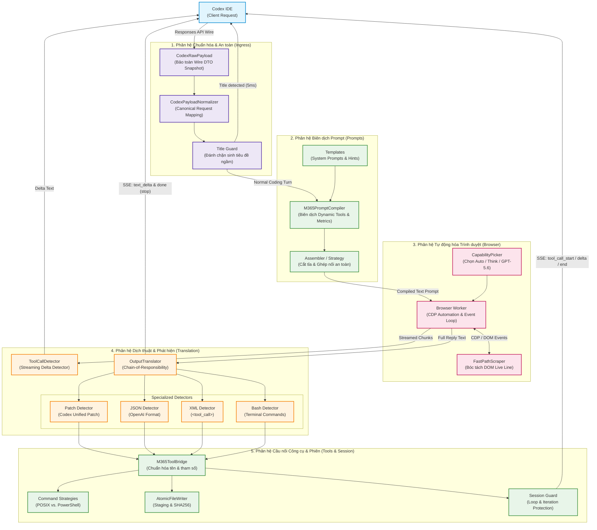
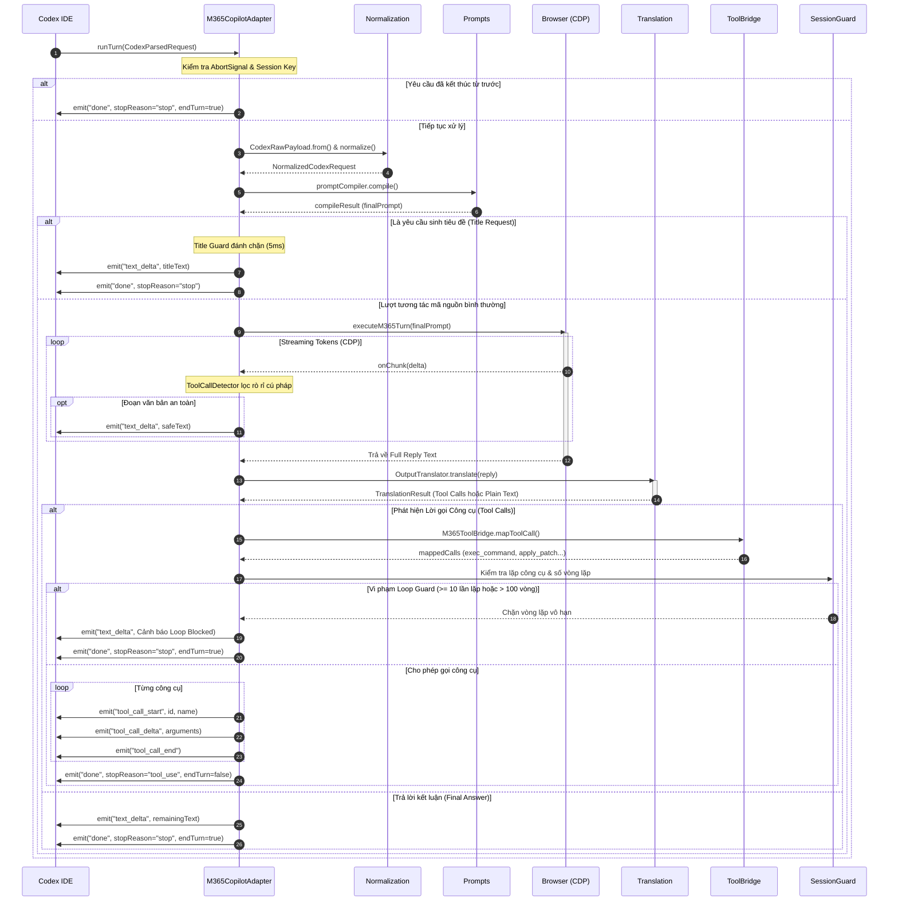
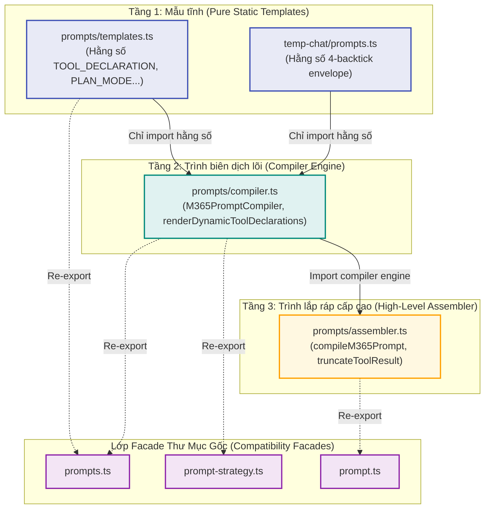

# Kiến Trúc Microsoft 365 Copilot Adapter (m365-copilot)

> **Tài liệu kiến trúc kỹ thuật chính thức**  
> **Phiên bản:** 2.1 (XML Response Envelope & Cognitive Loop)  
> **Áp dụng cho:** `src/adapters/m365-copilot/`  
> **Trạng thái:** Active / Production-Ready  
> **CI Cycle Gate:** Passed (0 circular dependencies / 71 TypeScript modules)

---

## Mục lục (Table of Contents)

- [1. Tổng quan (Overview)](#1-tổng-quan-overview)
  - [1.1. M365 Copilot Adapter là gì?](#11-m365-copilot-adapter-là-gì)
  - [1.2. Vai trò trong hệ sinh thái codex-chatgpt-web](#12-vai-trò-trong-hệ-sinh-thái-codex-chatgpt-web)
  - [1.3. Các năng lực cốt lõi (Key Capabilities)](#13-các-năng-lực-cốt-lõi-key-capabilities)
- [2. Kiến trúc tổng quan (High-Level Architecture)](#2-kiến-trúc-tổng-quan-high-level-architecture)
  - [2.1. Sơ đồ luồng xử lý cấp cao (Mermaid Architecture Diagram)](#21-sơ-đồ-luồng-xử-lý-cấp-cao-mermaid-architecture-diagram)
  - [2.2. Bản đồ cấu trúc thư mục (Directory Structure Map)](#22-bản-đồ-cấu-trúc-thư-mục-directory-structure-map)
- [3. Trách nhiệm các phân hệ (Module Responsibilities)](#3-trách-nhiệm-các-phân-hệ-module-responsibilities)
  - [3.1. Phân hệ session (Session Management & Loop Guard)](#31-phân-hệ-session-session-management--loop-guard)
  - [3.2. Phân hệ guards (Security & Optimization Guards)](#32-phân-hệ-guards-security--optimization-guards)
  - [3.3. Phân hệ normalization (Ingress Parsing & Canonical Domain)](#33-phân-hệ-normalization-ingress-parsing--canonical-domain)
  - [3.4. Phân hệ prompts (Prompt Engineering & Compilation)](#34-phân-hệ-prompts-prompt-engineering--compilation)
  - [3.5. Phân hệ browser (Automation & CDP Streaming)](#35-phân-hệ-browser-automation--cdp-streaming)
  - [3.6. Phân hệ translation (Detectors & Protocol Translation)](#36-phân-hệ-translation-detectors--protocol-translation)
  - [3.7. Phân hệ tools (Tool Bridge & OS Execution Strategies)](#37-phân-hệ-tools-tool-bridge--os-execution-strategies)
  - [3.8. Phân hệ harness (Autonomous Agent Evaluation Loop)](#38-phân-hệ-harness-autonomous-agent-evaluation-loop)
  - [3.9. Phân hệ temp-chat (Stateless Forwarding & Fast-Path Scraper)](#39-phân-hệ-temp-chat-stateless-forwarding--fast-path-scraper)
- [4. Vòng đời yêu cầu (Request Lifecycle)](#4-vòng-đời-yêu-cầu-request-lifecycle)
  - [4.1. Chi tiết 12 giai đoạn xử lý](#41-chi-tiết-12-giai-đoạn-xử-lý)
  - [4.2. Sơ đồ tuần tự tương tác (Sequence Diagram)](#42-sơ-đồ-tuần-tự-tương-tác-sequence-diagram)
- [5. Quy tắc phụ thuộc (Dependency Rules)](#5-quy-tắc-phụ-thuộc-dependency-rules)
  - [5.1. Phụ thuộc hợp lệ (Allowed Dependencies)](#51-phụ-thuộc-hợp-lệ-allowed-dependencies)
  - [5.2. Phụ thuộc bị nghiêm cấm (Forbidden Dependencies)](#52-phụ-thuộc-bị-nghiêm-cấm-forbidden-dependencies)
  - [5.3. Ví dụ đối chiếu Import Đúng vs. Import Sai](#53-ví-dụ-đối-chiếu-import-đúng-vs-import-sai)
- [6. Lớp tương thích ngược (Backward Compatibility Layer)](#6-lớp-tương-thích-ngược-backward-compatibility-layer)
  - [6.1. Chiến lược Facade Re-export](#61-chiến-lược-facade-re-export)
  - [6.2. Danh mục các Facade Files tại thư mục gốc](#62-danh-mục-các-facade-files-tại-thư-mục-gốc)
  - [6.3. Cam kết không phá vỡ hợp đồng (Zero-Breakage Contract)](#63-cam-kết-không-phá-vỡ-hợp-đồng-zero-breakage-contract)
- [7. Ngăn ngừa phụ thuộc vòng (Circular Dependency Prevention)](#7-ngăn-ngừa-phụ-thuộc-vòng-circular-dependency-prevention)
  - [7.1. Bài toán chu kỳ trong quá khứ](#71-bài-toán-chu-kỳ-trong-quá-khứ)
  - [7.2. Giải pháp phân tầng 3 lớp (Three-Tier Prompt Hierarchy)](#72-giải-pháp-phân-tầng-3-lớp-three-tier-prompt-hierarchy)
  - [7.3. Quy tắc cốt lõi để không tái phát chu kỳ](#73-quy-tắc-cốt-lõi-để-không-tái-phát-chu-kỳ)
- [8. Danh mục Public API (Public API Inventory)](#8-danh-mục-public-api-public-api-inventory)
- [9. Lộ trình nợ kỹ thuật (Technical Debt Roadmap)](#9-lộ-trình-nợ-kỹ-thuật-technical-debt-roadmap)
  - [9.1. Phân rã browser-worker.ts](#91-phân-rã-browser-workerts)
  - [9.2. Phân rã translation/detectors (✅ COMPLETED)](#92-phân-rã-translationdetectors--completed)
  - [9.3. Cổng kiểm soát CI tự động (CI Dependency Gate)](#93-cổng-kiểm-soát-ci-tự-động-ci-dependency-gate)
- [10. Các nguyên lý kiến trúc cốt lõi (Architecture Principles)](#10-các-nguyên-lý-kiến-trúc-cốt-lõi-architecture-principles)
- [11. Hồ sơ quyết định kiến trúc (Architecture Decision Records - ADR)](#11-hồ-sơ-quyết-định-kiến-trúc-architecture-decision-records---adr)
  - [ADR-001: Session tách khỏi Guards](#adr-001-session-tách-khỏi-guards)
  - [ADR-002: Prompt Three-Tier Hierarchy](#adr-002-prompt-three-tier-hierarchy)
  - [ADR-003: Root Facade Compatibility Layer](#adr-003-root-facade-compatibility-layer)
- [12. Quy chế duy trì tài liệu (Documentation Maintenance Policy)](#12-quy-chế-duy-trì-tài-liệu-documentation-maintenance-policy)
  - [12.1. Vị thế Architecture Source of Truth](#121-vị-thế-architecture-source-of-truth)
  - [12.2. Các biến động bắt buộc phải cập nhật tài liệu](#122-các-biến-động-bắt-buộc-phải-cập-nhật-tài-liệu)
  - [12.3. Quy tắc kiểm duyệt PR (PR Enforcement Rule)](#123-quy-tắc-kiểm-duyệt-pr-pr-enforcement-rule)
  - [12.4. Thứ tự ưu tiên chân lý (Source of Truth Priority)](#124-thứ-tự-ưu-tiên-chân-lý-source-of-truth-priority)
- [13. Hướng dẫn mở rộng tính năng (Feature Extension Guides)](#13-hướng-dẫn-mở-rộng-tính-năng-feature-extension-guides)
  - [13.1. Thêm Tool Detector mới (Add New Tool Detector)](#131-thêm-tool-detector-mới-add-new-tool-detector)
  - [13.2. Thêm Capability Mode mới (Add New Capability Mode)](#132-thêm-capability-mode-mới-add-new-capability-mode)
  - [13.3. Thêm ánh xạ Tool mới (Add New Tool Mapping)](#133-thêm-ánh-xạ-tool-mới-add-new-tool-mapping)
  - [13.4. Thêm Subsystem mới (Add New Subsystem Checklist)](#134-thêm-subsystem-mới-add-new-subsystem-checklist)

---

## 1. Tổng quan (Overview)

### 1.1. M365 Copilot Adapter là gì?

`M365CopilotAdapter` là adapter cầu nối cấp doanh nghiệp chịu trách nhiệm tích hợp môi trường lập trình **Codex IDE** (thông qua Responses API) với dịch vụ **Microsoft 365 Copilot** (chạy trên phiên bản web nhúng của ứng dụng Desktop Launcher).

Mô hình Microsoft 365 Copilot vốn không cung cấp OpenAI Function Calling native ra ngoài Internet và chạy bên trong trình duyệt doanh nghiệp được bảo mật nghiêm ngặt. Adapter này đóng vai trò như một **Agent Runtime Bridge**: tiếp nhận yêu cầu từ Codex, chuẩn hóa dữ liệu, biên dịch prompt đặc thù, tự động hóa tương tác qua Chrome DevTools Protocol (CDP), thu nhận phản hồi streaming và dịch ngược ngôn ngữ tự nhiên/mã lệnh thành các cuộc gọi công cụ (Tool Calls) chuẩn OpenAI để Codex IDE thực thi trực tiếp trên máy người dùng.

### 1.2. Vai trò trong hệ sinh thái codex-chatgpt-web

Trong hệ thống `codex-chatgpt-web`, adapter thực hiện nhiệm vụ:
1. **Provider Impl:** Đóng vai trò là một implementation của interface `ProviderAdapter` (tương đương với `chatgpt-web`).
2. **Protocol Adapter:** Chuyển đổi định dạng raw JSON phong phú từ Codex IDE (`input`, `tools`, `client_metadata`) thành chỉ thị ngôn ngữ tự nhiên mà Copilot hiểu được.
3. **Out-of-Process Execution Bridge:** Biến M365 Copilot thành một Autonomous Coding Agent thực thụ có khả năng duyệt file, đọc mã nguồn, chạy lệnh terminal, áp dụng patch vi phân và báo cáo tiến độ.

```text
┌──────────────┐       Responses API (HTTP POST)       ┌────────────────────────┐
│  Codex IDE   │ ────────────────────────────────────> │  codex-chatgpt-web     │
│  (Client)    │ <──────────────────────────────────── │  (Bridge Server)       │
└──────────────┘           SSE Events (Tool/Delta)     └───────────┬────────────┘
                                                                   │
                                                                   ▼
                                                       ┌────────────────────────┐
                                                       │   M365CopilotAdapter   │
                                                       │ (src/adapters/m365...) │
                                                       └───────────┬────────────┘
                                                                   │ Playwright CDP
                                                                   ▼
                                                       ┌────────────────────────┐
                                                       │ Launcher WebContents   │
                                                       │ (M365 Copilot Web UI)  │
                                                       └────────────────────────┘
```

### 1.3. Các năng lực cốt lõi (Key Capabilities)

- **Stateful Session (Incremental Roundtrip):** Giữ nguyên ngữ cảnh phiên trò chuyện Copilot; mỗi turn kế tiếp chỉ gửi delta lời nhắc và kết quả công cụ mới (tiết kiệm đến 95% token tiêu thụ). Adapter không còn hỗ trợ Temporary Chat Per Request.
- **Fast-Path Streaming Scraper:** Trích xuất streaming text trực tiếp từ Scriptor Code Preview DOM qua `[data-line-index]`, không qua thư viện Turndown, cho độ trễ chỉ vài mili-giây và bảo toàn 100% định dạng code.
- **Zero-Latency Title Guard:** Đánh chặn các yêu cầu sinh tiêu đề ngầm từ Codex IDE và trả lời tức thì sau 5ms, giải phóng 100% tải browser cho tác vụ này.
- **XML Response Envelope:** Yêu cầu phản hồi của mô hình nằm trong phần tử gốc ``, với phần suy luận `<thought>`, nội dung Markdown và thao tác công cụ được phân tách rõ ràng.
- **Unified Multi-Grammar Tool Translation:** Phát hiện và chuyển ngữ Codex Unified Patch, JSON Schema, XML `<tool_call>`, XML `<custom_tool_call>` và câu lệnh shell/bash trực tiếp.
- **Cognitive Loop Evaluation:** Đánh giá từng lượt phản hồi dựa trên mức tuân thủ `<thought>`, độ rõ ràng của phần diễn giải, tỷ lệ thực thi công cụ thành công và trạng thái hoàn thành của phiên.
- **Loop & Recursion Guard:** Phát hiện và ngắt các chu kỳ lặp lại công cụ giống hệt nhau (ngưỡng 10 lần) hoặc số vòng lặp tối đa trong phiên (ngưỡng 100 vòng) để bảo vệ tài nguyên người dùng.
- **Cross-Platform OS Shell Strategies:** Tự động điều chỉnh cú pháp chạy lệnh giữa môi trường POSIX (Linux/macOS) và Windows PowerShell.
- **Atomic File Staging:** Hỗ trợ tạo và sửa file dung lượng lớn vượt giới hạn dòng lệnh hệ điều hành thông qua file staging và kiểm tra băm SHA256 an toàn.

---

## 2. Kiến trúc tổng quan (High-Level Architecture)

### 2.1. Sơ đồ luồng xử lý cấp cao (Mermaid Architecture Diagram)

Kiến trúc phân rã thành một chuỗi đường ống dẫn dữ liệu đơn hướng (Unidirectional Pipeline), phân tách ranh giới rõ ràng giữa Ingress, Prompting, Automation, Egress Translation và Execution:



### 2.2. Bản đồ cấu trúc thư mục (Directory Structure Map)

Sau đợt tái cấu trúc kiến trúc phân hệ modular, cấu trúc thư mục của `src/adapters/m365-copilot/` được tổ chức như sau:

```text
src/adapters/m365-copilot/
├── index.ts                         # Entry point chính của Adapter (triển khai ProviderAdapter)
│
├── session/                         # [Subsystem 1] Quản lý trạng thái phiên và chống vòng lặp
│   ├── index.ts                     # Explicit public exports của session
│   ├── conversation-state.ts        # Interface ConversationGuardState
│   └── conversation-guard.ts        # Map in-memory, TTL cleaner, tool fingerprinting
│
├── guards/                          # [Subsystem 2] Các bộ bảo vệ ngắt sớm và an toàn
│   ├── index.ts                     # Explicit public exports của guards
│   └── title-guard.ts               # Nhận diện request sinh title và sinh câu trả lời trong 5ms
│
├── normalization/                   # [Subsystem 3] Chuẩn hóa Ingress payload và Canonical Model
│   ├── index.ts                     # Explicit public exports của normalization
│   ├── canonical-types.ts           # Canonical Domain Types (NormalizedCodexRequest, Tools)
│   ├── codex-raw-payload.ts         # CodexRawPayload, CodexWireParser bảo toàn snapshot thô
│   └── codex-normalizer.ts          # CodexPayloadNormalizer trích xuất và lọc tools, messages
│
├── prompts/                         # [Subsystem 4] Kỹ thuật Prompt và biên dịch ngữ cảnh
│   ├── index.ts                     # Explicit public exports của prompts
│   ├── templates.ts                 # Hằng số template prompt (TOOL_DECLARATION, PLAN_MODE...)
│   ├── compiler.ts                  # M365PromptCompiler, UNIFIED_TOOL_PROTOCOL, render dynamic tools
│   └── assembler.ts                 # compileM365Prompt cấp cao, truncateToolResult
│
├── browser/                         # [Subsystem 5] Tự động hóa trình duyệt qua Playwright CDP
│   ├── index.ts                     # Explicit public exports của browser
│   ├── capability-picker.ts         # Điều khiển UI chọn Model (Auto, Think, GPT-5.6)
│   └── browser-worker.ts            # Quản lý vòng lặp CDP, gửi tin nhắn, theo dõi DOM streaming
│
├── translation/                     # [Subsystem 6] Phân tích ngữ pháp và dịch thuật đầu ra
│   ├── index.ts                     # Explicit public exports của translation
│   ├── output-translator.ts         # M365OutputTranslator điều phối Chain of Responsibility
│   ├── toolcall-detector.ts         # M365ToolCallDetector xử lý streaming chunk delta
│   ├── semantic-detector.ts         # Trích xuất Markdown blocks ngữ nghĩa từ HTML
│   ├── bash-translator.ts           # Dịch lệnh shell tự do sang Tool Call chính thức
│   ├── html-to-markdown.ts          # Bộ chuyển đổi HTML DOM thành Markdown sạch
│   ├── markdown.ts                  # Facade re-exporting html-to-markdown & semantic-detector
│   ├── log-masker.ts                # Che giấu dữ liệu nhạy cảm / payload lớn khi in log
│   └── detectors/                   # Các Detector chuyên biệt hóa theo nguyên lý SRP/OCP
│       ├── index.ts                 # Explicit exports của detectors
│       ├── types.ts                 # Interface IToolCallDetector, OpenAIToolCall, Diagnostics
│       ├── sanitizers.ts            # Hàm làm sạch chuỗi, cân bằng ngoặc JSON, tách code fence
│       ├── patch-detector.ts        # Detector nhận diện Codex Unified Patch
│       ├── json-detector.ts         # Detector nhận diện JSON tool call
│       ├── xml-detector.ts          # Detector nhận diện XML <tool_call>
│       └── bash-detector.ts         # Detector nhận diện câu lệnh bash/terminal
│
├── tools/                           # [Subsystem 7] Cầu nối công cụ và chiến lược hệ điều hành
│   ├── index.ts                     # Explicit public exports của tools
│   ├── tool-bridge.ts               # M365ToolBridge ánh xạ tham số tool cho client Codex
│   ├── atomic-file-writer.ts        # Cơ chế ghi file phân đoạn (staging) kèm băm SHA256
│   └── command-strategies/          # Chiến lược sinh lệnh shell đa nền tảng
│       ├── index.ts                 # Explicit exports của command-strategies
│       ├── types.ts                 # Interface PlatformCommandStrategy, Options
│       ├── base.ts                  # Abstract BaseCommandStrategy
│       ├── posix.ts                 # PosixCommandStrategy (bash / zsh / sh)
│       ├── powershell.ts            # PowerShellCommandStrategy (Windows powershell.exe)
│       └── resolver.ts              # CommandStrategyResolver tự động nhận diện shell
│
├── harness/                         # [Subsystem 8] Khung kiểm thử và đánh giá Agent độc lập
│   ├── index.ts                     # Explicit public exports của harness
│   └── agent-loop.ts                # M365AgentLoop, LocalToolExecutor chạy benchmark độc lập
│
├── temp-chat/                       # [Subsystem 9] Helper transport và Live DOM scraper
│   ├── index.ts                     # Explicit public exports của transport helpers
│   ├── prompts.ts                   # Chỉ thị bao bọc bắt buộc 4-backtick ````markdown
│   ├── stripCodeFence.ts            # stripOuterCodeFence bóc tách code block ngoài cùng
│   ├── fastPathScraper.ts           # FastPathStreamBuffer trích xuất LIVE DOM [data-line-index]
│
├── strategies/                      # Thư mục Facade re-export cho command-strategies
│   ├── index.ts                     # Re-export từ tools/command-strategies
│   ├── types.ts / base.ts / ...     # Re-export các thành phần con tương ứng
│
└── [Root Facade Compatibility Files] # 15 facade files tại thư mục gốc bảo toàn 100% API cũ
    ├── agent-loop.ts                # -> ./harness/agent-loop
    ├── atomic-file-writer.ts        # -> ./tools/atomic-file-writer
    ├── bash-translator.ts           # -> ./translation/bash-translator
    ├── browser-worker.ts            # -> ./browser/browser-worker
    ├── canonical-types.ts           # -> ./normalization/canonical-types
    ├── capability-picker.ts         # -> ./browser/capability-picker
    ├── codex-normalizer.ts          # -> ./normalization/codex-normalizer
    ├── codex-raw-payload.ts         # -> ./normalization/codex-raw-payload
    ├── markdown.ts                  # -> ./translation/markdown
    ├── output-translator.ts         # -> ./translation/output-translator
    ├── prompt-strategy.ts           # -> ./prompts/compiler
    ├── prompt.ts                    # -> ./prompts/index
    ├── prompts.ts                   # -> ./prompts/templates & compiler
    ├── title-guard.ts               # -> ./guards/title-guard
    └── tool-bridge.ts               # -> ./tools/tool-bridge
```

---

## 3. Trách nhiệm các phân hệ (Module Responsibilities)

### 3.1. Phân hệ `session` (Session Management & Loop Guard)

- **Nhiệm vụ:**
  - Quản lý trạng thái vòng đời của phiên hội thoại (`conversationKey`) trên bộ nhớ trong.
  - Ngăn ngừa hiện tượng vô hạn chu kỳ lặp lại công cụ giống hệt nhau (Identical Tool Calls) và vượt ngưỡng số lần gọi công cụ (Max Tool Iterations).
  - Tự động dọn dẹp các phiên hết hạn dựa trên cơ chế TTL (Time-To-Live).
  - Xác thực xem tin nhắn cuối cùng trong lịch sử có phải là câu trả lời kết luận (`assistant` final answer) hay không để ngắt lượt sớm, tránh gửi prompt dư thừa.
- **Public Classes / Functions / Types:**
  - `interface ConversationGuardState`: Lưu trữ `toolIterations`, `lastToolFingerprint`, `identicalToolCount`, `updatedAt`.
  - `const conversationGuard`: Bảng băm `Map<string, ConversationGuardState>`.
  - `cleanExpiredConversationGuards(now?: number)`: Dọn dẹp các session quá hạn (mặc định TTL 15 phút, kích thước tối đa 1000 phần tử).
  - `stableToolFingerprint(name, rawArgs)` & `stableSortValue(value)`: Tạo chữ ký nhận diện công cụ độc lập với thứ tự thuộc tính trong JSON.
  - `isAssistantFinalAnswer(msg)`: Kiểm tra tin nhắn kết thúc của assistant.
  - `isToolCallPart(part)`: Nhận diện cấu trúc gọi công cụ trong các biến thể schema.
  - `MAX_TOOL_ITERATIONS = 100`, `MAX_IDENTICAL_TOOL_CALLS = 10`, `GUARD_TTL_MS = 900,000`.
- **Được phép phụ thuộc:**
  - `../../types` (Kiểu `CodexMessage`).
  - Tuyệt đối **không** phụ thuộc vào `browser`, `prompts`, hay `tools`.

### 3.2. Phân hệ `guards` (Security & Optimization Guards)

- **Nhiệm vụ:**
  - Cung cấp các chốt chặn kiểm tra nhanh (Fast Guards) ở tầng vào (Ingress) nhằm tối ưu hóa thời gian phản hồi và tiết kiệm tài nguyên trình duyệt.
  - Đánh chặn các yêu cầu sinh tiêu đề ngầm từ Codex IDE (thường sinh ra tự động khi người dùng tạo phiên mới) và phản hồi tức thì với cấu trúc tiêu đề chuẩn mà không cần gửi tới Copilot.
- **Public Classes / Functions:**
  - `isTitleRequest(parsed: CodexParsedRequest, compiledPrompt: string): boolean`: Kiểm tra từ khóa sinh tiêu đề trong prompt hoặc systemPrompt.
  - `generateTitleResponse(compiledPrompt: string): string`: Trích xuất chủ đề lập trình và trả về văn bản `title: M365 - ... \n description: ...`.
- **Được phép phụ thuộc:**
  - `../../types` (`CodexParsedRequest`).
  - Hoàn toàn độc lập, là các pure function không gây side-effect.

### 3.3. Phân hệ `normalization` (Ingress Parsing & Canonical Domain)

- **Nhiệm vụ:**
  - Bảo vệ adapter khỏi sự thay đổi bất ngờ trong wire format của Codex Responses API.
  - Lưu trữ bản sao nguyên trạng (Deep Snapshot) 1:1 của Raw JSON Request từ client.
  - Chuyển đổi và chuẩn hóa toàn diện sang một mô hình nghiệp vụ duy nhất: `NormalizedCodexRequest`.
  - Làm sạch danh sách công cụ: bảo toàn namespace, lọc bỏ prefix mặc định `functions.` để tránh làm hỏng cú pháp gọi công cụ downstream, xác định các công cụ lập trình tích cực (`activeCodingTools`).
  - Phát hiện chính xác chế độ hợp tác (`collaborationMode` là `"default"` hay `"plan"`).
- **Public Classes / Functions / Types:**
  - `class CodexRawPayload`: Container bất biến lưu giữ snapshot thô `_rawSnapshot`, hỗ trợ các getter `getThreadId()`, `getTurnId()`, `getClientMetadata()`, `getTools()`, `getInput()`.
  - `class CodexWireParser`: Ingress structural guard kiểm tra tính toàn vẹn kiểu dữ liệu trước khi tạo đối tượng.
  - `class CodexPayloadNormalizer`: Bộ chuẩn hóa chính, cung cấp:
    - `normalize(rawPayload): NormalizedCodexRequest`
    - `extractTools(rawPayload): NormalizedTool[]`
    - `filterActiveCodingTools(tools): NormalizedTool[]`
    - `detectCollaborationMode(rawPayload): "default" | "plan"`
  - `interface NormalizedCodexRequest`, `NormalizedTool`, `NormalizedToolResult`, `NormalizedTurn`, `NormalizedExecutionPolicy`.
- **Được phép phụ thuộc:**
  - Phụ thuộc nội bộ giữa `canonical-types.ts`, `codex-raw-payload.ts` và `codex-normalizer.ts`.
  - Không phụ thuộc vào `prompts`, `browser`, hay `translation`.

### 3.4. Phân hệ `prompts` (Prompt Engineering & Compilation)

- **Nhiệm vụ:**
  - Chuyển đổi `NormalizedCodexRequest` thành câu lệnh prompt hoàn chỉnh tối ưu cho mô hình Microsoft 365 Copilot.
  - Quản lý các mẫu system prompt, hướng dẫn giao thức gọi tool qua văn bản (`Text Interaction Protocol`).
  - Xử lý phiên stateful: biên dịch đầy đủ ngữ cảnh ở lượt đầu, sau đó chỉ sinh delta lời nhắc, danh sách công cụ động và kết quả công cụ vừa nhận để giảm 95% token tiêu thụ.
  - Tự động cắt tỉa nội dung công cụ (`truncateToolResult` ngưỡng 8,000 ký tự) và prompt tổng (`MAX_M365_PROMPT_CHARS = 95,000` ký tự) để ngăn chặn tràn bộ nhớ hoặc từ chối dịch vụ từ Copilot.
  - Đo đạc độ dài từng section (`calculatePromptMetrics`) và ghi log kiểm toán (`logPromptAudit`).
- **Public Classes / Functions / Constants:**
  - `class M365PromptCompiler` & singleton `promptCompiler`.
  - `compileM365Prompt(parsed, isNewConversation): string`.
  - `truncateToolResult(content, maxChars): string`.
  - `renderDynamicToolDeclarations(tools: NormalizedTool[]): string`.
  - Hằng số: `TOOL_DECLARATION_PROMPT`, `PLAN_MODE_PROMPT`, `IMPLEMENT_PLAN_PROMPT`, `TOOL_REMINDER_PROMPT`, `UNIFIED_TOOL_PROTOCOL`, `CANONICAL_TOOL_EXAMPLES`.
- **Được phép phụ thuộc:**
  - `../normalization/canonical-types`
  - `../normalization/codex-raw-payload`
  - `../normalization/codex-normalizer`
  - `../temp-chat/prompts` (chỉ phụ thuộc vào hằng số chỉ thị định dạng 4-backtick)

### 3.5. Phân hệ `browser` (Automation & CDP Streaming)

- **Nhiệm vụ:**
  - Tự động hóa trình duyệt web nhúng (WebContentsView của Launcher) qua kết nối Playwright Chrome DevTools Protocol (CDP).
  - Tự động chuyển đổi chế độ suy nghĩ của model thông qua giao diện UI (`M365CapabilityPicker`).
  - Bơm prompt vào trình soạn thảo Copilot (hỗ trợ cả ProseMirror editor lẫn textarea fallback).
  - Lắng nghe sự kiện bàn phím và nút gửi để khởi kích lượt phản hồi.
  - Theo dõi quá trình sinh phản hồi DOM theo thời gian thực (DOM mutation polling & streaming delta) và đẩy sự kiện về adapter.
  - Báo cáo trạng thái vòng đời lượt (`start`, `done`, `error`) về cho Launcher Host qua `notifyLauncherTurn`.
- **Public Classes / Functions / Types:**
  - `executeM365Turn(promptText: string, options: M365BrowserRunOptions): Promise<string>`
  - `class M365CapabilityPicker` & `ensureM365CapabilityMode(page, targetMode)`
  - `interface M365BrowserRunOptions`, `M365TurnResult`, `M365CapabilityMode`.
- **Được phép phụ thuộc:**
  - `../../../launcher-browser-host`
  - `../translation/semantic-detector`
  - `../temp-chat/fastPathScraper`
  - `../observability/*`
  - `../../../m365-models`

### 3.6. Phân hệ `translation` (Detectors & Protocol Translation)

- **Nhiệm vụ:**
  - Phân tích cú pháp văn bản tự nhiên được sinh ra từ Copilot để bóc tách thành các lời gọi công cụ chuẩn của OpenAI.
  - Áp dụng mẫu thiết kế **Chain of Responsibility**: chạy tuần tự qua các detector theo thứ tự ưu tiên xác định nhằm tránh nhận diện nhầm lẫn:
    1. `PatchToolCallDetector` (Độ ưu tiên 0): Nhận diện cú pháp chỉnh sửa mã nguồn Codex Unified Patch (`*** Begin Patch ... *** End Patch`).
    2. `JsonToolCallDetector` (Độ ưu tiên 1): Nhận diện khối gọi hàm chuẩn JSON (`{"name": "...", "arguments": {...}}`).
    3. `XmlToolCallDetector` (Độ ưu tiên 2): Nhận diện thẻ XML bọc `<tool_call>...</tool_call>`.
    4. `BashCommandDetector` (Độ ưu tiên 3): Nhận diện các câu lệnh dòng lệnh tự do (`ls`, `cat`, `grep`, `git status`) và dịch sang công cụ IDE tương ứng.
  - Cung cấp bộ phát hiện streaming (`M365ToolCallDetector`) để ngăn chặn việc rò rỉ cú pháp raw tool call ra ngoài giao diện chat trong lúc đang streaming text cho người dùng.
  - Làm sạch Markdown và chuyển đổi HTML DOM thành định dạng Markdown chuẩn.
- **Public Classes / Functions / Types:**
  - `class M365OutputTranslator`: Lớp điều phối trung tâm.
  - `class M365ToolCallDetector`: Bộ phát hiện tool call dạng streaming chunk.
  - `class BashCommandTranslator`: Chuyển đổi lệnh bash thành function call.
  - Các detector con trong `translation/detectors/`: `PatchToolCallDetector`, `JsonToolCallDetector`, `XmlToolCallDetector`, `BashCommandDetector`.
  - Các tiện ích: `stripOuterCodeFence`, `normalizeToolName`, `balanceJsonBraces`, `cleanJsonPayload`, `normalizePatchEnvelope`, `maskArgumentsForLog`, `m365HtmlToMarkdown`.
- **Được phép phụ thuộc:**
  - Chỉ phụ thuộc vào các tiện ích nội bộ của phân hệ `translation/`.
  - Hoàn toàn độc lập với `browser` và `prompts`.

### 3.7. Phân hệ `tools` (Tool Bridge & OS Execution Strategies)

- **Nhiệm vụ:**
  - Ánh xạ từ các lời gọi công cụ do mô hình sinh ra sang danh sách công cụ thực tế mà client Codex đã khai báo trong request (`M365ToolBridge.mapToolCall`).
  - Áp dụng mẫu thiết kế **Strategy Pattern** cho lệnh thực thi: tự động sinh lệnh shell tương thích hoàn hảo giữa môi trường POSIX (bash/zsh trên macOS/Linux) và PowerShell trên Windows.
  - Giải quyết triệt để nguy cơ tràn độ dài dòng lệnh (`ARG_MAX` trên POSIX hoặc 8191 ký tự trên Windows) khi ghi file thông qua cơ chế phân đoạn file nguyên tử (`AtomicFileWriter`).
  - Chuẩn hóa nội dung mã nguồn (`normalizeFileContent`): bảo toàn tuyệt đối 100% byte-for-byte đối với Markdown (`.md`), YAML, JSON, TXT; đồng thời khử dấu escape vô ý đối với mã nguồn TypeScript/JavaScript.
- **Public Classes / Functions / Types:**
  - `class M365ToolBridge` & `normalizeFileContent(content, options)`
  - `class AtomicFileWriter`, `defaultAtomicFileWriter`, `computeSha256`, `createStagingFile`
  - `class PosixCommandStrategy`, `class PowerShellCommandStrategy`, `class CommandStrategyResolver`
  - `interface PlatformCommandStrategy`, `M365RawToolCall`, `M365MappedToolCall`.
- **Được phép phụ thuộc:**
  - `node:fs`, `node:path`, `node:crypto`, `node:os`.
  - `../../../types` (`CodexTool`).
  - Tuyệt đối **không** phụ thuộc vào `browser` hay `prompts`.

### 3.8. Phân hệ `harness` (Autonomous Agent Evaluation Loop)

- **Nhiệm vụ:**
  - Cung cấp một môi trường runtime độc lập (Standalone Test Harness) để kiểm thử, đánh giá chuẩn (benchmarking) và đo lường khả năng lập trình tự động của M365 Copilot mà không phụ thuộc vào toàn bộ tiến trình Codex IDE hay Network Server.
  - Triển khai vòng lặp tự trị đa lượt: Model -> Output Translation -> Local Tool Execution -> Truncate -> Model.
  - Đánh giá Cognitive Loop theo từng lượt và toàn phiên thông qua mức tuân thủ giao thức, độ rõ ràng của phần diễn giải, tỷ lệ thành công của công cụ và trạng thái hoàn thành.
- **Public Classes / Functions / Types:**
  - `class M365AgentLoop`: Vòng lặp điều phối chính.
  - `class LocalToolExecutor`: Trình thực thi công cụ cục bộ mô phỏng trực tiếp trên đĩa (hỗ trợ `read_file`, `list_dir`, `grep_code`, `git_status`, `git_diff`, `run_command`, `write_file`).
  - `class CognitiveEvaluator`: Bộ đánh giá cấu trúc và hiệu quả nhận thức của từng lượt phản hồi và toàn bộ phiên.
  - `interface IToolExecutor`, `IM365ModelClient`, `AgentLoopOptions`, `AgentLoopRetryOptions`, `AgentLoopResult`.
  - `type CognitiveTurnEvaluation`, `CognitiveSessionMetrics`.
- **Được phép phụ thuộc:**
  - `../translation/output-translator`
  - `../prompts/assembler`
  - `../tools/atomic-file-writer`
  - Tách biệt khỏi production server loop của `index.ts`.

### 3.9. Phân hệ `temp-chat` (Transport Helpers & Fast-Path Scraper)

- **Nhiệm vụ:**
  - Cung cấp các helper transport dùng chung cho phiên M365 stateful theo giao thức XML Response Envelope.
  - Quy định `<thought>` cho phần phân tích, `<tool_call>` cho lời gọi công cụ dạng JSON và `<custom_tool_call name="apply_patch">` cho Unified Patch dạng freeform.
  - Cung cấp thuật toán `FastPathStreamBuffer`: trích xuất tức thì các dòng code live DOM từ thẻ `[data-line-index]`, giải quyết triệt để độ trễ do ảo hóa DOM và bỏ qua quá trình parse HTML nặng nề của Turndown.
  - Cung cấp hàm `stripOuterCodeFence` để bóc bỏ an toàn lớp 4-backtick ngoài cùng mà vẫn giữ nguyên vẹn các code fence con 3-backtick bên trong mã nguồn người dùng.
- **Public Classes / Functions:**
  - `extractFastPathFromDom(contentEl: HTMLElement): FastPathExtraction | null`
  - `class FastPathStreamBuffer`
  - `stripOuterCodeFence(raw: string): string`
  - Hằng số và prompt builder cho XML Response Envelope, tool call JSON và Unified Patch freeform.
- **Được phép phụ thuộc:** Không phụ thuộc vào browser, tool execution hoặc prompt compiler.

---

## 4. Vòng đời yêu cầu (Request Lifecycle)

### 4.1. Chi tiết 12 giai đoạn xử lý

Vòng đời của một request từ Codex IDE qua `M365CopilotAdapter` diễn ra qua 12 bước tuần tự nghiêm ngặt:

1. **Ingress & Abort Guard:**  
   `runTurn(parsed, incoming, emit)` tiếp nhận `CodexParsedRequest`. Kiểm tra `incoming.abortSignal`. Nếu đã bị hủy trước khi bắt đầu, ném `DOMException("AbortError")` và kết thúc ngay.
2. **Domain Raw Snapshot Ingestion:**  
   Đóng gói parsed request vào domain model `CodexRawPayload.from(parsed._rawBody || parsed)` để lưu giữ deep snapshot toàn vẹn dữ liệu từ wire format.
3. **Session Key Resolution:**
   Xác định `conversationKey` từ HTTP header `x-codex-conversation-key` hoặc metadata `thread_id` để duy trì đúng phiên M365 stateful.
4. **Final Answer Short-Circuit Check:**  
   Gọi `isAssistantFinalAnswer(lastMsg)`. Nếu tin nhắn cuối cùng đã là câu trả lời kết luận của assistant (không có tool call đang chờ, không có input người dùng mới), xóa session guard, phát sự kiện `done` (`stopReason: "stop"`, `endTurn: true`) và hoàn tất lượt ngay.
5. **Canonical Normalization:**  
   Đưa `CodexRawPayload` qua `CodexPayloadNormalizer.normalize()` để sinh ra `NormalizedCodexRequest` với danh sách `activeCodingTools` sạch và chế độ hợp tác chuẩn xác.
6. **Prompt Compilation:**  
   Gọi `promptCompiler.compile({ normalized, parsed, isNewConversation })`. Lượt đầu gửi ngữ cảnh đầy đủ; các lượt tiếp theo trong cùng phiên chỉ gửi lời nhắc delta và trailing tool results mới.
7. **Zero-Latency Title Guard:**  
   Kiểm tra `isTitleRequest(parsed, compiledPrompt)`. Nếu Codex đang ngầm yêu cầu tiêu đề cuộc trò chuyện, gọi `generateTitleResponse()` và phát ngay sự kiện `text_delta` + `done` trong vòng 5ms mà không chạm vào trình duyệt.
8. **Browser Automation via CDP:**  
   Chuyển giao prompt đã biên dịch vào `executeM365Turn(promptToSend, options)`:
   - Đảm bảo model capability đúng trên UI qua `M365CapabilityPicker`.
   - Nhập prompt vào khung chat và kích hoạt phím Enter / nút gửi.
   - Kết nối Playwright CDP lắng nghe Live DOM.
9. **Streaming & Leak Protection:**  
   Trong quá trình Copilot gõ từng ký tự, dữ liệu delta được nạp vào `M365ToolCallDetector.feed(delta)`. Các đoạn text an toàn được phát ngay về client bằng `emit({ type: "text_delta", text })`. Các đoạn bắt đầu có dấu hiệu của tool call (`<tool_call>`, `{"name":`, `*** Begin Patch`) được giữ lại trong bộ đệm để tránh rò rỉ ra màn hình người dùng.
10. **Multi-Grammar Output Translation:**  
    Khi mô hình dừng sinh, chuỗi phản hồi hoàn chỉnh được chuyển vào `M365OutputTranslator.translate(fullContent)`. Bộ dịch chạy qua 4 detector (Patch -> JSON -> XML -> Bash) để trích xuất danh sách `detectedToolCalls`.
11. **Tool Bridge & Infinite Loop Guard:**  
    - Nếu phát hiện thấy công cụ được gọi:
      - Ánh xạ sang công cụ tương thích của client qua `M365ToolBridge.mapToolCall()`.
      - Tính toán chữ ký fingerprint ổn định của các công cụ vừa phát hiện (`stableToolFingerprint`).
      - Cập nhật `conversationGuard`: Nếu phát hiện lặp lại cùng công cụ với cùng đối số liên tiếp $\ge 10$ lần (`MAX_IDENTICAL_TOOL_CALLS`) hoặc số vòng vượt quá $100$ (`MAX_TOOL_ITERATIONS`), phát cảnh báo Markdown nguy cơ lặp vô hạn, giải phóng session và kết thúc lượt an toàn.
      - Nếu an toàn, phát chuỗi sự kiện SSE: `tool_call_start` $\rightarrow$ `tool_call_delta` $\rightarrow$ `tool_call_end` và `done` với `stopReason: "tool_use"` (`endTurn: false`).
12. **Final Text Emission:**  
    - Nếu mô hình không gọi công cụ nào (Final Answer), phát toàn bộ văn bản còn lại và phát sự kiện `done` với `stopReason: "stop"` (`endTurn: true`). Xóa session guard đã hoàn tất.

### 4.2. Sơ đồ tuần tự tương tác (Sequence Diagram)



---

## 5. Quy tắc phụ thuộc (Dependency Rules)

Để bảo đảm tính toàn vẹn của cấu trúc sau đợt tái cấu trúc, mọi lập trình viên khi phát triển tính năng mới bắt buộc phải tuân thủ nghiêm ngặt ma trận quy tắc phụ thuộc dưới đây:

### 5.1. Phụ thuộc hợp lệ (Allowed Dependencies)

| Phân hệ (Source) | Được phép phụ thuộc vào (Allowed Targets) | Ghi chú kiến trúc |
| :--- | :--- | :--- |
| `index.ts` (Root) | Tất cả các phân hệ nội bộ (`session`, `guards`, `normalization`, `prompts`, `browser`, `translation`, `tools`) | Đóng vai trò là Composition Root điều phối luồng. |
| `session` | Chỉ phụ thuộc kiểu `types.ts` (`CodexMessage`). | Phân hệ độc lập, lưu trữ in-memory state. |
| `guards` | Chỉ phụ thuộc kiểu `types.ts` (`CodexParsedRequest`). | Pure function đánh chặn nhanh. |
| `normalization` | Phụ thuộc nội bộ `canonical-types`, `codex-raw-payload`, `codex-normalizer`. | Ranh giới Ingress, không import downstream. |
| `prompts` | `normalization/canonical-types`, `prompts/templates`, `temp-chat/prompts`. | Phân tầng: templates $\rightarrow$ compiler $\rightarrow$ assembler. |
| `browser` | `translation/semantic-detector`, `temp-chat/fastPathScraper`, `browser/capability-picker`. | Kết nối hạ tầng Launcher & DOM scraping. |
| `translation` | Nội bộ `translation/detectors/*`, `log-masker`, `bash-translator`, `html-to-markdown`. | Xử lý chuỗi và ngữ pháp, không gọi I/O ngoài. |
| `tools` | `tools/command-strategies/*`, `tools/atomic-file-writer`, kiểu `types.ts` (`CodexTool`). | Thao tác file staging và sinh script CLI. |
| `harness` | `translation/output-translator`, `prompts/assembler`, `tools/atomic-file-writer`. | Môi trường test cô lập, không ảnh hưởng production. |
| `temp-chat` | `normalization/*`, `prompts/compiler`, `temp-chat/*`. | Phục vụ chế độ Stateless và Live DOM extraction. |

### 5.2. Phụ thuộc bị nghiêm cấm (Forbidden Dependencies)

1. **`tools` $\boldsymbol{\times}$ `browser`:** Phân hệ `tools` và `command-strategies` tuyệt đối không được phụ thuộc vào `browser` hay Playwright context. Logic sinh script hệ điều hành phải hoàn toàn tách rời khỏi việc tự động hóa trình duyệt.
2. **`browser` $\boldsymbol{\times}$ `session internals`:** Phân hệ `browser` không được can thiệp trực tiếp vào `conversationGuard` hay kiểm soát số vòng lặp của session.
3. **`translation` $\boldsymbol{\times}$ `prompts`:** Phân hệ `translation` nhận đầu vào là văn bản thuần túy và xuất ra `OpenAIToolCall`, tuyệt đối không được import ngược lại `M365PromptCompiler` hay `assembler`.
4. **`normalization` $\boldsymbol{\times}$ bất kỳ downstream adapter nào:** `normalization` chỉ phụ thuộc vào chính nó và types. Không bao giờ được import `prompts`, `browser`, `translation` hay `tools`.
5. **`prompts/templates` $\boldsymbol{\times}$ `prompts/compiler`:** Tầng mẫu template chỉ chứa string constant, không bao giờ được import logic từ tầng compiler hoặc assembler.

### 5.3. Ví dụ đối chiếu Import Đúng vs. Import Sai

#### Ví dụ 1: Import trong phân hệ `tools/tool-bridge.ts`
```typescript
// ✅ ĐÚNG: Import từ các phân hệ được phép (command-strategies, atomic-file-writer)
import { CommandStrategyResolver, type PlatformCommandStrategy } from "./command-strategies";
import { AtomicFileWriter, defaultAtomicFileWriter } from "./atomic-file-writer";
import type { CodexTool } from "../../../types";

// ❌ SAI: Nghiêm cấm import từ Browser Worker hoặc CDP
import { executeM365Turn } from "../browser/browser-worker"; // VI PHẠM KIẾN TRÚC!
```

#### Ví dụ 2: Import trong phân hệ `translation/output-translator.ts`
```typescript
// ✅ ĐÚNG: Import từ các specialized detectors cùng phân hệ
import { PatchToolCallDetector, JsonToolCallDetector } from "./detectors";
import { maskArgumentsForLog } from "./log-masker";

// ❌ SAI: Nghiêm cấm import Prompt Compiler vào Translator
import { promptCompiler } from "../prompts/compiler"; // TẠO NGUY CƠ CIRCULAR DEPENDENCY!
```

#### Ví dụ 3: Import trong phân hệ `prompts/templates.ts`
```typescript
// ✅ ĐÚNG: Chỉ khai báo hằng số chuỗi thuần túy
export const TOOL_DECLARATION_PROMPT = `[HỆ THỐNG GIAO TIẾP VĂN BẢN VỚI IDE]...`;

// ❌ SAI: Tuyệt đối không import logic xử lý từ compiler ngược vào template
import { cleanToolDescription } from "./compiler"; // TẠO CIRCULAR DEPENDENCY TRỰC TIẾP!
```

---

## 6. Lớp tương thích ngược (Backward Compatibility Layer)

### 6.1. Chiến lược Facade Re-export

Trong đợt tái cấu trúc, toàn bộ các file monolithic phẳng ở thư mục gốc `src/adapters/m365-copilot/` đã được chuyển vào các thư mục con tương ứng. Tuy nhiên, hàng chục bài kiểm thử đơn vị (`tests/`) và các module bên ngoài vẫn đang import theo đường dẫn cũ (ví dụ: `import { M365OutputTranslator } from "./output-translator"`).

Để bảo đảm **Zero Breaking Changes (100% tương thích ngược)**, dự án áp dụng chiến lược **Facade Re-export**:
- Giữ nguyên tất cả 15 file TypeScript tại thư mục gốc `src/adapters/m365-copilot/`.
- Mỗi file gốc đóng vai trò là một **Facade**: thực hiện re-export toàn bộ kiểu dữ liệu, lớp, hàm và hằng số từ phân hệ con mới bằng cú pháp `export * from "./<subsystem>/<file>"`.
- Bổ sung file `index.ts` ở mỗi thư mục con để kiểm soát chặt chẽ bề mặt API công khai (Explicit Named Exports).

### 6.2. Danh mục các Facade Files tại thư mục gốc

Dưới đây là danh sách toàn bộ các Facade Files tại thư mục gốc và vị trí đích thực tế:

| Facade File gốc | Phân hệ thực tế | Nội dung re-export chính |
| :--- | :--- | :--- |
| `src/adapters/m365-copilot/agent-loop.ts` | `harness/agent-loop.ts` | `M365AgentLoop`, `LocalToolExecutor`, `IToolExecutor` |
| `src/adapters/m365-copilot/atomic-file-writer.ts` | `tools/atomic-file-writer.ts` | `AtomicFileWriter`, `defaultAtomicFileWriter`, `createStagingFile` |
| `src/adapters/m365-copilot/bash-translator.ts` | `translation/bash-translator.ts` | `BashCommandTranslator`, `stripShellPrefix`, các Rules |
| `src/adapters/m365-copilot/browser-worker.ts` | `browser/browser-worker.ts` | `executeM365Turn`, `M365BrowserRunOptions` |
| `src/adapters/m365-copilot/canonical-types.ts` | `normalization/canonical-types.ts` | `NormalizedCodexRequest`, `NormalizedTool`, `NormalizedTurn` |
| `src/adapters/m365-copilot/capability-picker.ts` | `browser/capability-picker.ts` | `M365CapabilityPicker`, `ensureM365CapabilityMode` |
| `src/adapters/m365-copilot/codex-normalizer.ts` | `normalization/codex-normalizer.ts` | `CodexPayloadNormalizer` |
| `src/adapters/m365-copilot/codex-raw-payload.ts` | `normalization/codex-raw-payload.ts` | `CodexRawPayload`, `CodexWireParser` |
| `src/adapters/m365-copilot/markdown.ts` | `translation/markdown.ts` | `m365HtmlToMarkdown`, `M365MarkdownBuffer` |
| `src/adapters/m365-copilot/output-translator.ts` | `translation/output-translator.ts` | `M365OutputTranslator`, các Detectors, `maskArgumentsForLog` |
| `src/adapters/m365-copilot/prompt-strategy.ts` | `prompts/compiler.ts` | `promptCompiler`, `renderDynamicToolDeclarations` |
| `src/adapters/m365-copilot/prompt.ts` | `prompts/index.ts` | Toàn bộ API của `prompts` subsystem |
| `src/adapters/m365-copilot/prompts.ts` | `prompts/templates.ts` & `compiler.ts` | Template constants + `promptCompiler` |
| `src/adapters/m365-copilot/title-guard.ts` | `guards/title-guard.ts` | `isTitleRequest`, `generateTitleResponse` |
| `src/adapters/m365-copilot/tool-bridge.ts` | `tools/tool-bridge.ts` | `M365ToolBridge`, `normalizeFileContent`, strategies |
| `src/adapters/m365-copilot/strategies/*` | `tools/command-strategies/*` | Toàn bộ hệ thống POSIX / PowerShell Strategy |

### 6.3. Cam kết không phá vỡ hợp đồng (Zero-Breakage Contract)

Tính toàn vẹn của Facade được bảo đảm tự động qua bài kiểm tra tích hợp:
- File kiểm thử: [tests/m365-architecture-integrity.test.ts](file:///Users/huytv/IdeaProjects/1.m365-codex/codex-chatgpt-web/tests/m365-architecture-integrity.test.ts)
- Bài test: `"ARCH INTEGRITY: Root Adapter Facade bảo toàn đầy đủ các API công khai"`
- Bất kỳ thay đổi nào làm mất export hoặc thay đổi chữ ký hàm mà không thông qua Facade sẽ lập tức làm rớt CI test.

---

## 7. Ngăn ngừa phụ thuộc vòng (Circular Dependency Prevention)

### 7.1. Bài toán chu kỳ trong quá khứ

Trước đợt tái cấu trúc, module prompt gặp phải lỗi phụ thuộc vòng nghiêm trọng do sự đan xen giữa:
- `prompt.ts`: Định nghĩa prompt builder cũ và re-export.
- `prompts.ts`: Chứa cả template mẫu lẫn import compiler.
- `prompt-strategy.ts`: Vừa biên dịch prompt vừa import ngược lại helper từ `prompt.ts`.

Hệ quả là khi một module được load, module đối ứng vẫn đang trong trạng thái chưa khởi tạo (undefined export), gây ra các lỗi runtime bí ẩn như: `TypeError: Cannot read properties of undefined (reading 'compile')`.

### 7.2. Giải pháp phân tầng 3 lớp (Three-Tier Prompt Hierarchy)

Kiến trúc mới bẻ gãy hoàn toàn chu kỳ phụ thuộc bằng cách thiết lập cấu trúc phân tầng 3 lớp đơn hướng (Strict 3-Tier Layering):



### 7.3. Quy tắc cốt lõi để không tái phát chu kỳ

1. **Luật đơn hướng (Unidirectional Flow):** Dữ liệu và phụ thuộc chỉ được đi theo một chiều duy nhất:
   $$\text{Templates} \longrightarrow \text{Compiler} \longrightarrow \text{Assembler} \longrightarrow \text{Adapter Index}$$
2. **Không import ngược (No Upward Imports):** Tầng thấp hơn (ví dụ: `templates` hoặc `compiler`) tuyệt đối không được phép import bất kỳ ký hiệu nào từ tầng cao hơn (như `assembler` hoặc `index.ts`).
3. **Facade chỉ là ngõ cụt (Leaf-only Facades):** Các file Facade tại thư mục gốc chỉ được phép là điểm cuối (leaf nodes) chuyên re-export. Không có bất kỳ module nội bộ nào trong các thư mục con được phép import ngược lại các file Facade ở thư mục gốc.

---

## 8. Danh mục Public API (Public API Inventory)

Bảng dưới đây thống kê danh mục các Public API chính thống sau đợt tái cấu trúc, kèm phân hệ sở hữu và consumer điển hình:

| Phân hệ (Module) | Ký hiệu Export chính | Kiểu dữ liệu / Chức năng | Consumer điển hình |
| :--- | :--- | :--- | :--- |
| **`m365-copilot`** | `M365CopilotAdapter` | Class triển khai `ProviderAdapter` | `src/adapters/index.ts`, Server router |
| | `createM365CopilotAdapter` | Factory khởi tạo adapter | Server bootstrap |
| **`session`** | `conversationGuard` | `Map<string, ConversationGuardState>` | `index.ts` (quản lý trạng thái) |
| | `cleanExpiredConversationGuards`| Hàm dọn dẹp bộ nhớ theo TTL 15 phút | `index.ts`, Cron tasks |
| | `stableToolFingerprint` | Tạo mã băm nhận diện tool call | `index.ts`, loop detection |
| | `isAssistantFinalAnswer` | Kiểm tra kết thúc hội thoại | `index.ts` (ngắt lượt sớm) |
| **`guards`** | `isTitleRequest` | Nhận diện yêu cầu sinh tiêu đề ngầm | `index.ts` (Fast Path) |
| | `generateTitleResponse` | Sinh tiêu đề 5ms không qua trình duyệt | `index.ts`, Unit tests |
| **`normalization`**| `CodexRawPayload` | Container lưu trữ raw snapshot | `index.ts`, prompt compiler |
| | `CodexPayloadNormalizer` | Bộ chuẩn hóa Canonical Request | `index.ts`, Prompt compiler |
| | `NormalizedCodexRequest` | Interface biểu diễn yêu cầu chuẩn | `compiler.ts`, Tool bridge |
| **`prompts`** | `promptCompiler` | Singleton `M365PromptCompiler` | `index.ts`, `temp-chat` |
| | `compileM365Prompt` | Biên dịch prompt cấp cao | `index.ts`, Test suites |
| | `renderDynamicToolDeclarations` | Render danh sách công cụ động từ raw | `compiler.ts`, Stateful mode |
| | `UNIFIED_TOOL_PROTOCOL` | Hằng số chỉ dẫn định dạng tool duy nhất| Prompt engine |
| **`browser`** | `executeM365Turn` | Chạy 1 lượt chat qua CDP vào Launcher | `index.ts` (bước 4) |
| | `M365CapabilityPicker` | Điều khiển chọn model UI | `browser-worker.ts` |
| | `ensureM365CapabilityMode` | Chuyển đổi Auto/Think/GPT-5.6 | `browser-worker.ts`, Integration tests |
| **`translation`** | `M365OutputTranslator` | Điều phối dịch đầu ra của Copilot | `index.ts`, `agent-loop.ts` |
| | `M365ToolCallDetector` | Streaming parser chặn rò rỉ tool call | `index.ts` (CDP streaming chunk) |
| | `PatchToolCallDetector` | Detector bóc tách Codex Unified Patch | `output-translator.ts` |
| | `JsonToolCallDetector` | Detector bóc tách JSON tool call | `output-translator.ts` |
| | `XmlToolCallDetector` | Detector bóc tách XML `<tool_call>` | `output-translator.ts` |
| | `BashCommandDetector` | Detector bóc tách câu lệnh shell | `output-translator.ts` |
| | `BashCommandTranslator`| Trình dịch lệnh terminal sang tool | `detectors/bash-detector.ts` |
| **`tools`** | `M365ToolBridge` | Ánh xạ tool sang công cụ client | `index.ts`, `agent-loop.ts` |
| | `AtomicFileWriter` | Ghi file an toàn qua staging & SHA256 | `tool-bridge.ts`, `agent-loop.ts` |
| | `normalizeFileContent` | Bảo toàn byte Markdown / khử escape code | `tool-bridge.ts`, Regression tests |
| | `CommandStrategyResolver`| Tự động nhận diện Shell (POSIX/Win) | `tool-bridge.ts` |
| **`harness`** | `M365AgentLoop` | Vòng lặp Autonomous Agent độc lập | Evals, Benchmarks |
| | `LocalToolExecutor` | Thực thi công cụ cục bộ cho eval | Evals, Offline regression tests |
| **`temp-chat`** | `FastPathStreamBuffer` | Thu thập live DOM lines qua CDP | `browser-worker.ts` |
| | `stripOuterCodeFence` | Bóc lớp bọc 4-backtick ngoài cùng | `output-translator.ts`, Scraper |

---

## 9. Lộ trình nợ kỹ thuật (Technical Debt Roadmap)

Sau khi hoàn tất việc bẻ gãy circular dependency và tách các phân hệ cốt lõi, lộ trình quản lý nợ kỹ thuật và tối ưu kiến trúc tiếp theo được quy hoạch rõ ràng:

### 9.1. Phân rã `browser-worker.ts`

Hiện tại, file [src/adapters/m365-copilot/browser/browser-worker.ts](file:///Users/huytv/IdeaProjects/1.m365-codex/codex-chatgpt-web/src/adapters/m365-copilot/browser/browser-worker.ts) đang có quy mô **857 dòng lệnh (LOC)**. File này đang đảm nhiệm đồng thời 3 trách nhiệm:
1. Kết nối và quản lý vòng đời CDP với Desktop Launcher (`launcher-browser-host`).
2. Tương tác trực tiếp với DOM (tìm selector, nhập text vào ProseMirror/Textarea, bấm nút gửi).
3. Vòng lặp theo dõi streaming, polling mutation và phát hiện trạng thái dừng của mô hình.

- **Kế hoạch tái cấu trúc tương lai:**
  Tách `browser/` thành các module con:
  ```text
  browser/
  ├── cdp/                  # Quản lý CDP connection, session attachment, lifecycle notifications
  ├── dom/                  # DOM queries, ProseMirror text injection, button clicking
  ├── streaming/            # Streaming observer, mutation polling, stopping conditions
  ├── capability-picker.ts  # Đã tách độc lập (224 LOC)
  └── index.ts              # Facade điều phối
  ```
- **Điều kiện kích hoạt (Refactor Triggers):**
  - Kích thước file vượt ngưỡng **1,500 LOC**.
  - Bổ sung thêm các tính năng CDP phức tạp (ví dụ: Network interception, Console log capture hoặc Multi-tab multiplexing).

### 9.2. Phân rã `translation/detectors` (✅ COMPLETED)

Trước đây, `output-translator.ts` là một God File chứa 678 LOC gồm toàn bộ logic Regex, JSON Repair, XML Parsing, và Bash translation.
- **Trạng thái:** **✅ COMPLETED (ĐÃ HOÀN THÀNH 100%)**
- **Thời gian hoàn thành (Completion Date):** 2026-10-05 (Mon Oct 5 20:27:29 2026 +0700)
- **Mã Commit (Commit Hash):** [`99fad8a8ca517b5765095a6759e5c43928ce745e`](https://github.com/huytvdev22/codex-chatgpt-web/commit/99fad8a8ca517b5765095a6759e5c43928ce745e)
- File chính [translation/output-translator.ts](file:///Users/huytv/IdeaProjects/1.m365-codex/codex-chatgpt-web/src/adapters/m365-copilot/translation/output-translator.ts) đã giảm từ 678 LOC xuống còn **178 LOC**, đóng vai trò là Orchestrator thuần túy.
- Các detector đã được phân rã thành các unit độc lập theo đúng nguyên lý Open/Closed (OCP) tại `src/adapters/m365-copilot/translation/detectors/`:
  - `patch-detector.ts` (77 LOC)
  - `json-detector.ts` (123 LOC)
  - `xml-detector.ts` (143 LOC)
  - `bash-detector.ts` (19 LOC)
  - `sanitizers.ts` (78 LOC)
  - `types.ts` (55 LOC)
  - `log-masker.ts` (63 LOC)

### 9.3. Cổng kiểm soát CI tự động (CI Dependency Gate)

Để bảo đảm chất lượng kiến trúc dài hạn và ngăn chặn nguy cơ các lập trình viên vô tình import chéo tạo ra cycle mới, dự án đã thiết lập hệ thống **CI Dependency Gate**:

1. **Script phân tích đồ thị phụ thuộc DFS:**
   - File: [scripts/check-circular-deps.js](file:///Users/huytv/IdeaProjects/1.m365-codex/codex-chatgpt-web/scripts/check-circular-deps.js)
   - Thuật toán: Sử dụng thuật toán Duyệt theo chiều sâu (Depth-First Search - DFS) với Recursion Stack để kiểm tra toàn bộ cây import của các module TypeScript trong `src/adapters/m365-copilot`.
   - Lệnh thực thi:
     ```bash
     npm run check:circular
     # tương đương: node scripts/check-circular-deps.js
     ```
2. **Bộ kiểm thử tích hợp CI:**
   - File: [tests/m365-architecture-integrity.test.ts](file:///Users/huytv/IdeaProjects/1.m365-codex/codex-chatgpt-web/tests/m365-architecture-integrity.test.ts)
   - Lệnh thực thi:
     ```bash
     npm run check:architecture
     # tương đương: bun test tests/m365-architecture-integrity.test.ts
     ```
3. **Quy tắc chặn Build (Fail-Fast Policy):**
   - Nếu số lượng chu kỳ phụ thuộc $\text{Cycles} > 0$, script trả về mã thoát `exit code 1` và in chi tiết toàn bộ chuỗi mắt xích gây chu kỳ ra màn hình console.
   - Toàn bộ pipeline CI/CD trên GitHub Actions sẽ từ chối merge PR nếu bài kiểm tra kiến trúc không vượt qua (100% Green).

---

## 10. Các nguyên lý kiến trúc cốt lõi (Architecture Principles)

Toàn bộ mã nguồn của phân hệ M365 Copilot Adapter được định hình bởi 6 nguyên lý kỹ thuật bất biến:

1. **Kiến trúc Modular & Phân tách Ranh giới (Modular Architecture & Boundary Slicing):**  
   Mỗi thư mục đại diện cho một phân hệ độc lập, có trách nhiệm duy nhất (Single Responsibility). Ranh giới giữa các subsystem được bảo vệ nghiêm ngặt qua file `index.ts`.
2. **Cắt lát Kỹ thuật (Technical Slicing):**  
   Phân tách rạch ròi giữa Ingress Normalization, Prompt Engineering, Hạ tầng tự động hóa trình duyệt (Browser), và Dịch thuật ngữ pháp đầu ra (Translation). Không để logic của tầng này rò rỉ sang tầng khác.
3. **Explicit Named Exports:**  
   Không sử dụng các export ẩn danh hoặc xuất bừa bãi. Mọi public API của phân hệ đều phải được xuất tường minh qua file `index.ts` của thư mục đó để giúp IDE auto-import chính xác và dễ dàng kiểm soát bề mặt API.
4. **Ưu tiên Tương thích ngược (Backward Compatibility First):**  
   Tái cấu trúc mã nguồn bên trong nhưng tuyệt đối **không được làm hỏng mã nguồn bên ngoài**. Mọi đường dẫn import cũ từ thư mục gốc phải tiếp tục hoạt động 100% nhờ hệ thống Facade Re-export.
5. **Độc lập và Khả thử cao (Decoupled & Testable):**  
   Các phân hệ nặng về logic xử lý (như `normalization`, `prompts`, `translation`, `tools/command-strategies`) được thiết kế dạng Pure Domain Logic hoặc Stateless Services, cho phép viết Unit Test chạy độc lập với tốc độ mili-giây mà không cần mở trình duyệt Playwright hay kết nối mạng.
6. **Tự động phòng vệ (Defensive by Design):**  
   Mọi dữ liệu đầu vào không rõ ràng đều phải qua Structural Guard (`CodexWireParser`). Mọi kết quả công cụ lớn đều được cắt tỉa (`truncateToolResult`). Mọi tương tác lặp lại đều được giám sát qua Fingerprint Map (`session/conversation-guard`). Hệ thống luôn chuẩn bị kịch bản fallback an toàn khi mô hình sinh dữ liệu bất thường.

---

## 11. Hồ sơ quyết định kiến trúc (Architecture Decision Records - ADR)

Phần này ghi lại các quyết định thiết kế kiến trúc quan trọng (Architectural Decisions) đã định hình cấu trúc hiện tại của module `src/adapters/m365-copilot`, lý do lựa chọn và các tác động dài hạn của chúng.

---

### ADR-001: Session tách khỏi Guards

- **Trạng thái (Status):** Accepted (Đã chấp thuận & Triển khai)
- **Bối cảnh (Context):**
  - Trong kiến trúc phẳng ban đầu, cấu trúc `conversationGuard` (Map in-memory theo dõi số vòng lặp và fingerprint công cụ) được khai báo trực tiếp trong `index.ts`.
  - Điều này dẫn đến việc file `index.ts` vừa phải đóng vai trò Adapter Orchestrator, vừa phải gánh vác trách nhiệm quản lý trạng thái phiên, tính toán TTL, làm sạch bộ nhớ và kiểm tra fingerprint.
  - Đồng thời, khái niệm "Guard" bị nhập nhằng: các bộ lọc ngắt nhanh không trạng thái (như `TitleGuard` - kiểm tra chuỗi prompt và trả lời 5ms) bị trộn lẫn với việc theo dõi phiên có trạng thái dài hạn (Session State Management).
- **Quyết định (Decision):**
  - Tách hoàn toàn logic quản lý trạng thái phiên thành một phân hệ riêng biệt `src/adapters/m365-copilot/session/`.
  - Phân tách cấu trúc dữ liệu sang [session/conversation-state.ts](file:///Users/huytv/IdeaProjects/1.m365-codex/codex-chatgpt-web/src/adapters/m365-copilot/session/conversation-state.ts) (`interface ConversationGuardState`).
  - Triển khai Map lưu trữ, cơ chế dọn dẹp TTL, và các hàm tính fingerprint ổn định tại [session/conversation-guard.ts](file:///Users/huytv/IdeaProjects/1.m365-copilot/src/adapters/m365-copilot/session/conversation-guard.ts).
  - Giữ phân hệ `guards/` (cụ thể là [guards/title-guard.ts](file:///Users/huytv/IdeaProjects/1.m365-codex/codex-chatgpt-web/src/adapters/m365-copilot/guards/title-guard.ts)) thuần túy là các stateless ingress guards.
- **Hệ quả (Consequences):**
  - `index.ts` được tinh giản đáng kể, chỉ tập trung vào vai trò điều phối luồng (Composition Root).
  - Phân định ranh giới trách nhiệm duy nhất (Single Responsibility Principle) giữa Stateless Guards và Stateful Session Tracking.
  - Ngăn chặn nguy cơ biến `index.ts` thành "God Entry Point".
  - Cho phép viết Unit Test độc lập cho logic chống vòng lặp mà không cần khởi tạo toàn bộ adapter.

---

### ADR-002: Prompt Three-Tier Hierarchy

- **Trạng thái (Status):** Accepted (Đã chấp thuận & Triển khai)
- **Bối cảnh (Context):**
  - Trước đây, hệ thống prompt tồn tại chu kỳ phụ thuộc vòng (Circular Dependency) phức tạp giữa 3 module:
    $$\text{prompt.ts} \longleftrightarrow \text{prompts.ts} \longleftrightarrow \text{prompt-strategy.ts}$$
  - Hiện tượng này khiến JavaScript module loader tại runtime gặp phải các export chưa được khởi tạo (`undefined`), dẫn đến lỗi sụp đổ tiến trình biên dịch prompt khi có request gửi tới.
- **Quyết định (Decision):**
  - Tái cấu trúc phân hệ prompt thành mô hình phân tầng 3 lớp đơn hướng nghiêm ngặt (Strict Three-Tier Hierarchy) bên trong `src/adapters/m365-copilot/prompts/`:
    1. **Tầng 1 - Mẫu tĩnh (Pure Static Templates):** [prompts/templates.ts](file:///Users/huytv/IdeaProjects/1.m365-codex/codex-chatgpt-web/src/adapters/m365-copilot/prompts/templates.ts) chỉ chứa các hằng số chuỗi prompt thô (`TOOL_DECLARATION_PROMPT`, `PLAN_MODE_PROMPT`...). Tuyệt đối không import bất kỳ logic nào.
    2. **Tầng 2 - Động cơ biên dịch lõi (Compiler Engine):** [prompts/compiler.ts](file:///Users/huytv/IdeaProjects/1.m365-codex/codex-chatgpt-web/src/adapters/m365-copilot/prompts/compiler.ts) (`M365PromptCompiler`) chịu trách nhiệm dựng dynamic tools, biên dịch stateful và đo lường metrics. Tầng này chỉ import từ Tầng 1.
    3. **Tầng 3 - Trình lắp ráp cấp cao (High-Level Assembler):** [prompts/assembler.ts](file:///Users/huytv/IdeaProjects/1.m365-codex/codex-chatgpt-web/src/adapters/m365-copilot/prompts/assembler.ts) (`compileM365Prompt`, `truncateToolResult`). Tầng này import từ Tầng 1 và Tầng 2.
- **Hệ quả (Consequences):**
  - Hướng phụ thuộc hoàn toàn một chiều từ trên xuống dưới ($T_1 \rightarrow T_2 \rightarrow T_3$).
  - Triệt tiêu 100% chu kỳ phụ thuộc vòng trong toàn bộ subsystem prompt.
  - Tách bạch rõ ràng giữa nội dung ngôn ngữ tự nhiên (Prompt Copywriting) và logic phần mềm (Compiler/Assembler).

---

### ADR-003: Root Facade Compatibility Layer

- **Trạng thái (Status):** Accepted (Đã chấp thuận & Triển khai)
- **Bối cảnh (Context):**
  - Việc tái cấu trúc modular di chuyển toàn bộ các file triển khai từ thư mục gốc `src/adapters/m365-copilot/` vào 9 thư mục con chuyên biệt.
  - Tuy nhiên, trong toàn bộ codebase, có hàng chục file bài kiểm thử (`tests/`) và các module mở rộng đang import trực tiếp từ các file gốc (ví dụ: `import { M365OutputTranslator } from "./output-translator"`, `import { M365ToolBridge } from "./tool-bridge"`).
  - Nếu xóa bỏ các file gốc hoặc buộc toàn bộ consumers phải đổi đường dẫn import cùng lúc, sẽ tạo ra rủi ro breaking changes rất lớn và làm gián đoạn tiến độ phát triển của các nhóm liên quan.
- **Quyết định (Decision):**
  - Duy trì toàn bộ 15 file TypeScript tại thư mục gốc `src/adapters/m365-copilot/` dưới vai trò là các **Compatibility Facades**.
  - Các file Facade này chỉ chứa lệnh re-export từ subsystem đích (ví dụ: `export * from "./translation/output-translator"`).
  - Các thư mục subsystem mới sử dụng `index.ts` để quản lý các **Explicit Named Exports** một cách chặt chẽ.
- **Hệ quả (Consequences):**
  - Đạt được cam kết **Zero Breaking Changes (Tương thích ngược 100%)**.
  - Cho phép tái cấu trúc sâu cấu trúc module bên trong mà không làm hỏng bất kỳ bài test hay consumer nào bên ngoài.
  - Cung cấp lộ trình di chuyển êm dịu (Graceful Migration Path): các module mới có thể import theo cấu trúc thư mục mới, trong khi các mã nguồn cũ vẫn hoạt động trơn tru.

---

## 12. Quy chế duy trì tài liệu (Documentation Maintenance Policy)

Tài liệu này được thiết kế để trở thành **Architecture Source of Truth** vận hành dài hạn. Để tài liệu không bị lỗi thời (stale) so với sự phát triển của mã nguồn, mọi thành viên trong nhóm phát triển và các AI coding agents bắt buộc phải tuân thủ quy chế dưới đây.

---

### 12.1. Vị thế Architecture Source of Truth

File [docs/m365-copilot-architecture.md](file:///Users/huytv/IdeaProjects/1.m365-copilot-architecture.md) là **Nguồn Sự Thật Kiến Trúc Chính Thức** cho module `src/adapters/m365-copilot/`.

Mọi nhà phát triển và AI agents trước khi thực hiện thay đổi cấu trúc mã nguồn đều phải tham chiếu tài liệu này; và sau khi thay đổi, bắt buộc phải cập nhật tài liệu tương ứng để phản ánh trung thực hiện trạng source code.

---

### 12.2. Các biến động bắt buộc phải cập nhật tài liệu

Bất kỳ Pull Request (PR) hoặc tác vụ refactor nào xuất hiện một trong các biến động sau **BẮT BUỘC** phải cập nhật tài liệu này:

1. **Biến động cấu trúc (Structural Changes):**
   - Bổ sung thêm module hoặc subsystem mới trong `src/adapters/m365-copilot/`.
   - Đổi tên hoặc sáp nhập các subsystem hiện có.
   - Di chuyển các file chức năng qua lại giữa các subsystem.
2. **Biến động phụ thuộc (Dependency Changes):**
   - Thiết lập hướng phụ thuộc mới giữa hai subsystem.
   - Bổ sung quy tắc phụ thuộc được phép (Allowed) hoặc bị cấm (Forbidden).
   - Tích hợp thêm các thư viện bên ngoài vào adapter.
3. **Biến động API công khai (Public API Changes):**
   - Bổ sung export mới tại `index.ts` của adapter hoặc các subsystem.
   - Deprecate, đổi chữ ký hàm hoặc xóa bỏ bất kỳ public API nào.
   - Thay đổi các Facade re-export tại thư mục gốc.
4. **Biến động luồng thực thi (Runtime Flow Changes):**
   - Thay đổi các giai đoạn trong Request Lifecycle.
   - Bổ sung hoặc điều chỉnh luồng tự động hóa Browser CDP.
   - Thay đổi cơ chế phát hiện Tool Call hoặc bộ chốt chặn Loop Guard.

---

### 12.3. Quy tắc kiểm duyệt PR (PR Enforcement Rule)

> [!IMPORTANT]
> **QUY TẮC BẤT BIẾN KHI KIỂM DUYỆT PR:**  
> Nếu một Pull Request hoặc phiên làm việc có thay đổi kiến trúc source code (cấu trúc thư mục, quy tắc phụ thuộc, API công khai hoặc luồng thực thi) nhưng **KHÔNG cập nhật tương ứng file `docs/m365-copilot-architecture.md`**, thì PR/tác vụ đó **ĐƯỢC COI LÀ CHƯA HOÀN THÀNH (INCOMPLETE)** và bị chặn merge vào nhánh chính.

---

### 12.4. Thứ tự ưu tiên chân lý (Source of Truth Priority)

Khi phát hiện mâu thuẫn giữa các tài liệu mô tả và mã nguồn thực tế, thứ tự ưu tiên chân lý kỹ thuật được áp dụng nghiêm ngặt theo cấp bậc:

```text
┌────────────────────────────────────────────────────────┐
│  1. Source Code thực tế (src/adapters/m365-copilot/*)  │  <-- Chân lý tối thượng
└───────────────────────────┬────────────────────────────┘
                            │ (Khi tài liệu mô tả sai)
                            ▼
┌────────────────────────────────────────────────────────┐
│  2. docs/m365-copilot-architecture.md                 │  <-- Bản đặc tả kiến trúc chính thức
└───────────────────────────┬────────────────────────────┘
                            │ (Khi hướng dẫn agent chưa khớp)
                            ▼
┌────────────────────────────────────────────────────────┐
│  3. AGENTS.md / README.md                              │  <-- Hướng dẫn vận hành & prompts
└────────────────────────────────────────────────────────┘
```

1. **Source Code:** Luôn là sự thật cuối cùng và có giá trị cao nhất. Mã nguồn chạy thực tế phản ánh hành vi chính xác của hệ thống.
2. **`docs/m365-copilot-architecture.md`:** Là bản đặc tả thiết kế chuẩn mực. Nếu tài liệu khác với source code, tài liệu phải được cập nhật lại theo source code.
3. **`AGENTS.md` / `README.md`:** Đóng vai trò hướng dẫn tóm tắt, phải tuân thủ và đồng bộ theo bản đặc tả kiến trúc.

---

## 13. Hướng dẫn mở rộng tính năng (Feature Extension Guides)

Mục này cung cấp các hướng dẫn từng bước (Step-by-step Guides) giúp các developer mới và AI coding agents mở rộng hệ thống một cách chuẩn mực, tuân thủ đúng nguyên lý kiến trúc và không gây tái phát nợ kỹ thuật.

---

### 13.1. Thêm Tool Detector mới (Add New Tool Detector)

Khi Microsoft 365 Copilot hỗ trợ một giao thức cú pháp mới hoặc mô hình sinh ra một định dạng công cụ mới, hãy thực hiện theo 6 bước:

1. **Tạo file Detector mới:**  
   Tạo file `src/adapters/m365-copilot/translation/detectors/<name>-detector.ts`.
2. **Triển khai interface `IToolCallDetector`:**  
   Kế thừa lớp trừu tượng `BaseToolCallDetector` hoặc triển khai trực tiếp interface:
   ```typescript
   import { BaseToolCallDetector, type DetectedToolCall } from "./types";

   export class CustomGrammarDetector extends BaseToolCallDetector {
     readonly name = "custom_grammar";
     readonly priority = 2.5; // Đặt độ ưu tiên phù hợp trong chuỗi

     detect(content: string): DetectedToolCall[] {
       // Logic phân tích cú pháp trích xuất tool call
       return [];
     }
   }
   ```
3. **Đăng ký Export:**  
   Thêm export vào [translation/detectors/index.ts](file:///Users/huytv/IdeaProjects/1.m365-copilot/src/adapters/m365-copilot/translation/detectors/index.ts):
   ```typescript
   export * from "./<name>-detector";
   ```
4. **Đăng ký trong Orchestrator:**  
   Trong file [translation/output-translator.ts](file:///Users/huytv/IdeaProjects/1.m365-copilot/src/adapters/m365-copilot/translation/output-translator.ts), bổ sung detector vào mảng khởi tạo mặc định của `M365OutputTranslator`:
   ```typescript
   this.detectors = [
     new PatchToolCallDetector(),
     new JsonToolCallDetector(),
     new CustomGrammarDetector(), // Detector mới
     new XmlToolCallDetector(),
     new BashCommandDetector(),
   ].sort((a, b) => a.priority - b.priority);
   ```
5. **Thêm Unit Test:**  
   Tạo bài kiểm thử mới trong `tests/` kiểm tra các trường hợp: khớp chính xác, khớp lồng trong Markdown code block, và đối số bị dị tật cú pháp.
6. **Cập nhật tài liệu:**  
   Nếu detector có export public, bổ sung vào bảng [Public API Inventory](#8-danh-mục-public-api-public-api-inventory) của tài liệu này.

---

### 13.2. Thêm Capability Mode mới (Add New Capability Mode)

Khi Microsoft phát hành phiên bản model mới trên web (ví dụ: GPT-6 Reasoning):

1. **Định danh Mode mới:**  
   Bổ sung giá trị chuỗi vào union type `M365CapabilityMode` tại file [src/m365-models.ts](file:///Users/huytv/IdeaProjects/1.m365-copilot/src/m365-models.ts).
2. **Khai báo Spec giao diện:**  
   Mở [browser/capability-picker.ts](file:///Users/huytv/IdeaProjects/1.m365-copilot/src/adapters/m365-copilot/browser/capability-picker.ts) và thêm cấu hình vào `M365_CAPABILITY_SPECS`:
   ```typescript
   "gpt-6-think": {
     mode: "gpt-6-think",
     label: "GPT 6 Think deeper",
     iconTestId: "checkmark-Gpt_6_Reasoning",
     isSubmenu: true,
     parentMenuTestId: "gptSubMenuModelTrigger-OpenAI",
   },
   ```
3. **Cập nhật logic click nếu có menu con phức tạp:**  
   Kiểm tra phương thức `ensureMode()` trong `M365CapabilityPicker` để bảo đảm các hành vi hover/click menu con hoạt động ổn định.
4. **Kiểm tra tương thích với Streaming Worker:**  
   Xác thực xem model mới trong [browser/browser-worker.ts](file:///Users/huytv/IdeaProjects/1.m365-copilot/src/adapters/m365-copilot/browser/browser-worker.ts) có hiển thị thẻ suy nghĩ đặc biệt (Thinking blocks) cần lọc bỏ hay không.
5. **Kiểm thử thực tế:**  
   Chạy script kiểm thử tương tác `scripts/test-m365-capability-picker.js` trên browser thật.
6. **Cập nhật tài liệu:**  
   Cập nhật danh sách capability trong mục 1.3 và 3.5 của tài liệu này.

---

### 13.3. Thêm ánh xạ Tool mới (Add New Tool Mapping)

Khi Codex IDE bổ sung thêm công cụ mới cần M365 Copilot hỗ trợ (ví dụ: `database_query`):

1. **Bổ sung Handler trong Tool Bridge:**  
   Mở file [tools/tool-bridge.ts](file:///Users/huytv/IdeaProjects/1.m365-copilot/src/adapters/m365-copilot/tools/tool-bridge.ts) và thêm vào object `TOOL_HANDLERS`:
   ```typescript
   database_query: (args, strategy) => {
     // Chuẩn hóa và ánh xạ đối số sang định dạng tool client
     return {
       name: "database_query",
       args: { query: String(args.query || "") },
     };
   },
   ```
2. **Bổ sung Command Strategy (nếu cần sinh lệnh OS):**  
   Nếu công cụ yêu cầu thực thi thông qua terminal command:
   - Thêm phương thức trừu tượng trong [tools/command-strategies/base.ts](file:///Users/huytv/IdeaProjects/1.m365-copilot/src/adapters/m365-copilot/tools/command-strategies/base.ts).
   - Triển khai cú pháp POSIX trong [tools/command-strategies/posix.ts](file:///Users/huytv/IdeaProjects/1.m365-copilot/src/adapters/m365-copilot/tools/command-strategies/posix.ts).
   - Triển khai cú pháp PowerShell trong [tools/command-strategies/powershell.ts](file:///Users/huytv/IdeaProjects/1.m365-copilot/src/adapters/m365-copilot/tools/command-strategies/powershell.ts).
3. **Cập nhật Prompt Template:**  
   Cập nhật hằng số `TOOL_DECLARATION_PROMPT` trong [prompts/templates.ts](file:///Users/huytv/IdeaProjects/1.m365-copilot/src/adapters/m365-copilot/prompts/templates.ts) và `CANONICAL_TOOL_EXAMPLES` để Copilot nắm được danh sách tham số và ví dụ mẫu.
4. **Viết Test:**  
   Bổ sung ca kiểm thử trong `tests/m365-tool-bridge.test.ts`.

---

### 13.4. Thêm Subsystem mới (Add New Subsystem Checklist)

Khi hệ thống phát triển cần tách thêm một phân hệ mới (ví dụ: `telemetry/` hoặc `cdp/`):

- [ ] **1. Thư mục riêng:** Tạo thư mục `src/adapters/m365-copilot/<subsystem-name>/`.
- [ ] **2. Entry Point nội bộ:** Tạo file `<subsystem-name>/index.ts` để kiểm soát các Explicit Named Exports.
- [ ] **3. Dependency Direction:** Xác định rõ ràng phân hệ này được phép phụ thuộc vào đâu và ai được phép phụ thuộc vào nó (xem [Quy tắc phụ thuộc](#5-quy-tắc-phụ-thuộc-dependency-rules)).
- [ ] **4. Facade Re-export (nếu cần):** Nếu có consumers cũ, tạo file `src/adapters/m365-copilot/<subsystem-name>.ts` tại thư mục gốc để re-export.
- [ ] **5. CI Cycle Check:** Chạy lệnh `npm run check:circular` để bảo đảm không tạo ra chu kỳ phụ thuộc vòng ($\text{Cycles} = 0$).
- [ ] **6. Architecture Integrity Test:** Thêm các assert kiểm tra exports của subsystem mới vào [tests/m365-architecture-integrity.test.ts](file:///Users/huytv/IdeaProjects/1.m365-copilot/tests/m365-architecture-integrity.test.ts).
- [ ] **7. Cập nhật Tài liệu:**  
  Cập nhật file [docs/m365-copilot-architecture.md](file:///Users/huytv/IdeaProjects/1.m365-copilot-architecture.md):
  - Cập nhật sơ đồ Mermaid & cây thư mục (Mục 2).
  - Thêm mục mô tả trách nhiệm phân hệ (Mục 3).
  - Cập nhật ma trận phụ thuộc (Mục 5).
  - Cập nhật bảng Public API Inventory (Mục 8).
- [ ] **8. Cập nhật AGENTS.md:** Bổ sung tóm tắt phân hệ mới vào tài liệu ngữ cảnh cho các AI agent tiếp theo.
