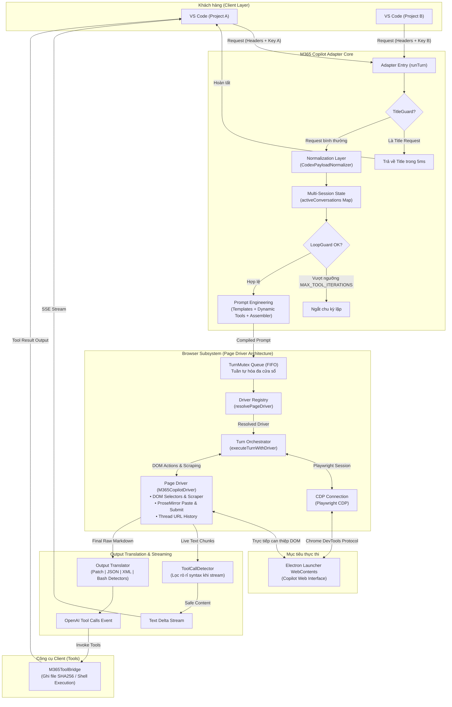

# Kiến Trúc Microsoft 365 Copilot Adapter (`m365-copilot`)

> **Tài liệu kiến trúc kỹ thuật tinh gọn (Streamlined Architecture Reference)**  
> **Áp dụng cho:** `src/adapters/m365-copilot/`  
> **Trạng thái:** Active / Production-Ready  
> **Quy chuẩn CI:** Zero Circular Dependencies (`check-circular-deps.js`) | 100% Backward Compatibility

---

## 1. Tổng quan (Overview)

`M365CopilotAdapter` là cầu nối API (Responses API Bridge) cho phép Codex IDE giao tiếp với **Microsoft 365 Copilot Web** (chạy trên nền Electron Desktop Launcher qua Chrome DevTools Protocol - CDP).

```text
Codex IDE ──(Responses API)──> Bridge Server (Local) ──(Playwright CDP)──> Launcher WebContents (M365 Web)
```

### Nguyên lý thiết kế cốt lõi
1. **Modular Architecture & Technical Slicing:** Phân tách ranh giới rõ ràng: Ingress Normalization $\rightarrow$ Prompts $\rightarrow$ Browser Engine $\rightarrow$ Output Translation $\rightarrow$ Tool Bridge.
2. **Page Driver Pattern (Plug & Play):** Tách lõi điều phối trình duyệt (`TurnOrchestrator`, `cdp-connection`) khỏi chi tiết DOM cụ thể của từng trang web (`PageDriver`), cho phép mở rộng trang web mới chỉ bằng cách tạo file driver mới.
3. **Zero Circular Dependencies & 100% Backward Compatibility:** Bảo toàn toàn bộ các Facade export tại thư mục gốc.

---

## 2. Bản đồ cấu trúc thư mục (Directory Tree Map)

```text
src/adapters/m365-copilot/
├── index.ts                         # Entry point chính của Adapter (triển khai ProviderAdapter)
├── debug-logger.ts                  # Tiện ích logging debug nội bộ phân hệ
│
├── session/                         # [Subsystem 1] Quản lý phiên và chống vòng lặp vô hạn
│   ├── index.ts                     # Explicit public exports
│   ├── conversation-state.ts        # Interface ConversationGuardState
│   └── conversation-guard.ts        # Map in-memory, TTL cleaner (15p), stableToolFingerprint
│
├── guards/                          # [Subsystem 2] Chốt chặn an toàn & ngắt sớm
│   ├── index.ts                     # Explicit public exports
│   └── title-guard.ts               # Đánh chặn yêu cầu sinh title ngầm và phản hồi trong 5ms
│
├── normalization/                   # [Subsystem 3] Chuẩn hóa Ingress payload & Canonical Domain
│   ├── index.ts                     # Explicit public exports
│   ├── canonical-types.ts           # Types nghiệp vụ (NormalizedCodexRequest, NormalizedTool)
│   ├── codex-raw-payload.ts         # Container bất biến CodexRawPayload bảo toàn wire snapshot
│   └── codex-normalizer.ts          # CodexPayloadNormalizer trích xuất tools, messages, plan mode
│
├── prompts/                         # [Subsystem 4] Kỹ thuật Prompt phân tầng
│   ├── index.ts                     # Explicit public exports
│   ├── templates.ts                 # Hằng số tĩnh (TOOL_DECLARATION, PLAN_MODE...)
│   ├── compiler.ts                  # M365PromptCompiler biên dịch dynamic tools & instruction
│   └── assembler.ts                 # compileM365Prompt cấp cao, cắt tỉa ngữ cảnh an toàn
│
├── browser/                         # [Subsystem 5] Động cơ trình duyệt & Page Drivers (Mới refactor)
│   ├── index.ts                     # Explicit public exports
│   ├── browser-worker.ts            # Facade tương thích ngược cho executeM365Turn
│   ├── capability-picker.ts         # Logic chọn model UI (Think Mode, GPT-5.6...)
│   ├── contracts/                   # Hợp đồng trừu tượng chung
│   │   ├── index.ts                 # Export contracts
│   │   └── page-driver.ts           # Interface PageDriver, BaselineState, ScrapeProgressResult
│   ├── cdp/                         # Hạ tầng kết nối CDP & Launcher lifecycle
│   │   ├── index.ts                 # Export CDP utilities
│   │   └── cdp-connection.ts        # connectCdpSurface, resolveDescriptorPath, notifyTurn*
│   ├── drivers/                     # Các cài đặt Driver cho từng trang web cụ thể
│   │   ├── index.ts                 # Export drivers
│   │   └── m365-copilot-driver.ts   # M365CopilotDriver: CHAT_SELECTORS, ProseMirror, DOM Scraper
│   └── engine/                      # Động cơ điều phối dùng chung (Shared Engine)
│       ├── index.ts                 # Export engine
│       ├── orchestrator.ts          # executeTurnWithDriver: streaming loop, delta, settlement
│       ├── driver-registry.ts       # Registry quản lý và phân giải PageDriver động
│       └── turn-mutex.ts            # TurnMutex FIFO tuần tự hóa tương tác đa cửa sổ VS Code
│
├── translation/                     # [Subsystem 6] Dịch thuật đầu ra & phát hiện Tool Calls
│   ├── index.ts                     # Explicit public exports
│   ├── output-translator.ts         # M365OutputTranslator điều phối chuỗi Detectors
│   ├── toolcall-detector.ts         # M365ToolCallDetector lọc rò rỉ cú pháp khi stream
│   ├── semantic-detector.ts         # M365MarkdownBuffer, trích xuất Markdown blocks
│   ├── bash-translator.ts           # Dịch lệnh shell tự do sang Tool Call chính thức
│   ├── html-to-markdown.ts          # Chuyển đổi DOM HTML thành Markdown sạch
│   ├── markdown.ts                  # Facade re-export html-to-markdown
│   ├── log-masker.ts                # Che giấu payload lớn khi in log
│   └── detectors/                   # Các Detectors chuyên biệt hóa (Chain-of-Responsibility)
│       ├── index.ts                 # Explicit exports
│       ├── types.ts                 # Interface IToolCallDetector
│       ├── sanitizers.ts            # Làm sạch chuỗi, cân bằng ngoặc JSON
│       ├── patch-detector.ts        # Nhận diện Codex Unified Patch (*** Begin Patch ***)
│       ├── json-detector.ts         # Nhận diện JSON Tool Call
│       ├── xml-detector.ts          # Nhận diện XML <tool_call> & <custom_tool_call>
│       └── bash-detector.ts         # Nhận diện lệnh bash/terminal
│
├── tools/                           # [Subsystem 7] Cầu nối công cụ & thực thi hệ điều hành
│   ├── index.ts                     # Explicit public exports
│   ├── tool-bridge.ts               # M365ToolBridge ánh xạ lời gọi sang lệnh client Codex
│   ├── atomic-file-writer.ts        # Ghi file phân đoạn kèm băm SHA256 an toàn
│   └── command-strategies/          # Chiến lược sinh lệnh shell đa nền tảng
│       ├── index.ts                 # Explicit exports
│       ├── types.ts / base.ts       # BaseCommandStrategy
│       ├── posix.ts                 # PosixCommandStrategy (bash / zsh / sh)
│       ├── powershell.ts            # PowerShellCommandStrategy (Windows PowerShell)
│       └── resolver.ts              # CommandStrategyResolver tự động nhận diện shell
│
├── harness/                         # [Subsystem 8] Khung kiểm thử Agent độc lập
│   ├── index.ts                     # Explicit public exports
│   └── agent-loop.ts                # M365AgentLoop, LocalToolExecutor benchmark ngoại tuyến
│
├── temp-chat/                       # [Subsystem 9] Chế độ Stateless Temporary Chat Per Request
│   ├── index.ts                     # Explicit public exports
│   ├── prompts.ts                   # Chỉ thị bao bọc 4-backtick ````markdown
│   ├── stripCodeFence.ts            # Bóc tách code block ngoài cùng
│   ├── fastPathScraper.ts           # FastPathStreamBuffer đọc LIVE DOM [data-line-index]
│   └── compileHybridForwardPrompt.ts# Biên dịch hybrid forward prompt kết hợp
│
└── [Root Facade Compatibility Files] # 15 facade files tại thư mục gốc bảo toàn 100% import cũ
    ├── agent-loop.ts / atomic-file-writer.ts / bash-translator.ts / browser-worker.ts
    ├── canonical-types.ts / capability-picker.ts / codex-normalizer.ts / codex-raw-payload.ts
    ├── markdown.ts / output-translator.ts / prompt-strategy.ts / prompt.ts / prompts.ts
    └── title-guard.ts / tool-bridge.ts
```

---

## 3. Mô hình luồng tổng quan giữa các thành phần (System Flow)



### Các giai đoạn xử lý chính:

1. **Ingress & Chặn ngắt sớm (Guard & Normalization)**:
   - Tiếp nhận request từ Codex IDE. `TitleGuard` đánh chặn ngay các request sinh tên hội thoại ngầm và phản hồi trong **5ms** mà không kích hoạt browser.
   - `CodexPayloadNormalizer` trích xuất payload thành mô hình Canonical bất biến.
2. **Cách ly phiên đa cửa sổ & Chống lặp vô hạn (Session)**:
   - `activeConversations Map` ghi nhận độc lập trạng thái của từng cửa sổ VS Code, bảo toàn thread URL riêng mà không làm đè hay reset session lẫn nhau.
   - `ConversationGuard` kiểm soát fingerprint của các lượt gọi công cụ, ngắt sớm nếu phát hiện vòng lặp vô hạn.
3. **Biên dịch Prompt (Prompt Engineering)**:
   - Kết hợp chỉ dẫn hệ thống tĩnh, dynamic tool schemas và cắt tỉa ngữ cảnh an toàn trước khi chuyển giao.
4. **Điều phối tuần tự hóa & Thực thi Driver (Browser Engine)**:
   - `TurnMutex` (FIFO) đảm bảo chỉ duy nhất một cửa sổ thao tác với DOM tại một thời điểm, các cửa sổ khác tự động xếp hàng đợi an toàn.
   - `DriverRegistry` tự động phân giải `PageDriver` tương ứng (M365 Copilot, Copilot Studio, Bing...).
   - `PageDriver` thực hiện paste ProseMirror, bấm nút submit và quan sát Live DOM.
5. **Streaming an toàn & Dịch thuật đa ngữ pháp (Translation)**:
   - `ToolCallDetector` nuốt trọn các thẻ cú pháp tool call trong quá trình streaming để không rò rỉ rác ra UI người dùng.
   - `M365OutputTranslator` dịch toàn bộ phản hồi từ M365 (Codex Patch, JSON, XML, Bash command) sang OpenAI Tool Call tiêu chuẩn.
6. **Thực thi công cụ (Tool Bridge)**:
   - `M365ToolBridge` thực thi các tác vụ file an toàn (kèm băm SHA256) và lệnh shell POSIX/PowerShell để trả kết quả về cho Codex IDE.

---

## 4. Trách nhiệm vắn tắt của các phân hệ

| Phân hệ | Vai trò chính |
| :--- | :--- |
| **`normalization`** | Lưu giữ snapshot bất biến `CodexRawPayload` và chuẩn hóa thành `NormalizedCodexRequest`. |
| **`guards`** | Đánh chặn yêu cầu sinh tiêu đề ngầm trong 5ms (`TitleGuard`), giải phóng tải trình duyệt. |
| **`prompts`** | Biên dịch chỉ dẫn công cụ động và đóng gói prompt theo khuôn mẫu an toàn. |
| **`browser`** | Động cơ điều phối CDP (`TurnOrchestrator`), `TurnMutex` đa cửa sổ và thực thi qua `PageDriver`. |
| **`translation`** | Phát hiện tool call khi stream và dịch đa ngữ pháp (Patch, JSON, XML, Bash) sang OpenAI Tool Call. |
| **`tools`** | Cầu nối công cụ phía client (`M365ToolBridge`), ghi file an toàn SHA256 và sinh lệnh shell đa nền tảng. |
| **`session`** | Theo dõi loop guard (`MAX_TOOL_ITERATIONS = 100`, `MAX_IDENTICAL_TOOL_CALLS = 10`), TTL cleanup 15 phút. |
| **`temp-chat`** | Trích xuất Fast-Path DOM thời gian thực và xử lý chế độ hội thoại tạm thời không lưu lịch sử. |
| **`harness`** | Vòng lặp Agent khép kín phục vụ kiểm thử benchmark không cần IDE. |

---

## 5. Quy tắc phụ thuộc (Dependency Rules)

```text
normalization ──> canonical-types
prompts       ──> templates
browser       ──> translation (chỉ dùng semantic detector & buffer)
tools         ──> command-strategies
session       ──> internal state & pure types
```

- **Quy tắc bất biến:** Tuyệt đối **không** tạo chu kỳ phụ thuộc (Circular Dependency). Đồ thị phụ thuộc bắt buộc phải là DAG (Directed Acyclic Graph).
- **Lệnh kiểm tra CI Gate:**
  ```bash
  bun run check:architecture
  # tương đương: node scripts/check-circular-deps.js && bun test tests/m365-architecture-integrity.test.ts
  ```

---

## 6. Mở rộng trang web mới qua PageDriver

Để tích hợp một trang web chat AI mới:
1. Tạo file mới: `src/adapters/m365-copilot/browser/drivers/<ten-trang>-driver.ts` triển khai interface `PageDriver`.
2. Đăng ký driver: `registerPageDriver(new MyDriver())`.
3. **Không chỉnh sửa bất kỳ tệp dùng chung nào** trong `cdp/`, `engine/` hay `orchestrator.ts`.
