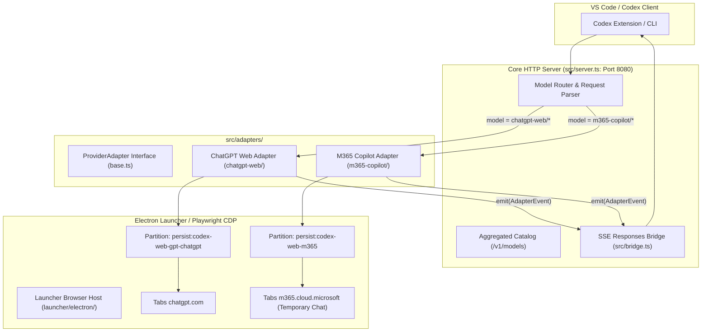

# Kế hoạch Kỹ thuật: Tích hợp Multi-Provider (M365 Copilot Web) vào codex-chatgpt-web

## 1. Tổng quan & Bối cảnh

### 1.1. Vấn đề thực tế
- Dự án `codex-chatgpt-web` hiện tại cung cấp cầu nối cục bộ xuất sắc giữa Codex và ChatGPT Web.
- Tuy nhiên, khi sử dụng trên mạng nội bộ doanh nghiệp/ngân hàng (GPBank), việc kết nối tới `chatgpt.com` thường gặp phải độ trễ cao (do máy chủ đặt tại Mỹ, đi qua nhiều gateway kiểm soát và cơ chế kiểm tra bot của Cloudflare).
- Trong khi đó, **Microsoft 365 Copilot Web** (`https://m365.cloud.microsoft/chat`):
  - Được cấp phép và whitelist 100% trên mạng nội bộ ngân hàng.
  - Sử dụng các Edge Node của Microsoft tại khu vực Đông Nam Á (độ trễ cực thấp < 50ms).
  - Có chế độ **Commercial Data Protection** (bảo vệ dữ liệu thương mại) và **Temporary Chat** (không lưu lịch sử, không rác thanh bên).
  - Khung soạn thảo hỗ trợ dung lượng lớn (đã kiểm chứng trên 100.000 ký tự).

### 1.2. Mục tiêu
1. **Bảo toàn 100% tính năng hiện có**: Giữ nguyên toàn bộ logic hoạt động, kiểm thử và hỗ trợ của ChatGPT Web.
2. **Kiến trúc Multi-Provider**: Mở rộng hệ thống để hỗ trợ song song 2 nhà cung cấp:
   - `chatgpt-web`: Nhà cung cấp ChatGPT Web gốc.
   - `m365-copilot`: Nhà cung cấp Microsoft 365 Copilot Web mới.
3. **Chuyển đổi liền mạch từ VS Code**: Người dùng chỉ cần đổi tên model trong `~/.codex/config.toml` (ví dụ: `m365-copilot/gpt-5` hoặc `chatgpt-web/gpt-5.6`) là hệ thống tự động định tuyến đến đúng trình duyệt tương ứng.

---

## 2. Kiến trúc Tổng thể (Multi-Provider Architecture)



---

## 3. Đặc tả Kỹ thuật chi tiết từng Module

### Module 1: M365 Copilot Adapter (`src/adapters/m365-copilot/`)
Triển khai mới theo đúng hợp đồng `ProviderAdapter` trong [src/adapters/base.ts](file:///Users/huytv/IdeaProjects/1.m365-codex/codex-chatgpt-web/src/adapters/base.ts).

#### 1. `index.ts` - Bộ điều phối Adapter
- Triển khai hàm `createM365CopilotAdapter(...)`.
- Nhận diện các yêu cầu đặc biệt:
  - **Title Guard**: Nhận diện request sinh tiêu đề (`isTitleRequest`) và trả về kết quả giả lập tức thì (5ms) thay vì gửi sang trình duyệt.
  - **Task Run**: Chuyển giao các câu lệnh lập trình thực tế cho `M365BrowserWorker`.

#### 2. `browser-worker.ts` - Điều khiển Trình duyệt qua CDP (Playwright)
- Kết nối tới cổng CDP do Launcher cung cấp.
- Quản lý vòng đời tab:
  - Kiểm tra trạng thái đăng nhập tài khoản M365.
  - Đảm bảo chế độ **Temporary Chat** luôn bật (`button[aria-label="Temporary chat"]`).
  - Xóa sạch nội dung cũ trong editor `#m365-chat-editor-target-element`.
  - Bơm văn bản mới thông qua sự kiện dán nguyên tử `ClipboardEvent("paste")`.
  - Kích hoạt nút gửi qua chuỗi sự kiện con trỏ: `pointerdown ➔ mousedown ➔ pointerup ➔ mouseup ➔ click` trên `.fai-SendButton`.
- Lắng nghe luồng phản hồi:
  - Bắt thẻ `.fai-CopilotMessage` mới nhất.
  - Theo dõi nút Stop để xác định trạng thái đang sinh mã (`isGenerating`).
  - Gửi các sự kiện `emit({ type: "text_delta", text: delta })` theo thời gian thực.
  - Khi hoàn thành, gửi `emit({ type: "done", usage: ... })`.

#### 3. `prompt.ts` - Tối ưu hóa Ngữ cảnh
- Chắt lọc ngữ cảnh từ `CodexParsedRequest`:
  - Lọc bỏ các chỉ thị hệ thống cồng kềnh của Codex CLI không cần thiết với web chat.
  - Giữ lại ngữ cảnh hội thoại gần nhất và câu lệnh lập trình của người dùng.
  - Giới hạn độ dài an toàn tối đa 100.000 ký tự để không vượt ngưỡng giới hạn của khung soạn thảo M365.

---

### Module 2: Định nghĩa Model M365 (`src/m365-models.ts`)
Tương tự cấu trúc của [src/chatgpt-web-models.ts](file:///Users/huytv/IdeaProjects/1.m365-codex/codex-chatgpt-web/src/chatgpt-web-models.ts):

```typescript
export const M365_COPILOT_MODEL_PREFIX = "m365-copilot/";

export const M365_MODELS = {
  DEFAULT: "m365-copilot/gpt-5",
  FAST: "m365-copilot/fast",
} as const;

export const M365_CONTEXT_WINDOW = 100_000;
export const M365_AUTO_COMPACT_LIMIT = 90_000;
export const M365_COMPOSER_CHAR_LIMIT = 115_000;

export function isM365ModelSlug(slug: string): boolean {
  return slug.startsWith(M365_COPILOT_MODEL_PREFIX) || slug.includes("m365");
}
```

---

### Module 3: Định tuyến trong Core Server (`src/server.ts`)

1. **Danh mục mô hình (`GET /v1/models`)**:
   - Gộp danh sách các model của ChatGPT Web và M365 Copilot:
     - `chatgpt-web/gpt-5.6`
     - `chatgpt-web/pro`
     - `m365-copilot/gpt-5` *(Mới)*
     - `m365-copilot/fast` *(Mới)*
2. **Điều phối yêu cầu (`POST /v1/responses`)**:
   - Kiểm tra `requestedModel`:
     ```typescript
     if (isM365ModelSlug(requestedModel)) {
       // Điều phối qua M365 Copilot Adapter
       return handleM365Request(req, raw, m365AdapterFactory);
     }
     if (isChatGptWebModelSlug(requestedModel)) {
       // Điều phối qua ChatGPT Web Adapter gốc
       return handleChatGptRequest(req, raw, chatGptAdapterFactory);
     }
     // Mặc định fallback về Native Passthrough
     ```

---

### Module 4: Phân vùng Trình duyệt Launcher (`launcher/electron/`)

1. **Phân vùng độc lập (Session Isolation)**:
   - ChatGPT: `persist:codex-web-gpt-chatgpt`
   - M365 Copilot: `persist:codex-web-m365`
   - Đảm bảo cookie của 2 dịch vụ không bị trộn lẫn hoặc xung đột.
2. **Giao diện & Cấu hình**:
   - Thêm tab hoặc tùy chọn cấu hình `Provider: [ ChatGPT Web | M365 Copilot ]` trong phần cài đặt của Launcher.
   - Khi chọn M365, cửa sổ đăng nhập sẽ điều hướng tới `https://m365.cloud.microsoft/chat`.

---

## 4. Lộ trình Triển khai (4 Giai đoạn)

```mermaid
gantt
    title Lộ trình Tích hợp Multi-Provider (M365 Copilot)
    dateFormat  YYYY-MM-DD
    section Giai đoạn 1: Core Adapter
    Tạo module src/adapters/m365-copilot/          :done, 2026-09-30, 1d
    browser-worker.ts (CDP + Temporary Chat)       :active, 2026-09-30, 2d
    title-guard & prompt optimizer                 :2026-10-01, 1d

    section Giai đoạn 2: Model & Routing
    Khai báo src/m365-models.ts                    :2026-10-02, 1d
    Cập nhật src/server.ts (Multi-provider router) :2026-10-02, 2d
    Tích hợp GET /v1/models gộp                    :2026-10-03, 1d

    section Giai đoạn 3: Launcher Desktop
    Mở rộng partition persist:codex-web-m365       :2026-10-04, 2d
    Giao diện chuyển đổi Provider trong Launcher   :2026-10-05, 2d

    section Giai đoạn 4: Kiểm thử & Đóng gói
    Smoke test CLI & VS Code Codex                 :2026-10-06, 1d
    Đóng gói bản cài đặt macOS / Windows           :2026-10-07, 1d
```

### Chi tiết các bước thực hiện:

#### **Giai đoạn 1: Xây dựng Module Adapter M365 (`src/adapters/m365-copilot/`)**
- [ ] Tạo `src/adapters/m365-copilot/index.ts` tuân thủ interface `ProviderAdapter`.
- [ ] Tạo `src/adapters/m365-copilot/browser-worker.ts` điều khiển Playwright CDP gắn vào tab M365.
- [ ] Tích hợp cơ chế tự động bật Temporary Chat và dán văn bản siêu tốc bằng `ClipboardEvent`.
- [ ] Tích hợp chuỗi sự kiện con trỏ PointerEvents trên nút `.fai-SendButton`.
- [ ] Tích hợp `title-guard.ts` xử lý tức thì yêu cầu Title ngầm của Codex.

#### **Giai đoạn 2: Định nghĩa Model & Tích hợp Router (`src/server.ts`)**
- [ ] Tạo `src/m365-models.ts` định nghĩa catalog `m365-copilot/*`.
- [ ] Cập nhật `src/server.ts` để phân luồng request theo model prefix.
- [ ] Cập nhật danh mục model trong `/v1/models` để Codex hiển thị cả 2 nhà cung cấp.

#### **Giai đoạn 3: Mở rộng Launcher Electron (`launcher/`)**
- [ ] Cập nhật `launcher/electron/browser-host.cjs` hỗ trợ phân vùng `persist:codex-web-m365`.
- [ ] Hỗ trợ điều hướng tới `https://m365.cloud.microsoft/chat` để đăng nhập một lần.
- [ ] Tích hợp lưu trạng thái session và tự động phục hồi khi mở lại app.

#### **Giai đoạn 4: Kiểm thử Toàn diện & Tối ưu**
- [ ] Kiểm thử chuyển đổi qua lại giữa `chatgpt-web/gpt-5.6` và `m365-copilot/gpt-5` trên VS Code.
- [ ] Đo lường tốc độ phản hồi thực tế trên mạng công ty (GPBank).
- [ ] Xác nhận không còn tình trạng treo "Thinking" và kiểm tra xử lý lỗi khi mất kết nối mạng.

---

## 5. Tiêu chí Nghiệm thu (Acceptance Criteria)

1. **Hiệu năng & Tốc độ**:
   - Các prompt gửi tới `m365-copilot/gpt-5` bắt đầu stream chữ đầu tiên sau dưới 3 giây trên mạng công ty.
2. **Tính độc lập & Ổn định**:
   - Việc thêm M365 không làm thay đổi hay gãy bất kỳ tính năng nào của ChatGPT Web gốc.
   - Toàn bộ các bài test hiện có (`bun test` hoặc `npm test`) của `codex-chatgpt-web` vẫn pass 100%.
3. **Bảo mật & Riêng tư**:
   - Phiên chat M365 luôn chạy ở chế độ **Temporary Chat**, không lưu vết hay làm rác lịch sử tài khoản ngân hàng.
   - Phiên làm việc chạy trong phân vùng cô lập, không đọc/ghi dữ liệu trình duyệt cá nhân.
